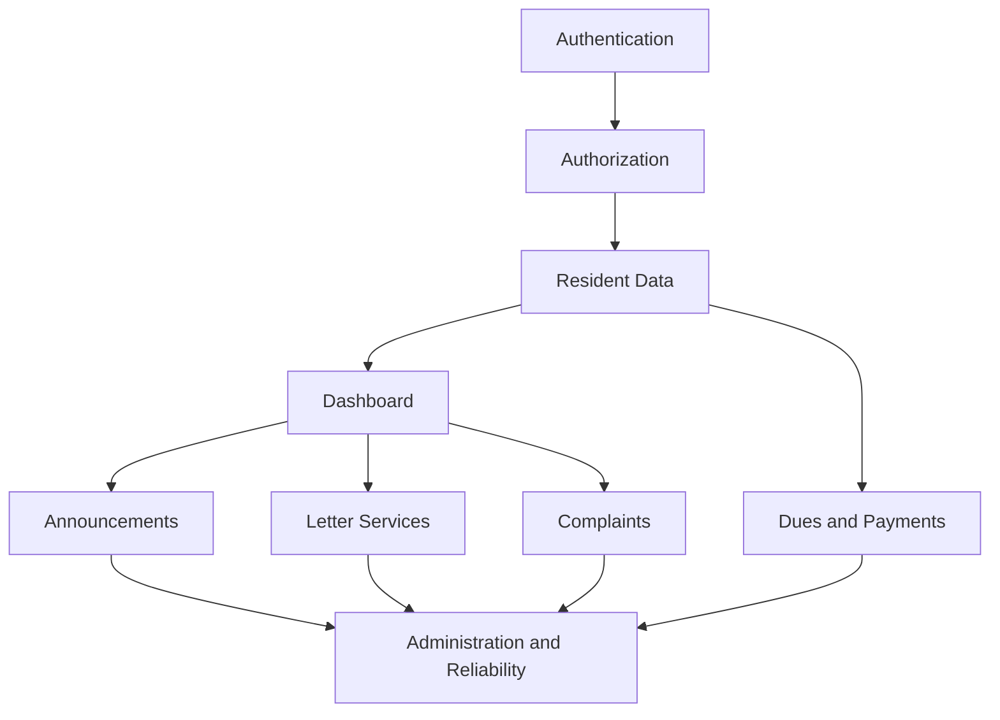

# WargaHub Product Backlog

## 1. Document Control

- Document Title: WargaHub Product Backlog
- Product Name: WargaHub
- Version: 0.1.0
- Status: Draft
- Owner: Product and Engineering Team
- Last Updated: 2026-07-18
- Related Documents:
  - [PROJECT_MANIFEST.md](../PROJECT_MANIFEST.md)
  - [.ai/AI_CONTEXT.md](../.ai/AI_CONTEXT.md)
  - [.ai/PROJECT_RULES.md](../.ai/PROJECT_RULES.md)
  - [.ai/SYSTEM_PROMPT.md](../.ai/SYSTEM_PROMPT.md)
  - [docs/01-VISION.md](01-VISION.md)
  - [docs/02-SRS.md](02-SRS.md)
- Change History:
  - 2026-07-18: Initial backlog draft created from the SRS and product vision.

---

## 2. Backlog Purpose

Product Backlog ini adalah dokumen prioritas kerja untuk WargaHub yang menerjemahkan kebutuhan formal dari [docs/02-SRS.md](02-SRS.md) menjadi item kerja yang dapat dipahami, ditaksir, dan dipindahkan ke Sprint.

Tujuan backlog ini adalah:

- mengubah kebutuhan bisnis dan fungsional menjadi item kerja yang terarah
- memastikan setiap item memiliki nilai bisnis yang jelas
- memberi dasar untuk Sprint Planning, refinement, dan review
- menjaga agar tim tetap fokus pada MVP dan batasan yang disepakati

Backlog ini terkait erat dengan SRS karena setiap item dapat ditelusuri ke requirement tertentu. Dalam Scrum, backlog ini bersifat hidup: item dapat ditambah, dikurangi, diurutkan, dipecah, atau ditunda sesuai pemahaman yang berkembang selama pengembangan.

---

## 3. Backlog Management Rules

Backlog WargaHub akan dikelola dengan aturan berikut:

- Item backlog dibuat dari kebutuhan yang sudah tercantum dalam SRS atau dokumen produk terkait.
- Setiap item harus memiliki nilai bisnis, prioritas, dan kriteria penerimaan yang jelas.
- Item yang terlalu besar harus dipotong menjadi item yang lebih kecil dan lebih mudah dikerjakan.
- Prioritas ditentukan berdasarkan nilai bisnis, urgensi MVP, ketergantungan, dan resiko.
- Item yang belum siap untuk Sprint harus melalui refinement sebelum masuk ke Sprint candidate pool.
- Item yang tidak lagi relevan atau tidak layak pada saat ini dapat ditunda atau didefer.
- Perubahan prioritas atau status harus didokumentasikan secara konsisten.

Prinsip utama:

- fokus pada MVP
- hindari over-scoping
- utamakan item yang memberi nilai nyata secara cepat
- hindari fitur yang belum didukung secara kuat oleh visi dan SRS

---

## 4. Priority Framework

### MUST_HAVE
Required for MVP or core operation. Item ini wajib ada agar produk dapat memberikan nilai inti bagi pengguna.

### SHOULD_HAVE
Important but can be delivered after core functionality. Item ini memperkuat pengalaman pengguna atau efisiensi operasional.

### COULD_HAVE
Useful enhancement with lower urgency. Item ini dapat ditambahkan bila kapasitas tim memungkinkan.

### FUTURE
Not part of current MVP. Item ini disimpan sebagai ide pengembangan berikutnya dan tidak menjadi komitmen sprint saat ini.

---

## 5. Epic Map

### EPIC-AUTH
- Purpose: Menyediakan mekanisme masuk, keluar, dan perlindungan akses berdasarkan peran.
- Business Value: Meningkatkan keamanan dan memastikan pengguna hanya melihat data yang sesuai otoritas.
- Related SRS Sections: Section 10.1, Section 11.1, Section 12.4, Section 19
- MVP Relevance: High

### EPIC-PROFILE
- Purpose: Mengelola informasi profil pengguna yang terautentikasi.
- Business Value: Memberi pengguna kontrol atas data akun mereka dan mengurangi kebingungan saat mengakses sistem.
- Related SRS Sections: Section 10.2, Section 11.2
- MVP Relevance: Medium

### EPIC-RESIDENT
- Purpose: Mengelola data warga, pencarian, detail, dan status administratif.
- Business Value: Menyediakan fondasi administrasi komunitas yang terstruktur dan mudah dicari.
- Related SRS Sections: Section 10.3, Section 11.3, Section 15.2
- MVP Relevance: High

### EPIC-FAMILY
- Purpose: Menghubungkan warga, keluarga, rumah, dan relasi administratif.
- Business Value: Membantu pengurus memahami struktur keluarga dan hunian secara lebih konsisten.
- Related SRS Sections: Section 10.4, Section 10.5, Section 11.4
- MVP Relevance: Medium

### EPIC-DASHBOARD
- Purpose: Menyediakan ringkasan informasi yang relevan bagi pengguna sesuai peran.
- Business Value: Membantu pengguna memahami situasi penting dengan cepat tanpa harus mencari data secara manual.
- Related SRS Sections: Section 10.6, Section 11.5
- MVP Relevance: High

### EPIC-ANNOUNCEMENT
- Purpose: Mengelola pengumuman lingkungan secara terstruktur.
- Business Value: Memastikan komunikasi komunitas terdokumentasi dan dapat diakses dengan jelas.
- Related SRS Sections: Section 10.7, Section 11.6
- MVP Relevance: High

### EPIC-LETTER
- Purpose: Mendukung pengajuan dan pemrosesan surat layanan administratif.
- Business Value: Mengurangi proses manual dan meningkatkan transparansi status permohonan.
- Related SRS Sections: Section 10.8, Section 11.7, Section 14.1
- MVP Relevance: High

### EPIC-DUES
- Purpose: Mengelola iuran, tagihan, pembayaran, dan riwayat keuangan.
- Business Value: Meningkatkan transparansi dan akurasi administrasi keuangan lingkungan.
- Related SRS Sections: Section 10.9, Section 11.8, Section 15.9
- MVP Relevance: High

### EPIC-COMPLAINT
- Purpose: Mengelola pengaduan warga dari awal sampai penutupan.
- Business Value: Membuat penanganan masalah lebih terdokumentasi dan dapat dipantau.
- Related SRS Sections: Section 10.10, Section 11.9, Section 14.2
- MVP Relevance: High

### EPIC-ACTIVITY
- Purpose: Mencatat kegiatan lingkungan yang penting dan dapat dilihat oleh pengguna yang berwenang.
- Business Value: Membantu komunitas mendokumentasikan aktivitas dan partisipasi secara konsisten.
- Related SRS Sections: Section 10.11, Section 11.10
- MVP Relevance: Medium

### EPIC-NOTIFICATION
- Purpose: Memberikan informsi penting secara tepat waktu kepada pengguna yang relevan.
- Business Value: Mengurangi keterlambatan informasi dan memastikan pengguna tidak melewatkan hal penting.
- Related SRS Sections: Section 10.12, Section 11.11
- MVP Relevance: Medium

### EPIC-FILE
- Purpose: Mengelola dokumen pendukung dan file yang dikaitkan dengan record bisnis.
- Business Value: Menyediakan sarana penyimpanan dokumen yang aman dan terhubung dengan proses bisnis.
- Related SRS Sections: Section 10.13, Section 11.12, Section 23
- MVP Relevance: Medium

### EPIC-AUDIT
- Purpose: Mencatat aktivitas penting yang dilakukan pengguna dan sistem.
- Business Value: Meningkatkan akuntabilitas dan memudahkan pelacakan kejadian penting.
- Related SRS Sections: Section 10.14, Section 11.13, Section 24
- MVP Relevance: Medium

### EPIC-ADMIN
- Purpose: Mengelola pengguna, peran, dan konfigurasi sistem dasar.
- Business Value: Menjaga keamanan dan memastikan sistem dapat dikelola secara terkontrol.
- Related SRS Sections: Section 10.15, Section 11.14, Section 19
- MVP Relevance: High

### EPIC-PLATFORM
- Purpose: Menjamin kualitas, keamanan, kinerja, dan kesiapan operasional platform.
- Business Value: Mengurangi resiko bug, meningkatkan kepercayaan pengguna, dan memastikan sistem dapat dipelihara.
- Related SRS Sections: Section 12, Section 16, Section 17, Section 18, Section 25, Section 26
- MVP Relevance: High

---

## 6. Product Backlog Items

### Authentication and Authorization

### WB-AUTH-001

**Title:** Login pengguna dengan validasi kredensial

**Epic:** EPIC-AUTH

**Priority:** MUST_HAVE

**Status:** BACKLOG

**Story Points:** 3

**User Story:**

> Sebagai pengguna yang terdaftar,
> saya ingin masuk ke sistem dengan kredensial yang valid,
> agar saya dapat mengakses fitur yang sesuai dengan peran saya.

**Business Value:**
Memastikan pengguna dapat masuk dengan aman dan langsung mulai menggunakan sistem.

**Description:**
Sistem harus menerima kredensial pengguna, memvalidasi keberadaannya, dan mengautentikasi pengguna ke dashboard atau halaman yang sesuai.

**SRS Traceability:**
- FR-001
- FR-002
- NFR-007
- SEC-001

**Acceptance Criteria:**
- Given user memiliki akun yang terdaftar,
- When user memasukkan kredensial yang valid,
- Then sistem mengautentikasi user dan mengarahkan ke dashboard yang sesuai.
- Given kredensial tidak valid,
- When user mencoba login,
- Then sistem menolak akses dan menampilkan pesan kesalahan yang aman.

**Dependencies:** None

**Technical Notes:**
Gunakan alur autentikasi yang aman dan konsisten dengan arsitektur backend dan frontend yang disepakati.

**Risks:**
Risiko terkait akses tidak sah jika validasi tidak diterapkan dengan benar.

**Definition of Done:**
- Requirement implemented.
- Acceptance criteria satisfied.
- Login flow berhasil diuji.
- Error handling untuk kredensial tidak valid telah diverifikasi.

### WB-AUTH-002

**Title:** Logout dan penanganan sesi pengguna

**Epic:** EPIC-AUTH

**Priority:** MUST_HAVE

**Status:** BACKLOG

**Story Points:** 2

**User Story:**

> Sebagai pengguna yang sudah login,
> saya ingin keluar dari sesi saya dengan aman,
> agar akses saya tidak tetap aktif setelah selesai bekerja.

**Business Value:**
Meningkatkan keamanan sesi dan mengurangi risiko akses yang tidak disengaja.

**Description:**
Sistem harus menyediakan mekanisme logout yang jelas dan mengakhiri sesi aktif pengguna dengan aman.

**SRS Traceability:**
- FR-003
- FR-005
- NFR-007
- SEC-003

**Acceptance Criteria:**
- Given pengguna sedang login,
- When pengguna memilih logout,
- Then sesi pengguna berakhir dan pengguna diarahkan ke halaman login.
- Given sesi pengguna sudah berakhir,
- When pengguna mencoba mengakses halaman terlindungi,
- Then sistem memaksa pengguna untuk login ulang.

**Dependencies:** WB-AUTH-001

**Technical Notes:**
Perlu dipertimbangkan pengelolaan token atau session state secara konsisten.

**Risks:**
None identified.

**Definition of Done:**
- Logout flow implemented.
- Session invalidation verified.
- Tidak ada akses yang tersisa setelah logout.

### WB-AUTH-003

**Title:** Kontrol akses berbasis peran

**Epic:** EPIC-AUTH

**Priority:** MUST_HAVE

**Status:** BACKLOG

**Story Points:** 5

**User Story:**

> Sebagai administrator atau pengurus,
> saya ingin sistem membatasi akses berdasarkan peran,
> agar pengguna hanya melihat dan mengelola data yang sesuai dengan tanggung jawab mereka.

**Business Value:**
Mengurangi risiko akses tidak sah dan menjaga integritas data.

**Description:**
Sistem harus menerapkan otorisasi berbasis peran untuk fitur, modul, dan data sensitif.

**SRS Traceability:**
- FR-004
- BRULE-001
- BRULE-002
- NFR-008
- SEC-002

**Acceptance Criteria:**
- Given user memiliki peran tertentu,
- When user mengakses fitur tertentu,
- Then sistem hanya mengizinkan akses yang sesuai dengan peran tersebut.
- Given user mencoba mengakses data di luar cakupan perannya,
- Then sistem menolak akses dan menampilkan pesan yang sesuai.

**Dependencies:** WB-AUTH-001

**Technical Notes:**
Penerapan kontrol akses harus konsisten di frontend, backend, dan layer data.

**Risks:**
Kesalahan konfigurasi peran dapat menimbulkan celah akses.

**Definition of Done:**
- Otorisasi peran implemented.
- Akses yang tidak sah ditolak.
- Role-based access tested untuk skenario inti.

### WB-AUTH-004

**Title:** Penanganan error autentikasi dan otorisasi

**Epic:** EPIC-AUTH

**Priority:** SHOULD_HAVE

**Status:** BACKLOG

**Story Points:** 3

**User Story:**

> Sebagai pengguna,
> saya ingin menerima pesan error yang jelas saat autentikasi atau otorisasi gagal,
> agar saya memahami apa yang perlu dilakukan selanjutnya.

**Business Value:**
Mengurangi kebingungan pengguna dan memperkuat keamanan.

**Description:**
Sistem harus menangani skenario login gagal, sesi invalid, dan akses ditolak dengan pesan yang aman dan jelas.

**SRS Traceability:**
- FR-002
- FR-004
- FR-097
- FR-098
- SEC-006

**Acceptance Criteria:**
- Given user memasukkan kredensial salah,
- When sistem menolak login,
- Then user menerima pesan yang jelas dan aman.
- Given user tidak memiliki hak akses,
- When mereka mencoba membuka halaman yang dibatasi,
- Then sistem menampilkan pesan yang sesuai tanpa mengungkap detail sensitif.

**Dependencies:** WB-AUTH-001, WB-AUTH-003

**Technical Notes:**
Pesan error harus aman dan tidak menampilkan detail yang tidak perlu.

**Risks:**
None identified.

**Definition of Done:**
- Error state implemented.
- Error handling validated.
- Tidak ada kebocoran informasi sensitif pada pesan error.

### User Profile

### WB-PROFILE-001

**Title:** Melihat profil akun sendiri

**Epic:** EPIC-PROFILE

**Priority:** MUST_HAVE

**Status:** BACKLOG

**Story Points:** 2

**User Story:**

> Sebagai pengguna yang terautentikasi,
> saya ingin melihat profil akun saya,
> agar saya dapat memastikan data akun saya benar.

**Business Value:**
Memberi pengguna visibilitas atas data akun mereka dan mengurangi kebingungan operasional.

**Description:**
Sistem harus menampilkan profil pengguna yang sedang login beserta informasi dasar akun yang relevan.

**SRS Traceability:**
- FR-006
- FR-008

**Acceptance Criteria:**
- Given pengguna sudah login,
- When pengguna membuka halaman profil,
- Then sistem menampilkan informasi profil yang relevan.

**Dependencies:** WB-AUTH-001

**Technical Notes:**
Profil harus disediakan secara sederhana dan tidak menampilkan data yang tidak diperlukan.

**Risks:**
None identified.

**Definition of Done:**
- Profil user dapat dilihat.
- Informasi yang ditampilkan sesuai hak akses.

### WB-PROFILE-002

**Title:** Memperbarui informasi profil yang diizinkan

**Epic:** EPIC-PROFILE

**Priority:** SHOULD_HAVE

**Status:** BACKLOG

**Story Points:** 3

**User Story:**

> Sebagai pengguna,
> saya ingin memperbarui informasi profil saya yang diizinkan,
> agar data akun saya tetap akurat.

**Business Value:**
Mengurangi kebutuhan untuk menghubungi admin untuk perubahan data akun dasar.

**Description:**
Sistem harus memungkinkan pengguna memperbarui bidang profil yang diizinkan sesuai kebijakan aplikasi.

**SRS Traceability:**
- FR-007

**Acceptance Criteria:**
- Given pengguna membuka form profil,
- When pengguna memperbarui data yang diizinkan,
- Then sistem menyimpan perubahan dan menampilkan konfirmasi.
- Given user mencoba mengubah field yang tidak diizinkan,
- Then sistem menolak perubahan.

**Dependencies:** WB-PROFILE-001

**Technical Notes:**
Validasi input harus diterapkan sebelum penyimpanan.

**Risks:**
Risiko data yang tidak konsisten jika validasi lemah.

**Definition of Done:**
- Update profil berhasil.
- Validasi diterapkan.
- Data tersimpan sesuai aturan.

### Resident Data

### WB-RESIDENT-001

**Title:** Menampilkan daftar warga dan detail dasar

**Epic:** EPIC-RESIDENT

**Priority:** MUST_HAVE

**Status:** BACKLOG

**Story Points:** 5

**User Story:**

> Sebagai pengurus lingkungan,
> saya ingin melihat daftar warga beserta detail dasar mereka,
> agar saya dapat mengelola data administrasi secara terstruktur.

**Business Value:**
Membantu pengurus mengakses data warga secara cepat dan konsisten.

**Description:**
Sistem harus menampilkan daftar warga yang relevan dengan kemampuan melihat detail dasar setiap data warga.

**SRS Traceability:**
- FR-009
- FR-012
- DATA-003

**Acceptance Criteria:**
- Given user memiliki hak akses yang sesuai,
- When user membuka halaman warga,
- Then sistem menampilkan daftar warga yang relevan.
- Given user memilih satu warga,
- When user membuka detail warga,
- Then sistem menampilkan data dasar yang tersedia.

**Dependencies:** WB-AUTH-003

**Technical Notes:**
Daftar harus mendukung paginasi atau pembagian data yang wajar.

**Risks:**
Data yang sangat besar dapat memperlambat tampilan jika tidak dikelola dengan baik.

**Definition of Done:**
- Daftar warga tersedia.
- Detail warga dapat dibuka.
- Akses sesuai otorisasi.

### WB-RESIDENT-002

**Title:** Pencarian dan filter data warga

**Epic:** EPIC-RESIDENT

**Priority:** MUST_HAVE

**Status:** BACKLOG

**Story Points:** 3

**User Story:**

> Sebagai pengurus,
> saya ingin mencari dan memfilter warga berdasarkan kriteria tertentu,
> agar saya dapat menemukan data yang saya butuhkan lebih cepat.

**Business Value:**
Mengurangi waktu pencarian manual dan meningkatkan efisiensi kerja.

**Description:**
Sistem harus menyediakan mekanisme pencarian dan pemfilteran data warga yang sesuai.

**SRS Traceability:**
- FR-010
- FR-011

**Acceptance Criteria:**
- Given user memasukkan kata kunci pencarian,
- When user menjalankan pencarian,
- Then sistem menampilkan hasil yang sesuai.
- Given user memilih filter yang valid,
- When user menerapkan filter,
- Then sistem membatasi hasil sesuai kriteria.

**Dependencies:** WB-RESIDENT-001

**Technical Notes:**
Filter dan pencarian harus tetap sederhana dan mudah dipahami.

**Risks:**
None identified.

**Definition of Done:**
- Pencarian dan filter berfungsi.
- Hasil yang tampil sesuai kriteria.

### WB-RESIDENT-003

**Title:** Membuat dan memperbarui data warga

**Epic:** EPIC-RESIDENT

**Priority:** MUST_HAVE

**Status:** BACKLOG

**Story Points:** 5

**User Story:**

> Sebagai pengurus yang berwenang,
> saya ingin membuat dan memperbarui data warga,
> agar data administrasi lingkungan tetap akurat dan terkelola.

**Business Value:**
Memastikan data warga dapat dikelola secara konsisten dan terkini.

**Description:**
Sistem harus menyediakan alur pembuatan dan pembaruan data warga dengan validasi yang cukup.

**SRS Traceability:**
- FR-013
- FR-014
- DATA-003
- DATA-004

**Acceptance Criteria:**
- Given user berwenang,
- When user mengisi data warga baru,
- Then sistem menyimpan data dan menampilkan konfirmasi.
- Given data warga yang ada diperbarui,
- When user menyimpan perubahan,
- Then sistem memperbarui record yang relevan.

**Dependencies:** WB-RESIDENT-001

**Technical Notes:**
Validasi harus dipertimbangkan secara hati-hati untuk menghindari data invalid.

**Risks:**
Data yang salah dapat memengaruhi seluruh proses administratif.

**Definition of Done:**
- Create dan update resident berhasil.
- Validasi diterapkan.
- Data tersimpan dengan konsistensi yang baik.

### WB-RESIDENT-004

**Title:** Arsip dan nonaktifkan data warga sesuai aturan bisnis

**Epic:** EPIC-RESIDENT

**Priority:** SHOULD_HAVE

**Status:** BACKLOG

**Story Points:** 3

**User Story:**

> Sebagai pengurus,
> saya ingin menandai warga sebagai nonaktif atau terarsip,
> agar data historis tetap terjaga tanpa menghapus informasi penting.

**Business Value:**
Membantu pengelolaan data yang berubah seiring waktu tanpa kehilangan konteks.

**Description:**
Sistem harus mendukung penandaan status warga yang tidak aktif atau diarsipkan sesuai aturan bisnis.

**SRS Traceability:**
- FR-015
- BRULE-008

**Acceptance Criteria:**
- Given user berwenang,
- When user mengarsipkan atau menonaktifkan data warga,
- Then sistem menandai status data tersebut secara jelas.
- Given data warga diarsipkan,
- When user melihat record tersebut,
- Then sistem tetap memelihara konteks historis yang sesuai.

**Dependencies:** WB-RESIDENT-003

**Technical Notes:**
Perlu dipertimbangkan apakah status ini akan memengaruhi visibilitas default atau hanya status tertentu.

**Risks:**
Kesalahan status dapat menimbulkan kebingungan data.

**Definition of Done:**
- Status archive/nonaktif berhasil diimplementasikan.
- Historis data tetap terjaga.

### Family and Household

### WB-FAMILY-001

**Title:** Mengelola data keluarga dan anggota keluarga

**Epic:** EPIC-FAMILY

**Priority:** SHOULD_HAVE

**Status:** BACKLOG

**Story Points:** 3

**User Story:**

> Sebagai pengurus lingkungan,
> saya ingin mengelola data keluarga dan anggota keluarga,
> agar hubungan administratif antar warga lebih jelas.

**Business Value:**
Membantu memahami struktur sosial dan administratif di lingkungan.

**Description:**
Sistem harus memungkinkan definisi keluarga dan hubungan anggota keluarga yang relevan.

**SRS Traceability:**
- FR-016
- FR-017
- DATA-005

**Acceptance Criteria:**
- Given user berwenang,
- When user membuat atau memperbarui data keluarga,
- Then sistem menyimpan relasi anggota keluarga secara konsisten.

**Dependencies:** WB-RESIDENT-003

**Technical Notes:**
Struktur data keluarga harus dibuat dengan sederhana dan tidak terlalu kompleks untuk MVP.

**Risks:**
Relasi yang salah dapat mengganggu pemahaman administratif.

**Definition of Done:**
- Data keluarga dapat dibuat dan diperbarui.
- Relasi anggota keluarga tersimpan dengan benar.

### WB-FAMILY-002

**Title:** Mengaitkan warga dengan rumah dan residensi

**Epic:** EPIC-FAMILY

**Priority:** SHOULD_HAVE

**Status:** BACKLOG

**Story Points:** 3

**User Story:**

> Sebagai pengurus,
> saya ingin mengaitkan warga dengan rumah atau lokasi tertentu,
> agar struktur hunian dan penduduk dapat dipahami dengan baik.

**Business Value:**
Membantu menghubungkan data penduduk dengan lokasi administratif yang relevan.

**Description:**
Sistem harus mendukung asosiasi warga dengan rumah atau residensi tertentu.

**SRS Traceability:**
- FR-018
- DATA-006

**Acceptance Criteria:**
- Given user berwenang,
- When user mengaitkan warga ke rumah atau residensi,
- Then sistem menyimpan hubungan tersebut secara konsisten.

**Dependencies:** WB-FAMILY-001

**Technical Notes:**
Asosiasi ini harus jelas dan mudah dikelola untuk skenario MVP.

**Risks:**
None identified.

**Definition of Done:**
- Hubungan warga-rumah tersimpan.
- Data dapat dilihat dan dikelola dengan benar.

### Dashboard

### WB-DASHBOARD-001

**Title:** Dashboard berbasis peran

**Epic:** EPIC-DASHBOARD

**Priority:** MUST_HAVE

**Status:** BACKLOG

**Story Points:** 5

**User Story:**

> Sebagai pengguna dengan peran tertentu,
> saya ingin melihat dashboard yang relevan dengan kebutuhan saya,
> agar saya dapat segera melihat informasi penting.

**Business Value:**
Memberi pengguna akses cepat ke informasi yang paling penting.

**Description:**
Sistem harus menampilkan dashboard yang menyesuaikan isi berdasarkan peran pengguna.

**SRS Traceability:**
- FR-019
- FR-022

**Acceptance Criteria:**
- Given user login dengan peran tertentu,
- When user membuka dashboard,
- Then sistem menampilkan informasi yang relevan bagi peran tersebut.

**Dependencies:** WB-AUTH-003

**Technical Notes:**
Dashboard harus tetap sederhana dan tidak terlalu padat untuk MVP.

**Risks:**
Jika konten terlalu kompleks, dashboard bisa menjadi kurang berguna.

**Definition of Done:**
- Dashboard muncul sesuai peran.
- Informasi utama tersedia dengan jelas.

### WB-DASHBOARD-002

**Title:** Ringkasan pengumuman dan aktivitas terbaru

**Epic:** EPIC-DASHBOARD

**Priority:** MUST_HAVE

**Status:** BACKLOG

**Story Points:** 3

**User Story:**

> Sebagai pengguna,
> saya ingin melihat pengumuman terbaru dan aktivitas terkait,
> agar saya tidak ketinggalan informasi penting.

**Business Value:**
Membantu pengguna tetap up-to-date dengan komunikasi dan aktivitas lingkungan.

**Description:**
Dashboard harus menampilkan elemen ringkas seperti pengumuman terbaru dan aktivitas yang relevan.

**SRS Traceability:**
- FR-020
- FR-021

**Acceptance Criteria:**
- Given data pengumuman atau aktivitas tersedia,
- When user membuka dashboard,
- Then sistem menampilkan item yang relevan secara ringkas.

**Dependencies:** WB-DASHBOARD-001

**Technical Notes:**
Item yang ditampilkan harus disaring berdasarkan otorisasi.

**Risks:**
None identified.

**Definition of Done:**
- Ringkasan pengumuman dan aktivitas tersedia.
- Konten relevan dan sesuai hak akses.

### Announcements

### WB-ANNOUNCEMENT-001

**Title:** Membuat dan mengedit pengumuman

**Epic:** EPIC-ANNOUNCEMENT

**Priority:** MUST_HAVE

**Status:** BACKLOG

**Story Points:** 3

**User Story:**

> Sebagai pengurus lingkungan,
> saya ingin membuat dan mengedit pengumuman,
> agar informasi penting dapat disampaikan secara terstruktur.

**Business Value:**
Memastikan komunikasi komunitas dapat dilakukan secara tertib dan terdokumentasi.

**Description:**
Sistem harus memungkinkan pembuatan dan perbaikan pengumuman oleh pengguna yang berwenang.

**SRS Traceability:**
- FR-023
- FR-024
- BRULE-010

**Acceptance Criteria:**
- Given user berwenang,
- When user membuat atau memperbarui pengumuman,
- Then sistem menyimpan perubahan dengan status yang sesuai.

**Dependencies:** WB-AUTH-003

**Technical Notes:**
Pengumuman perlu memiliki status publikasi yang jelas.

**Risks:**
Pengumuman yang salah dapat menyesatkan warga.

**Definition of Done:**
- Pengumuman dapat dibuat dan disimpan.
- Status publikasi jelas.

### WB-ANNOUNCEMENT-002

**Title:** Melihat dan mempublikasikan pengumuman

**Epic:** EPIC-ANNOUNCEMENT

**Priority:** MUST_HAVE

**Status:** BACKLOG

**Story Points:** 3

**User Story:**

> Sebagai pengguna yang berwenang,
> saya ingin melihat dan mempublikasikan pengumuman,
> agar masyarakat dapat menerima informasi yang benar dan tepat waktu.

**Business Value:**
Meningkatkan efektivitas komunikasi lingkungan.

**Description:**
Sistem harus menampilkan pengumuman yang dapat dilihat oleh pengguna yang berwenang dan mendukung publikasi.

**SRS Traceability:**
- FR-025
- FR-027
- FR-028

**Acceptance Criteria:**
- Given pengumuman disimpan,
- When user mempublikasikan pengumuman,
- Then pengumuman tersebut tersedia untuk pengguna yang berwenang.

**Dependencies:** WB-ANNOUNCEMENT-001

**Technical Notes:**
Visibilitas harus dikendalikan dengan benar berdasarkan peran dan cakupan.

**Risks:**
None identified.

**Definition of Done:**
- Pengumuman dapat dipublikasikan.
- Pengumuman terlihat sesuai hak akses.

### WB-ANNOUNCEMENT-003

**Title:** Arsip pengumuman yang tidak aktif

**Epic:** EPIC-ANNOUNCEMENT

**Priority:** SHOULD_HAVE

**Status:** BACKLOG

**Story Points:** 2

**User Story:**

> Sebagai pengurus,
> saya ingin mengarsipkan pengumuman lama,
> agar informasi yang ditampilkan tetap relevan dan tidak membingungkan.

**Business Value:**
Membantu menjaga kebersihan informasi yang ditampilkan.

**Description:**
Sistem harus memungkinkan pengarsipan pengumuman yang tidak aktif lagi.

**SRS Traceability:**
- FR-026

**Acceptance Criteria:**
- Given pengumuman yang sudah tidak relevan,
- When user mengarsipkannya,
- Then pengumuman tidak lagi tampil sebagai aktif tanpa menghapus historisnya.

**Dependencies:** WB-ANNOUNCEMENT-002

**Technical Notes:**
Status arsip harus jelas dan tidak menimbulkan ambiguitas.

**Risks:**
None identified.

**Definition of Done:**
- Arsip pengumuman berhasil.
- Status tampilan berubah sesuai aturan.

### Letter Services

### WB-LETTER-001

**Title:** Menampilkan katalog jenis surat

**Epic:** EPIC-LETTER

**Priority:** MUST_HAVE

**Status:** BACKLOG

**Story Points:** 2

**User Story:**

> Sebagai warga,
> saya ingin melihat jenis surat yang tersedia,
> agar saya dapat memilih layanan yang sesuai.

**Business Value:**
Membuat proses permohonan surat lebih jelas dan mudah dipahami.

**Description:**
Sistem harus menyediakan katalog jenis surat yang tersedia dalam sistem.

**SRS Traceability:**
- FR-029
- DATA-010

**Acceptance Criteria:**
- Given user membuka fitur surat,
- When user melihat daftar jenis surat,
- Then sistem menampilkan jenis surat yang tersedia.

**Dependencies:** None

**Technical Notes:**
Daftar jenis surat harus sederhana dan mudah dikembangkan di masa depan.

**Risks:**
Perubahan daftar surat dapat menuntut pembaruan yang sering.

**Definition of Done:**
- Katalog surat tersedia.
- Daftar jenis surat sesuai kebutuhan dokumentasi.

### WB-LETTER-002

**Title:** Mengajukan surat dengan lampiran pendukung

**Epic:** EPIC-LETTER

**Priority:** MUST_HAVE

**Status:** BACKLOG

**Story Points:** 5

**User Story:**

> Sebagai warga,
> saya ingin mengajukan surat dan melampirkan dokumen pendukung,
> agar permohonan saya dapat diproses dengan benar.

**Business Value:**
Membuat pengajuan layanan lebih terorganisasi dan lengkap.

**Description:**
Sistem harus memungkinkan pembuatan surat baru, pengisian data yang diperlukan, dan pengunggahan dokumen pendukung bila diperlukan.

**SRS Traceability:**
- FR-030
- FR-031
- DATA-009

**Acceptance Criteria:**
- Given user mengisi form surat,
- When user mengirimkan permohonan,
- Then sistem menyimpan pengajuan dengan status awal yang jelas.
- Given user melampirkan dokumen,
- When permohonan dikirim,
- Then dokumen terkait terhubung dengan record surat.

**Dependencies:** WB-LETTER-001

**Technical Notes:**
File upload harus dipadukan dengan aturan keamanan dan validasi.

**Risks:**
Dokumen pendukung yang tidak valid dapat mengganggu proses.

**Definition of Done:**
- Surat dapat diajukan.
- Lampiran terhubung dengan request.
- Status awal tersimpan.

### WB-LETTER-003

**Title:** Melihat status dan riwayat surat sendiri

**Epic:** EPIC-LETTER

**Priority:** MUST_HAVE

**Status:** BACKLOG

**Story Points:** 3

**User Story:**

> Sebagai warga,
> saya ingin melihat status dan riwayat surat saya,
> agar saya tahu apa yang sedang terjadi terhadap permohonan saya.

**Business Value:**
Mengurangi pertanyaan berulang dan meningkatkan transparansi.

**Description:**
Sistem harus menunjukkan status permohonan surat dan riwayat perubahannya bagi pengguna yang berwenang.

**SRS Traceability:**
- FR-032
- BRULE-003

**Acceptance Criteria:**
- Given surat sudah diajukan,
- When user membuka halaman surat,
- Then sistem menampilkan status dan riwayat yang relevan.

**Dependencies:** WB-LETTER-002

**Technical Notes:**
Status lifecycle harus konsisten dengan dokumen SRS.

**Risks:**
None identified.

**Definition of Done:**
- Status surat bisa dilihat.
- Riwayat permohonan tersedia.

### WB-LETTER-004

**Title:** Meninjau, menyetujui, dan menolak surat

**Epic:** EPIC-LETTER

**Priority:** MUST_HAVE

**Status:** BACKLOG

**Story Points:** 5

**User Story:**

> Sebagai pengurus atau admin yang berwenang,
> saya ingin meninjau, menyetujui, dan menolak surat,
> agar proses layanan dapat berjalan sesuai aturan.

**Business Value:**
Memastikan surat diproses dengan kontrol administrasi yang jelas.

**Description:**
Sistem harus memungkinkan review surat, pencatatan keputusan, serta alasan penolakan jika diterapkan.

**SRS Traceability:**
- FR-033
- FR-034
- FR-035
- BRULE-004

**Acceptance Criteria:**
- Given surat menunggu review,
- When user menyetujui atau menolak request,
- Then sistem memperbarui status surat dan menyimpan keputusan.
- Given surat ditolak,
- When user memasukkan alasan penolakan,
- Then alasan tersebut tersimpan dan terlihat oleh pihak yang relevan.

**Dependencies:** WB-LETTER-002

**Technical Notes:**
Workflow status harus jelas dan tidak boleh melompati tahapan yang tidak sah.

**Risks:**
Ketidakkonsistenan workflow dapat menimbulkan konflik proses.

**Definition of Done:**
- Review, approval, rejection berhasil.
- Alasan penolakan tersimpan.

### Dues and Payments

### WB-DUES-001

**Title:** Mengelola kategori iuran dan tagihan

**Epic:** EPIC-DUES

**Priority:** MUST_HAVE

**Status:** BACKLOG

**Story Points:** 3

**User Story:**

> Sebagai bendahara atau pengurus,
> saya ingin mengelola kategori iuran dan tagihan,
> agar transaksi keuangan lingkungan terorganisir.

**Business Value:**
Memungkinkan administrasi keuangan dikelola secara konsisten dan jelas.

**Description:**
Sistem harus mendukung definisi kategori iuran dan pembuatan tagihan yang terkait.

**SRS Traceability:**
- FR-036
- FR-037
- DATA-011

**Acceptance Criteria:**
- Given user berwenang,
- When user membuat kategori iuran atau tagihan,
- Then sistem menyimpan data tersebut dan menampilkannya untuk pengguna yang relevan.

**Dependencies:** WB-AUTH-003

**Technical Notes:**
Item ini harus tetap sederhana untuk MVP.

**Risks:**
None identified.

**Definition of Done:**
- Kategori iuran dan tagihan dapat dibuat.
- Data tersimpan dengan benar.

### WB-DUES-002

**Title:** Mencatat pembayaran dan status pembayaran

**Epic:** EPIC-DUES

**Priority:** MUST_HAVE

**Status:** BACKLOG

**Story Points:** 5

**User Story:**

> Sebagai bendahara,
> saya ingin mencatat pembayaran yang diterima,
> agar status tagihan dan pembayaran dapat dipantau dengan jelas.

**Business Value:**
Meningkatkan akurasi pencatatan keuangan dan transparansi.

**Description:**
Sistem harus memungkinkan pencatatan pembayaran dan perubahan status pembayaran yang relevan.

**SRS Traceability:**
- FR-038
- FR-039
- BRULE-006

**Acceptance Criteria:**
- Given tagihan tersedia,
- When pembayaran dicatat,
- Then sistem memperbarui status pembayaran dan menyimpan riwayat terkait.

**Dependencies:** WB-DUES-001

**Technical Notes:**
Status pembayaran harus konsisten dengan lifecycle yang disepakati.

**Risks:**
Kesalahan pencatatan dapat mengganggu keuangan lingkungan.

**Definition of Done:**
- Pembayaran dapat dicatat.
- Status pembayaran terupdate.
- Riwayat tersimpan.

### WB-DUES-003

**Title:** Menampilkan riwayat pembayaran dan ringkasan keuangan

**Epic:** EPIC-DUES

**Priority:** SHOULD_HAVE

**Status:** BACKLOG

**Story Points:** 3

**User Story:**

> Sebagai bendahara atau pengurus,
> saya ingin melihat riwayat pembayaran dan ringkasan keuangan,
> agar saya dapat memantau kondisi keuangan lingkungan dengan lebih baik.

**Business Value:**
Mendukung pemantauan keuangan yang lebih transparan dan cepat.

**Description:**
Sistem harus menampilkan histori transaksi dan ringkasan keuangan yang sesuai otorisasi.

**SRS Traceability:**
- FR-040
- FR-041
- DATA-012

**Acceptance Criteria:**
- Given data pembayaran tersedia,
- When user membuka halaman keuangan,
- Then sistem menampilkan riwayat dan ringkasan yang relevan.

**Dependencies:** WB-DUES-002

**Technical Notes:**
Ringkasan harus sederhana dan sesuai peran.

**Risks:**
None identified.

**Definition of Done:**
- Riwayat pembayaran tersedia.
- Ringkasan keuangan tampil.

### Complaints

### WB-COMPLAINT-001

**Title:** Mengirim pengaduan baru

**Epic:** EPIC-COMPLAINT

**Priority:** MUST_HAVE

**Status:** BACKLOG

**Story Points:** 3

**User Story:**

> Sebagai warga,
> saya ingin mengirim pengaduan,
> agar masalah atau kebutuhan saya dapat ditangani secara terdokumentasi.

**Business Value:**
Mendorong pengaduan yang terstruktur dan dapat ditindaklanjuti.

**Description:**
Sistem harus memungkinkan pembuatan pengaduan baru dengan kategori yang sesuai jika tersedia.

**SRS Traceability:**
- FR-042
- FR-043
- DATA-013

**Acceptance Criteria:**
- Given user mengisi form pengaduan,
- When user mengirimkan pengaduan,
- Then sistem menyimpan pengaduan dengan status awal yang jelas.

**Dependencies:** WB-AUTH-001

**Technical Notes:**
Kategori pengaduan harus sederhana dan mudah ditambah di tahap berikutnya.

**Risks:**
None identified.

**Definition of Done:**
- Pengaduan dapat dikirim.
- Status awal tersimpan.

### WB-COMPLAINT-002

**Title:** Meninjau dan menanggapi pengaduan

**Epic:** EPIC-COMPLAINT

**Priority:** MUST_HAVE

**Status:** BACKLOG

**Story Points:** 5

**User Story:**

> Sebagai pengurus yang berwenang,
> saya ingin meninjau dan menanggapi pengaduan,
> agar masalah dapat ditangani secara tepat.

**Business Value:**
Membantu penanganan masalah menjadi lebih terarah dan terdokumentasi.

**Description:**
Sistem harus memungkinkan perubahan status pengaduan, penambahan tanggapan, dan pemantauan progres.

**SRS Traceability:**
- FR-044
- FR-045
- FR-046
- BRULE-005

**Acceptance Criteria:**
- Given pengaduan sudah ada,
- When user meninjau atau menanggapi,
- Then sistem memperbarui status dan menyimpan tanggapan yang relevan.

**Dependencies:** WB-COMPLAINT-001

**Technical Notes:**
Workflow status harus konsisten dan mudah dipahami.

**Risks:**
Peningkatan jumlah pengaduan dapat memperumit penanganan jika tidak disusun dengan baik.

**Definition of Done:**
- Review dan response tersedia.
- Status berubah sesuai proses.

### WB-COMPLAINT-003

**Title:** Menutup pengaduan dan melihat riwayat

**Epic:** EPIC-COMPLAINT

**Priority:** SHOULD_HAVE

**Status:** BACKLOG

**Story Points:** 3

**User Story:**

> Sebagai pengurus atau warga,
> saya ingin melihat status penutupan pengaduan dan riwayatnya,
> agar saya tahu apakah masalah sudah selesai.

**Business Value:**
Meningkatkan transparansi penyelesaian pengaduan.

**Description:**
Sistem harus memungkinkan penutupan pengaduan setelah tindakan selesai dan menampilkan riwayat statusnya.

**SRS Traceability:**
- FR-047

**Acceptance Criteria:**
- Given pengaduan sudah ditangani,
- When user menutup pengaduan,
- Then sistem memperbarui status menjadi tertutup dan menyimpan riwayat.

**Dependencies:** WB-COMPLAINT-002

**Technical Notes:**
Penutupan harus didukung oleh status yang jelas.

**Risks:**
None identified.

**Definition of Done:**
- Pengaduan dapat ditutup.
- Riwayat status terlihat.

### Activities and Events

### WB-ACTIVITY-001

**Title:** Membuat dan mempublikasikan kegiatan lingkungan

**Epic:** EPIC-ACTIVITY

**Priority:** SHOULD_HAVE

**Status:** BACKLOG

**Story Points:** 3

**User Story:**

> Sebagai pengurus lingkungan,
> saya ingin membuat dan mempublikasikan kegiatan,
> agar informasi kegiatan terdokumentasi dengan baik.

**Business Value:**
Membantu komunitas mendokumentasikan kegiatan dan partisipasi.

**Description:**
Sistem harus mampu membuat kegiatan lingkungan dan mempublikasikannya bagi pengguna yang relevan.

**SRS Traceability:**
- FR-048
- FR-049
- DATA-014

**Acceptance Criteria:**
- Given user berwenang,
- When user membuat kegiatan,
- Then sistem menyimpan data kegiatan dan menampilkannya sesuai aturan.

**Dependencies:** WB-AUTH-003

**Technical Notes:**
Kegiatan harus tetap sederhana untuk MVP.

**Risks:**
None identified.

**Definition of Done:**
- Kegiatan dapat dibuat dan dipublikasikan.
- Data tersimpan dengan benar.

### WB-ACTIVITY-002

**Title:** Melihat kegiatan dan partisipasi yang relevan

**Epic:** EPIC-ACTIVITY

**Priority:** COULD_HAVE

**Status:** BACKLOG

**Story Points:** 2

**User Story:**

> Sebagai pengguna,
> saya ingin melihat kegiatan yang tersedia dan informasi partisipasinya,
> agar saya tahu acara atau kegiatan yang sedang berlangsung.

**Business Value:**
Meningkatkan keterlibatan komunitas terhadap kegiatan lingkungan.

**Description:**
Sistem harus menampilkan kegiatan yang tersedia dan mengakomodasi pencatatan partisipasi bila diperlukan.

**SRS Traceability:**
- FR-050
- FR-051

**Acceptance Criteria:**
- Given kegiatan tersedia,
- When user membuka halaman kegiatan,
- Then sistem menampilkan daftar kegiatan yang relevan.

**Dependencies:** WB-ACTIVITY-001

**Technical Notes:**
Partisipasi harus menjadi fitur sederhana pada awalnya.

**Risks:**
None identified.

**Definition of Done:**
- Kegiatan dapat dilihat.
- Partisipasi tercatat bila tersedia.

### Notifications

### WB-NOTIFICATION-001

**Title:** Membuat dan menampilkan notifikasi penting

**Epic:** EPIC-NOTIFICATION

**Priority:** SHOULD_HAVE

**Status:** BACKLOG

**Story Points:** 3

**User Story:**

> Sebagai pengguna,
> saya ingin menerima notifikasi untuk peristiwa penting,
> agar saya tidak melewatkan hal yang relevan.

**Business Value:**
Membantu distribusi informasi secara lebih tepat dan timely.

**Description:**
Sistem harus mampu menghasilkan notifikasi internal untuk peristiwa penting terkait modul yang tersedia.

**SRS Traceability:**
- FR-052
- FR-083

**Acceptance Criteria:**
- Given peristiwa penting terjadi,
- When sistem memicu event terkait,
- Then pengguna relevan menerima notifikasi.

**Dependencies:** WB-AUTH-003

**Technical Notes:**
Notifikasi harus relevan dan tidak berlebihan.

**Risks:**
Notifikasi yang terlalu sering dapat mengganggu pengalaman pengguna.

**Definition of Done:**
- Notifikasi dibuat dan terlihat oleh penerima yang relevan.

### WB-NOTIFICATION-002

**Title:** Menandai notifikasi sebagai dibaca

**Epic:** EPIC-NOTIFICATION

**Priority:** SHOULD_HAVE

**Status:** BACKLOG

**Story Points:** 2

**User Story:**

> Sebagai pengguna,
> saya ingin menandai notifikasi yang sudah dibaca,
> agar saya dapat mengelola daftar notifikasi dengan lebih baik.

**Business Value:**
Membantu pengguna mengontrol informasi yang sudah ditangani.

**Description:**
Sistem harus menyediakan status notifikasi belum dibaca dan sudah dibaca serta mekanisme penandaan.

**SRS Traceability:**
- FR-053
- FR-054
- FR-084

**Acceptance Criteria:**
- Given notifikasi tersedia,
- When user menandai notifikasi sebagai dibaca,
- Then status notifikasi berubah sesuai.

**Dependencies:** WB-NOTIFICATION-001

**Technical Notes:**
Notifikasi sederhana lebih sesuai untuk MVP dibanding fitur yang kompleks.

**Risks:**
None identified.

**Definition of Done:**
- Status baca/tidak baca yang benar tersedia.

### Files and Documents

### WB-FILE-001

**Title:** Mengunggah dan mengaitkan dokumen pendukung

**Epic:** EPIC-FILE

**Priority:** SHOULD_HAVE

**Status:** BACKLOG

**Story Points:** 3

**User Story:**

> Sebagai pengguna yang berwenang,
> saya ingin mengunggah dokumen pendukung dan mengaitkannya dengan record yang relevan,
> agar informasi terkait tetap lengkap dan terdokumentasi.

**Business Value:**
Membuat proses bisnis lebih lengkap dan terhubung dengan dokumen pendukung.

**Description:**
Sistem harus menerima file yang diunggah, melakukan validasi sederhana, dan mengaitkannya dengan record tertentu.

**SRS Traceability:**
- FR-055
- FR-056
- FR-086
- FR-087

**Acceptance Criteria:**
- Given user berwenang,
- When user mengunggah file,
- Then sistem menerima file dan mengaitkannya dengan record yang relevan.

**Dependencies:** WB-LETTER-002

**Technical Notes:**
File handling harus aman dan sederhana untuk MVP.

**Risks:**
File yang tidak valid dapat menurunkan kualitas data.

**Definition of Done:**
- Upload file berhasil.
- File terkait dengan record tertentu.

### WB-FILE-002

**Title:** Mengontrol akses dan metadata file

**Epic:** EPIC-FILE

**Priority:** SHOULD_HAVE

**Status:** BACKLOG

**Story Points:** 3

**User Story:**

> Sebagai pengguna yang berwenang,
> saya ingin mengakses file secara aman dan melihat metadata yang terkait,
> agar dokumen tetap terkontrol dan mudah ditelusuri.

**Business Value:**
Meningkatkan keamanan dan kemampuan pelacakan dokumen.

**Description:**
Sistem harus membatasi akses file berdasarkan otorisasi dan menyimpan metadata file yang penting.

**SRS Traceability:**
- FR-057
- FR-088
- FR-089
- FR-090
- DATA-016

**Acceptance Criteria:**
- Given file terhubung dengan record tertentu,
- When user mengakses file,
- Then sistem mengizinkan akses hanya sesuai hak akses.

**Dependencies:** WB-FILE-001

**Technical Notes:**
Metadata file harus memfasilitasi audit dan penelusuran yang sederhana.

**Risks:**
Akses file yang salah dapat menimbulkan masalah privasi.

**Definition of Done:**
- Akses file dikontrol.
- Metadata tersimpan dan dapat diakses.

### Audit Activity

### WB-AUDIT-001

**Title:** Mencatat aktivitas penting pengguna dan sistem

**Epic:** EPIC-AUDIT

**Priority:** SHOULD_HAVE

**Status:** BACKLOG

**Story Points:** 3

**User Story:**

> Sebagai administrator,
> saya ingin melihat rekam jejak aktivitas penting,
> agar saya dapat memantau tindakan yang terjadi di sistem.

**Business Value:**
Meningkatkan akuntabilitas dan kemudahan investigasi.

**Description:**
Sistem harus mencatat aktivitas penting yang dilakukan pengguna dan objek yang terdampak.

**SRS Traceability:**
- FR-058
- FR-059
- FR-060
- FR-061
- DATA-017

**Acceptance Criteria:**
- Given tindakan penting terjadi,
- When sistem merekamnya,
- Then audit trail menyimpan actor, waktu, dan objek yang terdampak.

**Dependencies:** WB-AUTH-003

**Technical Notes:**
Audit record harus dirancang agar tidak mudah diubah secara tidak sah.

**Risks:**
Catatan audit yang tidak lengkap akan mengurangi nilai investigasi.

**Definition of Done:**
- Audit trail tersimpan.
- Informasi actor, waktu, dan objek tersedia.

### WB-AUDIT-002

**Title:** Melindungi integritas audit history

**Epic:** EPIC-AUDIT

**Priority:** SHOULD_HAVE

**Status:** BACKLOG

**Story Points:** 2

**User Story:**

> Sebagai administrator,
> saya ingin memastikan audit history terlindungi,
> agar catatan sistem tetap dapat dipercaya.

**Business Value:**
Memastikan data audit tetap valid dan dapat dipertanggungjawabkan.

**Description:**
Sistem harus menjaga agar audit record tidak dimodifikasi secara tidak sah.

**SRS Traceability:**
- FR-062
- BRULE-007

**Acceptance Criteria:**
- Given audit history tersedia,
- When user mencoba mengubah catatan audit secara tidak sah,
- Then sistem mencegah perubahan atau mencatat tindakan yang tidak sah.

**Dependencies:** WB-AUDIT-001

**Technical Notes:**
Perlindungan ini dapat ditempatkan pada level aplikasi dan data sesuai desain yang dipilih.

**Risks:**
None identified.

**Definition of Done:**
- Integritas audit history terjaga.

### Administration

### WB-ADMIN-001

**Title:** Mengelola pengguna dan peran

**Epic:** EPIC-ADMIN

**Priority:** MUST_HAVE

**Status:** BACKLOG

**Story Points:** 5

**User Story:**

> Sebagai administrator,
> saya ingin mengelola pengguna dan peran,
> agar akses sistem tetap aman dan sesuai kebutuhan organisasi.

**Business Value:**
Membantu tim menjaga kontrol akses dan struktur operasional platform.

**Description:**
Sistem harus menyediakan mekanisme pengelolaan akun pengguna, role, dan hak akses dasar.

**SRS Traceability:**
- FR-063
- FR-064
- SEC-002

**Acceptance Criteria:**
- Given administrator masuk ke area admin,
- When administrator menambah atau mengubah user dan peran,
- Then sistem menyimpan perubahan dan menerapkannya sesuai aturan.

**Dependencies:** WB-AUTH-003

**Technical Notes:**
Pengelolaan peran harus sederhana untuk MVP dan konsisten dengan model akses.

**Risks:**
Kesalahan konfigurasi peran dapat berdampak besar.

**Definition of Done:**
- User dan role dapat dikelola.
- Akses diterapkan sesuai peran.

### WB-ADMIN-002

**Title:** Mengelola konfigurasi sistem dasar dan monitoring aktivitas

**Epic:** EPIC-ADMIN

**Priority:** SHOULD_HAVE

**Status:** BACKLOG

**Story Points:** 3

**User Story:**

> Sebagai administrator,
> saya ingin mengelola konfigurasi dasar sistem dan memantau aktivitas penting,
> agar platform tetap berjalan dengan kontrol yang baik.

**Business Value:**
Meningkatkan kemampuan operasional dan pemeliharaan platform.

**Description:**
Sistem harus memberikan akses dasar untuk konfigurasi sistem dan pemantauan aktivitas penting yang relevan.

**SRS Traceability:**
- FR-065
- FR-066
- NFR-027

**Acceptance Criteria:**
- Given administrator membuka area admin,
- When administrator mengakses konfigurasi atau monitoring,
- Then sistem menampilkan area yang sesuai dengan hak akses.

**Dependencies:** WB-ADMIN-001

**Technical Notes:**
Konfigurasi harus dipertahankan sesederhana mungkin untuk MVP.

**Risks:**
None identified.

**Definition of Done:**
- Konfigurasi dan monitoring admin tersedia.

### Platform Quality, Security, Performance, and Reliability

### WB-PLATFORM-001

**Title:** Validasi input dan penanganan error yang konsisten

**Epic:** EPIC-PLATFORM

**Priority:** MUST_HAVE

**Status:** BACKLOG

**Story Points:** 3

**User Story:**

> Sebagai pengguna maupun pengembang,
> saya ingin sistem memvalidasi input dan menangani error secara konsisten,
> agar data yang masuk aman dan pengalaman pengguna lebih jelas.

**Business Value:**
Mengurangi bug, mencegah data invalid, dan memperbaiki pengalaman pengguna.

**Description:**
Sistem harus menerapkan validasi input yang konsisten dan menangani error yang muncul dengan pesan yang aman dan membantu.

**SRS Traceability:**
- FR-068
- FR-096
- FR-099
- FR-100
- FR-101
- NFR-010

**Acceptance Criteria:**
- Given user mengirim input yang invalid,
- When sistem memproses data,
- Then sistem menolak input dengan pesan yang jelas.

**Dependencies:** None

**Technical Notes:**
Validasi harus diterapkan di level aplikasi dan disesuaikan dengan domain yang relevan.

**Risks:**
Validasi yang lemah dapat memunculkan data bermasalah.

**Definition of Done:**
- Validasi diterapkan.
- Error handling diverifikasi.

### WB-PLATFORM-002

**Title:** Logging, observability, dan kesiapan deployment

**Epic:** EPIC-PLATFORM

**Priority:** MUST_HAVE

**Status:** BACKLOG

**Story Points:** 3

**User Story:**

> Sebagai tim pengembang dan operator,
> saya ingin sistem menyediakan logging dan kesiapan deployment yang memadai,
> agar masalah dapat ditelusuri dan platform dapat dioperasikan dengan aman.

**Business Value:**
Meningkatkan keandalan, kemudahan pemeliharaan, dan kesiapan operasi.

**Description:**
Sistem harus menyediakan logging yang cukup untuk operasi dasar, pemecahan masalah, dan kesiapan deployment.

**SRS Traceability:**
- FR-076
- NFR-004
- NFR-005
- NFR-027
- NFR-028

**Acceptance Criteria:**
- Given sistem mengalami error atau peristiwa penting,
- When logging berjalan,
- Then data yang diperlukan tersedia untuk investigasi.
- Given aplikasi akan dipasang ke lingkungan operasional,
- When deployment dilakukan,
- Then konfigurasi dasar dan langkah operasi siap tersedia.

**Dependencies:** None

**Technical Notes:**
Pengaturan logging dan deployment harus disesuaikan dengan pendekatan monorepo yang ada.

**Risks:**
Kurangnya observability dapat memperlambat penanganan incident.

**Definition of Done:**
- Logging dan observability tersedia.
- Deployment readiness diuji secara dasar.

### WB-PLATFORM-003

**Title:** Antarmuka responsif dan aksesibel untuk skenario MVP

**Epic:** EPIC-PLATFORM

**Priority:** SHOULD_HAVE

**Status:** BACKLOG

**Story Points:** 5

**User Story:**

> Sebagai pengguna,
> saya ingin menggunakan sistem dengan nyaman di berbagai perangkat,
> agar saya dapat mengakses fitur inti tanpa hambatan.

**Business Value:**
Memperluas aksesibilitas dan kenyamanan penggunaan.

**Description:**
Sistem harus memberikan pengalaman yang responsif dan sesuai prinsip aksesibilitas dasar pada antarmuka yang penting.

**SRS Traceability:**
- UX-001
- UX-002
- UX-003
- UX-004
- UX-005
- UX-007
- NFR-016
- NFR-019
- NFR-022

**Acceptance Criteria:**
- Given pengguna membuka aplikasi pada perangkat yang berbeda,
- When mereka menjalankan tindakan inti,
- Then antarmuka tetap berfungsi dengan jelas dan konsisten.

**Dependencies:** WB-DASHBOARD-001

**Technical Notes:**
Fokus MVP harus tetap pada fitur inti dan kualitas tampilan dasar.

**Risks:**
Antarmuka yang kurang responsif dapat menurunkan adopsi.

**Definition of Done:**
- UI responsif pada skenario utama.
- Aksesibilitas dasar terverifikasi.

### WB-PLATFORM-004

**Title:** Pengujian dan dokumentasi fitur inti

**Epic:** EPIC-PLATFORM

**Priority:** MUST_HAVE

**Status:** BACKLOG

**Story Points:** 3

**User Story:**

> Sebagai tim pengembang,
> saya ingin fitur inti diuji dan didokumentasikan dengan baik,
> agar perubahan dapat dilakukan dengan lebih aman.

**Business Value:**
Mengurangi regresi dan mempercepat perkembangan berikutnya.

**Description:**
Sistem harus memiliki pengujian dasar dan dokumentasi yang cukup untuk fitur inti yang disepakati.

**SRS Traceability:**
- NFR-024
- NFR-025
- NFR-026
- FR-077

**Acceptance Criteria:**
- Given fitur inti sudah diimplementasikan,
- When tim menjalankan pengujian,
- Then fitur tersebut dapat diverifikasi dengan hasil yang konsisten.

**Dependencies:** None

**Technical Notes:**
Dokumentasi harus tetap sederhana dan relevan dengan MVP.

**Risks:**
Kurangnya pengujian dapat membuat perubahan menjadi berisiko.

**Definition of Done:**
- Uji dasar untuk fitur inti tersedia.
- Dokumentasi relevan diperbarui.

---

## 7. MVP Backlog

### MVP-0 — Foundation

- WB-PLATFORM-001: Validasi input dan penanganan error yang konsisten
- WB-PLATFORM-002: Logging, observability, dan kesiapan deployment
- WB-PLATFORM-004: Pengujian dan dokumentasi fitur inti

### MVP-1 — Identity and Access

- WB-AUTH-001: Login pengguna dengan validasi kredensial
- WB-AUTH-002: Logout dan penanganan sesi pengguna
- WB-AUTH-003: Kontrol akses berbasis peran
- WB-AUTH-004: Penanganan error autentikasi dan otorisasi
- WB-PROFILE-001: Melihat profil akun sendiri
- WB-PROFILE-002: Memperbarui informasi profil yang diizinkan

### MVP-2 — Core Resident Data

- WB-RESIDENT-001: Menampilkan daftar warga dan detail dasar
- WB-RESIDENT-002: Pencarian dan filter data warga
- WB-RESIDENT-003: Membuat dan memperbarui data warga
- WB-FAMILY-001: Mengelola data keluarga dan anggota keluarga
- WB-FAMILY-002: Mengaitkan warga dengan rumah dan residensi

### MVP-3 — Communication

- WB-DASHBOARD-001: Dashboard berbasis peran
- WB-DASHBOARD-002: Ringkasan pengumuman dan aktivitas terbaru
- WB-ANNOUNCEMENT-001: Membuat dan mengedit pengumuman
- WB-ANNOUNCEMENT-002: Melihat dan mempublikasikan pengumuman
- WB-NOTIFICATION-001: Membuat dan menampilkan notifikasi penting

### MVP-4 — Services

- WB-LETTER-001: Menampilkan katalog jenis surat
- WB-LETTER-002: Mengajukan surat dengan lampiran pendukung
- WB-LETTER-003: Melihat status dan riwayat surat sendiri
- WB-LETTER-004: Meninjau, menyetujui, dan menolak surat

### MVP-5 — Financial Records

- WB-DUES-001: Mengelola kategori iuran dan tagihan
- WB-DUES-002: Mencatat pembayaran dan status pembayaran
- WB-DUES-003: Menampilkan riwayat pembayaran dan ringkasan keuangan

### MVP-6 — Community Operations

- WB-COMPLAINT-001: Mengirim pengaduan baru
- WB-COMPLAINT-002: Meninjau dan menanggapi pengaduan
- WB-ACTIVITY-001: Membuat dan mempublikasikan kegiatan lingkungan

### MVP-7 — Administration and Reliability

- WB-RESIDENT-004: Arsip dan nonaktifkan data warga sesuai aturan bisnis
- WB-ANNOUNCEMENT-003: Arsip pengumuman yang tidak aktif
- WB-COMPLAINT-003: Menutup pengaduan dan melihat riwayat
- WB-ACTIVITY-002: Melihat kegiatan dan partisipasi yang relevan
- WB-NOTIFICATION-002: Menandai notifikasi sebagai dibaca
- WB-FILE-001: Mengunggah dan mengaitkan dokumen pendukung
- WB-FILE-002: Mengontrol akses dan metadata file
- WB-AUDIT-001: Mencatat aktivitas penting pengguna dan sistem
- WB-AUDIT-002: Melindungi integritas audit history
- WB-ADMIN-001: Mengelola pengguna dan peran
- WB-ADMIN-002: Mengelola konfigurasi sistem dasar dan monitoring aktivitas

---

## 8. Future Backlog

Item-item berikut diklasifikasikan sebagai FUTURE dan tidak menjadi komitmen MVP saat ini.

### WB-MOBILE-001

**Title:** Aplikasi mobile native khusus

**Epic:** EPIC-PLATFORM

**Priority:** FUTURE

**Status:** BACKLOG

**Story Points:** 13

**User Story:**

> Sebagai pengguna yang sering bergerak,
> saya ingin menggunakan WargaHub melalui aplikasi mobile native,
> agar akses layanan menjadi lebih nyaman.

**Business Value:**
Meningkatkan kenyamanan akses di luar desktop.

**Description:**
Pengembangan aplikasi mobile native dapat dipertimbangkan setelah fondasi MVP stabil.

**SRS Traceability:**
- Out of Scope MVP
- Future Scope

**Acceptance Criteria:**
- Given kebutuhan mobile telah dinilai,
- When fitur ini dikembangkan,
- Then aplikasi mobile memiliki pengalaman pengguna yang konsisten dengan web.

**Dependencies:** None

**Technical Notes:**
Tidak menjadi prioritas MVP.

**Risks:**
Biaya dan kompleksitas yang lebih tinggi.

**Definition of Done:**
- Fitur mobile direncanakan dan disetujui.
- Implementasi sesuai standar kualitas yang diterima.

### WB-INTEGRATION-001

**Title:** Integrasi eksternal dengan sistem pemerintah atau layanan resmi

**Epic:** EPIC-PLATFORM

**Priority:** FUTURE

**Status:** BACKLOG

**Story Points:** 13

**User Story:**

> Sebagai administrator atau pemangku kepentingan,
> saya ingin menghubungkan WargaHub dengan layanan eksternal yang relevan,
> agar alur administrasi menjadi lebih terintegrasi.

**Business Value:**
Meningkatkan efisiensi lintas sistem di masa depan.

**Description:**
Integrasi eksternal hanya dipertimbangkan setelah MVP dan setelah kebutuhan bisnis yang jelas ada.

**SRS Traceability:**
- Out of Scope MVP
- Future Scope

**Acceptance Criteria:**
- Given integrasi disetujui,
- When alur eksternal dikembangkan,
- Then integrasi berjalan dengan aman dan teruji.

**Dependencies:** None

**Technical Notes:**
Tidak termasuk dalam MVP.

**Risks:**
Ketergantungan pada pihak eksternal dan keamanan.

**Definition of Done:**
- Integrasi disetujui dan diuji.

### WB-NOTIFICATION-003

**Title:** Notifikasi eksternal melalui kanal tambahan

**Epic:** EPIC-NOTIFICATION

**Priority:** FUTURE

**Status:** BACKLOG

**Story Points:** 8

**User Story:**

> Sebagai pengguna,
> saya ingin menerima notifikasi melalui kanal eksternal seperti email atau SMS,
> agar informasi penting lebih cepat sampai.

**Business Value:**
Memperluas jangkauan komunikasi di masa depan.

**Description:**
Fitur notifikasi eksternal dapat dipertimbangkan setelah notifikasi internal stabil.

**SRS Traceability:**
- Future Scope
- NFR-022

**Acceptance Criteria:**
- Given kanal eksternal tersedia,
- When notifikasi dipicu,
- Then pesan terkirim melalui kanal yang dipilih.

**Dependencies:** WB-NOTIFICATION-001

**Technical Notes:**
Tidak termasuk dalam MVP.

**Risks:**
Ketergantungan pada provider eksternal dan kebijakan privasi.

**Definition of Done:**
- Fitur notifikasi eksternal diuji dan didokumentasikan.

### WB-ANALYTICS-001

**Title:** Analitik dan pelaporan lanjutan

**Epic:** EPIC-PLATFORM

**Priority:** FUTURE

**Status:** BACKLOG

**Story Points:** 8

**User Story:**

> Sebagai pengurus RW atau administrator,
> saya ingin melihat analitik dan pelaporan yang lebih canggih,
> agar saya dapat mengambil keputusan yang lebih baik.

**Business Value:**
Meningkatkan kualitas pengambilan keputusan di tingkat lingkungan.

**Description:**
Analitik lanjutan dan pelaporan yang lebih canggih dapat dipertimbangkan setelah modul inti stabil.

**SRS Traceability:**
- Future Scope
- FR-078
- FR-079
- FR-080
- FR-081
- FR-082

**Acceptance Criteria:**
- Given data transaksi dan aktivitas tersedia,
- When laporan lanjutan dibuat,
- Then hasil laporan dapat dibaca dengan jelas.

**Dependencies:** None

**Technical Notes:**
Tidak termasuk dalam MVP.

**Risks:**
Kebutuhan pelaporan dapat berubah sesuai pengguna.

**Definition of Done:**
- Laporan lanjutan disetujui dan diuji.

### WB-AI-001

**Title:** Layanan berbasis AI untuk bantuan administratif

**Epic:** EPIC-PLATFORM

**Priority:** FUTURE

**Status:** BACKLOG

**Story Points:** 13

**User Story:**

> Sebagai administrator atau pengurus,
> saya ingin mendapatkan bantuan berbasis AI,
> agar pekerjaan administratif dapat dibantu secara lebih efisien.

**Business Value:**
Membuka potensi otomatisasi dan efisiensi tambahan di masa depan.

**Description:**
Layanan berbasis AI dapat dipertimbangkan sebagai pengembangan berikutnya setelah fondasi produk stabil.

**SRS Traceability:**
- Future Scope

**Acceptance Criteria:**
- Given kebutuhan AI telah dipastikan,
- When fitur diterapkan,
- Then hasilnya jelas, aman, dan sesuai batasan bisnis.

**Dependencies:** None

**Technical Notes:**
Tidak termasuk dalam MVP dan memerlukan tinjauan keamanan dan kebijakan yang lebih luas.

**Risks:**
Kesesuaian, kualitas hasil, dan pertimbangan privasi.

**Definition of Done:**
- Fitur AI disetujui, diuji, dan terdokumentasi.

---

## 9. Backlog Prioritization Matrix

| ID | Epic | Title | Priority | Story Points | Status | SRS Traceability |
|---|---|---|---|---|---|---|
| WB-AUTH-001 | EPIC-AUTH | Login pengguna dengan validasi kredensial | MUST_HAVE | 3 | BACKLOG | FR-001, FR-002, NFR-007, SEC-001 |
| WB-AUTH-002 | EPIC-AUTH | Logout dan penanganan sesi pengguna | MUST_HAVE | 2 | BACKLOG | FR-003, FR-005, NFR-007, SEC-003 |
| WB-AUTH-003 | EPIC-AUTH | Kontrol akses berbasis peran | MUST_HAVE | 5 | BACKLOG | FR-004, BRULE-001, BRULE-002, NFR-008, SEC-002 |
| WB-AUTH-004 | EPIC-AUTH | Penanganan error autentikasi dan otorisasi | SHOULD_HAVE | 3 | BACKLOG | FR-002, FR-004, FR-097, FR-098, SEC-006 |
| WB-PROFILE-001 | EPIC-PROFILE | Melihat profil akun sendiri | MUST_HAVE | 2 | BACKLOG | FR-006, FR-008 |
| WB-PROFILE-002 | EPIC-PROFILE | Memperbarui informasi profil yang diizinkan | SHOULD_HAVE | 3 | BACKLOG | FR-007 |
| WB-RESIDENT-001 | EPIC-RESIDENT | Menampilkan daftar warga dan detail dasar | MUST_HAVE | 5 | BACKLOG | FR-009, FR-012, DATA-003 |
| WB-RESIDENT-002 | EPIC-RESIDENT | Pencarian dan filter data warga | MUST_HAVE | 3 | BACKLOG | FR-010, FR-011 |
| WB-RESIDENT-003 | EPIC-RESIDENT | Membuat dan memperbarui data warga | MUST_HAVE | 5 | BACKLOG | FR-013, FR-014, DATA-003, DATA-004 |
| WB-RESIDENT-004 | EPIC-RESIDENT | Arsip dan nonaktifkan data warga sesuai aturan bisnis | SHOULD_HAVE | 3 | BACKLOG | FR-015, BRULE-008 |
| WB-FAMILY-001 | EPIC-FAMILY | Mengelola data keluarga dan anggota keluarga | SHOULD_HAVE | 3 | BACKLOG | FR-016, FR-017, DATA-005 |
| WB-FAMILY-002 | EPIC-FAMILY | Mengaitkan warga dengan rumah dan residensi | SHOULD_HAVE | 3 | BACKLOG | FR-018, DATA-006 |
| WB-DASHBOARD-001 | EPIC-DASHBOARD | Dashboard berbasis peran | MUST_HAVE | 5 | BACKLOG | FR-019, FR-022 |
| WB-DASHBOARD-002 | EPIC-DASHBOARD | Ringkasan pengumuman dan aktivitas terbaru | MUST_HAVE | 3 | BACKLOG | FR-020, FR-021 |
| WB-ANNOUNCEMENT-001 | EPIC-ANNOUNCEMENT | Membuat dan mengedit pengumuman | MUST_HAVE | 3 | BACKLOG | FR-023, FR-024, BRULE-010 |
| WB-ANNOUNCEMENT-002 | EPIC-ANNOUNCEMENT | Melihat dan mempublikasikan pengumuman | MUST_HAVE | 3 | BACKLOG | FR-025, FR-027, FR-028 |
| WB-ANNOUNCEMENT-003 | EPIC-ANNOUNCEMENT | Arsip pengumuman yang tidak aktif | SHOULD_HAVE | 2 | BACKLOG | FR-026 |
| WB-LETTER-001 | EPIC-LETTER | Menampilkan katalog jenis surat | MUST_HAVE | 2 | BACKLOG | FR-029, DATA-010 |
| WB-LETTER-002 | EPIC-LETTER | Mengajukan surat dengan lampiran pendukung | MUST_HAVE | 5 | BACKLOG | FR-030, FR-031, DATA-009 |
| WB-LETTER-003 | EPIC-LETTER | Melihat status dan riwayat surat sendiri | MUST_HAVE | 3 | BACKLOG | FR-032, BRULE-003 |
| WB-LETTER-004 | EPIC-LETTER | Meninjau, menyetujui, dan menolak surat | MUST_HAVE | 5 | BACKLOG | FR-033, FR-034, FR-035, BRULE-004 |
| WB-DUES-001 | EPIC-DUES | Mengelola kategori iuran dan tagihan | MUST_HAVE | 3 | BACKLOG | FR-036, FR-037, DATA-011 |
| WB-DUES-002 | EPIC-DUES | Mencatat pembayaran dan status pembayaran | MUST_HAVE | 5 | BACKLOG | FR-038, FR-039, BRULE-006 |
| WB-DUES-003 | EPIC-DUES | Menampilkan riwayat pembayaran dan ringkasan keuangan | SHOULD_HAVE | 3 | BACKLOG | FR-040, FR-041, DATA-012 |
| WB-COMPLAINT-001 | EPIC-COMPLAINT | Mengirim pengaduan baru | MUST_HAVE | 3 | BACKLOG | FR-042, FR-043, DATA-013 |
| WB-COMPLAINT-002 | EPIC-COMPLAINT | Meninjau dan menanggapi pengaduan | MUST_HAVE | 5 | BACKLOG | FR-044, FR-045, FR-046, BRULE-005 |
| WB-COMPLAINT-003 | EPIC-COMPLAINT | Menutup pengaduan dan melihat riwayat | SHOULD_HAVE | 3 | BACKLOG | FR-047 |
| WB-ACTIVITY-001 | EPIC-ACTIVITY | Membuat dan mempublikasikan kegiatan lingkungan | SHOULD_HAVE | 3 | BACKLOG | FR-048, FR-049, DATA-014 |
| WB-ACTIVITY-002 | EPIC-ACTIVITY | Melihat kegiatan dan partisipasi yang relevan | COULD_HAVE | 2 | BACKLOG | FR-050, FR-051 |
| WB-NOTIFICATION-001 | EPIC-NOTIFICATION | Membuat dan menampilkan notifikasi penting | SHOULD_HAVE | 3 | BACKLOG | FR-052, FR-083 |
| WB-NOTIFICATION-002 | EPIC-NOTIFICATION | Menandai notifikasi sebagai dibaca | SHOULD_HAVE | 2 | BACKLOG | FR-053, FR-054, FR-084 |
| WB-FILE-001 | EPIC-FILE | Mengunggah dan mengaitkan dokumen pendukung | SHOULD_HAVE | 3 | BACKLOG | FR-055, FR-056, FR-086, FR-087 |
| WB-FILE-002 | EPIC-FILE | Mengontrol akses dan metadata file | SHOULD_HAVE | 3 | BACKLOG | FR-057, FR-088, FR-089, FR-090, DATA-016 |
| WB-AUDIT-001 | EPIC-AUDIT | Mencatat aktivitas penting pengguna dan sistem | SHOULD_HAVE | 3 | BACKLOG | FR-058, FR-059, FR-060, FR-061, DATA-017 |
| WB-AUDIT-002 | EPIC-AUDIT | Melindungi integritas audit history | SHOULD_HAVE | 2 | BACKLOG | FR-062, BRULE-007 |
| WB-ADMIN-001 | EPIC-ADMIN | Mengelola pengguna dan peran | MUST_HAVE | 5 | BACKLOG | FR-063, FR-064, SEC-002 |
| WB-ADMIN-002 | EPIC-ADMIN | Mengelola konfigurasi sistem dasar dan monitoring aktivitas | SHOULD_HAVE | 3 | BACKLOG | FR-065, FR-066, NFR-027 |
| WB-PLATFORM-001 | EPIC-PLATFORM | Validasi input dan penanganan error yang konsisten | MUST_HAVE | 3 | BACKLOG | FR-068, FR-096, FR-099, FR-100, FR-101, NFR-010 |
| WB-PLATFORM-002 | EPIC-PLATFORM | Logging, observability, dan kesiapan deployment | MUST_HAVE | 3 | BACKLOG | FR-076, NFR-004, NFR-005, NFR-027, NFR-028 |
| WB-PLATFORM-003 | EPIC-PLATFORM | Antarmuka responsif dan aksesibel untuk skenario MVP | SHOULD_HAVE | 5 | BACKLOG | UX-001, UX-002, UX-003, UX-004, UX-005, UX-007, NFR-016, NFR-019, NFR-022 |
| WB-PLATFORM-004 | EPIC-PLATFORM | Pengujian dan dokumentasi fitur inti | MUST_HAVE | 3 | BACKLOG | NFR-024, NFR-025, NFR-026, FR-077 |
| WB-MOBILE-001 | EPIC-PLATFORM | Aplikasi mobile native khusus | FUTURE | 13 | BACKLOG | Out of Scope MVP, Future Scope |
| WB-INTEGRATION-001 | EPIC-PLATFORM | Integrasi eksternal dengan sistem pemerintah atau layanan resmi | FUTURE | 13 | BACKLOG | Out of Scope MVP, Future Scope |
| WB-NOTIFICATION-003 | EPIC-NOTIFICATION | Notifikasi eksternal melalui kanal tambahan | FUTURE | 8 | BACKLOG | Future Scope, NFR-022 |
| WB-ANALYTICS-001 | EPIC-PLATFORM | Analitik dan pelaporan lanjutan | FUTURE | 8 | BACKLOG | Future Scope, FR-078, FR-079, FR-080, FR-081, FR-082 |
| WB-AI-001 | EPIC-PLATFORM | Layanan berbasis AI untuk bantuan administratif | FUTURE | 13 | BACKLOG | Future Scope |

---

## 10. MVP Dependency Map

---

## 11. MVP Delivery Sequence

Urutan pengiriman yang disarankan:

1. Foundation dan autentikasi dasar.
2. Otorisasi dan profil pengguna.
3. Data warga dan relasi keluarga/rumah.
4. Dashboard dan pengumuman.
5. Surat dan status permohonan.
6. Iuran dan pembayaran.
7. Pengaduan dan kegiatan.
8. Administrasi, audit, file, dan kualitas platform.

Urutan ini mempertimbangkan dependency, nilai bisnis, dan resiko implementasi awal.

---

## 12. Sprint Candidate Pool

Item yang menjadi kandidat awal untuk Sprint 1 dan Sprint 2:

- WB-AUTH-001
- WB-AUTH-002
- WB-AUTH-003
- WB-PLATFORM-001
- WB-PLATFORM-002
- WB-PLATFORM-004
- WB-PROFILE-001
- WB-RESIDENT-001
- WB-RESIDENT-002
- WB-DASHBOARD-001
- WB-ANNOUNCEMENT-001
- WB-LETTER-001
- WB-LETTER-002

Item lainnya dapat dipindahkan ke Sprint berikutnya setelah refinement dan review dengan tim.

---

## 13. Backlog Quality Checklist

Sebuah backlog item dianggap siap bila memenuhi kriteria berikut:

- jelas dan mudah dipahami
- memiliki nilai bisnis yang terdefinisi
- dapat diuji melalui acceptance criteria
- memiliki estimasi awal yang masuk akal
- prioritas sudah ditetapkan
- traceable ke SRS atau dokumen terkait
- dependencies sudah diidentifikasi
- tidak terlalu besar untuk satu Sprint kecuali telah dibagi dengan benar

---

## 14. Traceability Summary

Vision
→ SRS
→ Epic
→ Product Backlog Item
→ Sprint
→ Implementation
→ Test

Backlog ini dibuat untuk memastikan setiap item kerja dapat ditelusuri kembali ke kebutuhan formal WargaHub.

---

## 15. Backlog Change Log

- 2026-07-18: Initial backlog draft created from SRS and product vision.
- 2026-07-18: MVP and future backlog separated clearly.
- 2026-07-18: Backlog items linked to SRS requirement IDs and prioritized for planning.
