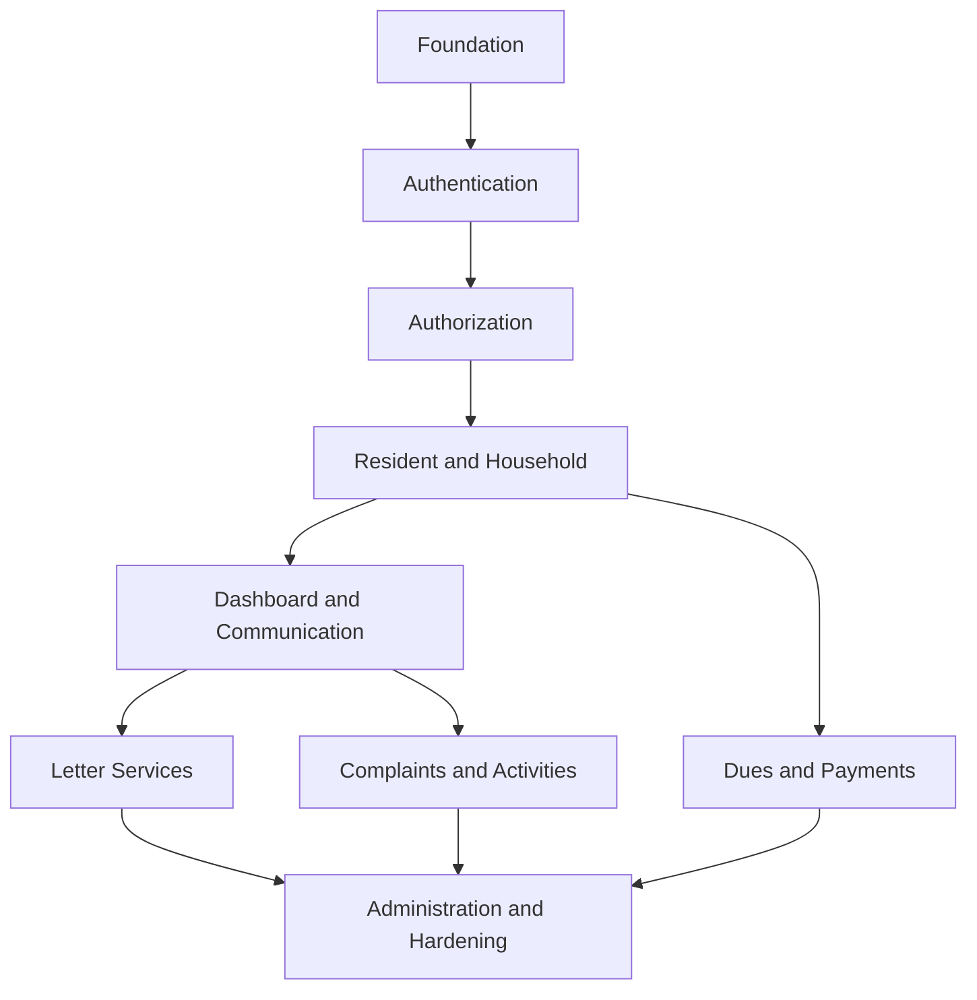

# WargaHub Sprint Planning and Delivery Plan

## 1. Document Control

- Document Title: WargaHub Sprint Planning and Delivery Plan
- Product Name: WargaHub
- Version: 0.1.0
- Status: Draft
- Owner: Product and Engineering Team
- Last Updated: 2026-07-18
- Related Documents:
  - [PROJECT_MANIFEST.md](../PROJECT_MANIFEST.md)
  - [.ai/AI_CONTEXT.md](../.ai/AI_CONTEXT.md)
  - [.ai/PROJECT_RULES.md](../.ai/PROJECT_RULES.md)
  - [.ai/SYSTEM_PROMPT.md](../.ai/SYSTEM_PROMPT.md)
  - [docs/01-VISION.md](01-VISION.md)
  - [docs/02-SRS.md](02-SRS.md)
  - [docs/03-PRODUCT-BACKLOG.md](03-PRODUCT-BACKLOG.md)
- Change History:
  - 2026-07-18: Initial sprint planning draft created from the backlog and SRS.

---

## 2. Purpose

Dokumen ini adalah rencana pengiriman Scrum untuk WargaHub. Tujuannya adalah menerjemahkan Product Backlog menjadi urutan pengembangan yang realistis untuk tim kecil, dengan fokus pada MVP yang dapat diuji, dipakai, dan dipelihara.

Dokumen ini digunakan untuk:

- mengubah backlog menjadi urutan Sprint yang masuk akal
- menjaga agar tim tetap fokus pada nilai pengguna dan batasan MVP
- memastikan dependency antar modul dipertimbangkan dengan baik
- memberi kerangka untuk Sprint Planning, review, dan retrospective

Dokumen ini bersifat dinamis. Setelah Sprint pertama berjalan, kapasitas aktual, prioritas, dan resiko akan memengaruhi Sprint berikutnya.

---

## 3. Scrum Delivery Principles

Pengembangan WargaHub akan mengikuti prinsip Scrum yang sederhana dan disiplin:

- Incremental delivery: setiap Sprint menghasilkan increment yang dapat dipahami dan diuji.
- Iterative development: fitur dibangun bertahap, bukan sekaligus dalam satu gelombang besar.
- Continuous feedback: hasil Sprint harus dievaluasi melalui review dan feedback pengguna atau pemangku kepentingan.
- Small and testable increments: setiap item harus cukup kecil untuk dipahami, dikembangkan, dan divalidasi dalam satu Sprint bila memungkinkan.
- Sustainable scope: tim tidak menambah scope secara berlebihan hanya karena momentum baik.
- Definition of Done: setiap item harus memenuhi kriteria kualitas sebelum dianggap selesai.
- Sprint Review: hasil kerja ditunjukkan dan dievaluasi secara terstruktur.
- Retrospective: tim merefleksikan apa yang berjalan baik dan apa yang perlu diperbaiki.
- Backlog refinement: item yang akan datang diperjelas sebelum masuk Sprint.

---

## 4. Planning Assumptions

Asumsi utama untuk perencanaan ini adalah:

- Tim pengembangan bersifat kecil dan fokus pada MVP yang dapat dikelola.
- Produk ini diperlakukan sebagai produk profesional dengan kualitas yang layak untuk portfolio atau pengembangan lanjutan.
- Sprint awal berlangsung selama 2 minggu secara konseptual.
- Story Points adalah estimasi relatif, bukan ukuran yang presisi.
- Kapasitas aktual dapat berubah berdasarkan beban operasional, kebutuhan desain, atau hambatan teknis.
- Scope dapat disesuaikan melalui backlog refinement dan Sprint Planning.
- Kualitas adalah bagian dari setiap Sprint, bukan sesuatu yang ditunda hingga akhir.
- Tidak ada asumsi bahwa seluruh backlog harus selesai sebelum MVP dianggap cukup.

Tidak ada penambahan anggota atau peran khusus yang tidak tercantum dalam dokumentasi proyek.

---

## 5. Sprint Structure

Sprint awal diperkirakan berlangsung selama 2 minggu dengan struktur berikut:

### Week 1
- Sprint Planning
- Development inti
- Testing awal
- Review progres harian
- Identifikasi blocker

### Week 2
- Development lanjutan
- Integrasi antar modul
- Testing dan penyesuaian
- Sprint Review
- Retrospective

Aktual hari kerja dapat bervariasi tergantung kalender, kebutuhan tim, dan prioritas organisasi. Yang terpenting adalah menjaga ritme kerja yang konsisten dan tidak terlalu menumpuk work-in-progress.

---

## 6. Definition of Ready

Sebuah backlog item dianggap siap untuk dipilih ke Sprint bila memenuhi kriteria berikut:

- memiliki tujuan yang jelas
- memiliki nilai pengguna atau bisnis yang jelas
- memiliki acceptance criteria yang cukup rinci
- memiliki traceability ke SRS atau dokumen terkait bila relevan
- dependency telah diidentifikasi
- ukuran item cukup masuk akal untuk satu Sprint
- tidak ada ambiguitas utama yang dapat mengganggu implementasi
- dapat diselesaikan dengan scope yang realistis dalam satu Sprint

Item yang belum siap harus melalui backlog refinement terlebih dahulu.

---

## 7. Definition of Done

Sebuah backlog item dianggap selesai bila:

- implementasi selesai sesuai persyaratan
- acceptance criteria terpenuhi
- pengujian relevan dilakukan
- validasi dilakukan secara memadai
- penanganan error telah dipertimbangkan
- aspek keamanan telah dipertimbangkan bila relevan
- perilaku responsif telah dipertimbangkan bila relevan
- dokumentasi yang diperlukan telah diperbarui
- review teknis atau code review dilakukan bila sesuai
- tidak ada critical defect yang belum ditangani
- perubahan berhasil terintegrasi dengan baik

Untuk fitur yang lebih besar, Definition of Done dapat diterapkan pada level increment dan bukan hanya level story tunggal.

---

## 8. Capacity and Velocity

Story Points adalah estimasi awal yang relatif. Tidak ada alasan untuk menganggap angka tersebut presisi.

Pada tahap awal, kecepatan tim belum diketahui dan akan terbentuk dari pengalaman Sprint pertama dan kedua. Karena itu:

- Sprint awal harus konservatif
- tidak boleh overcommit
- backlog harus dipilih secara bertahap berdasarkan kapasitas nyata
- velocity historis akan membantu memperbaiki perencanaan berikutnya

Kuncinya adalah membangun ritme yang realistis, bukan memaksakan target yang terlalu besar.

---

## 9. Release Strategy

Pengiriman WargaHub akan dipahami sebagai beberapa tahap berikut:

### Foundation
Tahap ini fokus pada fondasi teknis dan operasional agar fitur dapat dikembangkan dengan aman.

### MVP
Tahap ini memberikan nilai inti kepada pengguna: autentikasi, data warga, komunikasi sederhana, surat, iuran, pengaduan, dan administrasi dasar.

### Stabilization
Tahap ini fokus pada perbaikan kualitas, keamanan, usability, dan stabilitas sebelum penggunaan yang lebih luas.

### Expansion
Tahap ini mencakup fitur lanjutan dan ide yang saat ini diklasifikasikan sebagai FUTURE.

Tidak ada tanggal kalender yang ditetapkan secara khusus dalam dokumen ini. Rencana ini lebih menekankan urutan dan prioritas.

---

## 10. Sprint 0 — Foundation

### Sprint Goal
Mempersiapkan fondasi teknis dan kerja tim agar pengembangan fitur inti dapat berjalan dengan aman dan konsisten.

### Focus Areas
- repository foundation
- struktur workspace
- frontend foundation
- backend foundation
- shared packages foundation
- strategi konfigurasi
- strategi environment variable
- base UI shell
- alur development dasar
- baseline kualitas

### Candidate Backlog Items
- WB-PLATFORM-001
- WB-PLATFORM-002
- WB-PLATFORM-004

### Optional / Secondary Candidates
- WB-PLATFORM-003

### Dependencies
- Tidak ada dependency yang berat dari modul bisnis, tetapi hasil Sprint 0 akan menjadi fondasi untuk semua Sprint berikutnya.

### Expected Increment
- Proyek memiliki struktur dasar yang dapat digunakan untuk pengembangan fitur.
- Alur kerja pengembangan dan validasi dasar telah terbentuk.
- Baseline kualitas dan observability awal tersedia.

### Acceptance Conditions
- Struktur proyek dan workflow dasar tersedia.
- Validasi dan error handling dasar dapat diterapkan di area berikutnya.
- Logging dan kesiapan deployment dasar sudah dipersiapkan.
- Dokumentasi awal tersedia untuk tim.

### Risks
- Terlalu banyak scope pada Sprint 0 dapat menghambat pengembangan fitur inti.
- Fondasi yang terlalu sederhana dapat menimbulkan revisi di Sprint berikutnya.

---

## 11. Sprint 1 — Authentication and Access

### Sprint Goal
Pengguna dapat masuk dan mengakses WargaHub secara aman sesuai peran mereka.

### Focus
- login
- logout
- session/token handling
- role-based access
- unauthorized access handling
- authentication error handling

### Selected Product Backlog Items
- WB-AUTH-001
- WB-AUTH-002
- WB-AUTH-003
- WB-AUTH-004

### Also Consider
- WB-PROFILE-001

### Sprint Dependencies
- Bergantung pada hasil Sprint 0 untuk fondasi teknis, desain alur, dan setup baseline.

### Acceptance Criteria Summary
- Pengguna dapat login dengan kredensial valid.
- Pengguna dapat logout dengan aman.
- Akses dibatasi sesuai peran.
- Error autentikasi dan otorisasi ditangani dengan aman dan jelas.

### Expected Increment
- Fitur autentikasi dan akses dasar tersedia untuk pengguna yang berwenang.
- Alur akses aman dapat dipakai sebagai fondasi untuk modul berikutnya.

### Risks
- Kesalahan konfigurasi peran dapat menimbulkan celah akses.
- Implementasi awal terlalu sederhana dapat menghambat pengembangan modul berikutnya.

### Definition of Done Expectations
- Login/logout berjalan.
- Otorisasi peran diuji.
- Pesan error aman dan jelas.
- Tidak ada akses yang tersisa setelah logout.

---

## 12. Sprint 2 — Resident and Household Foundation

### Sprint Goal
Pengguna yang berwenang dapat mengelola data warga dan hubungan keluarga/rumah secara dasar.

### Focus
- resident list
- resident search
- resident filtering
- resident details
- create/update resident data
- family data
- household association
- residence association

### Selected Product Backlog Items
- WB-RESIDENT-001
- WB-RESIDENT-002
- WB-RESIDENT-003
- WB-FAMILY-001
- WB-FAMILY-002

### Dependencies
- Bergantung pada hasil Sprint 1 untuk otorisasi dan akses dasar.
- Data warga akan menjadi dasar untuk dashboard dan modul lain di Sprint berikutnya.

### Expected Increment
- Data warga dan relasi dasar tersedia dengan alur CRUD yang sederhana.
- Modul administrasi komunitas memiliki fondasi data yang penting.

### Risks
- Perubahan skema data dapat mengganggu rencana awal.
- Hubungan keluarga dan rumah dapat memerlukan klarifikasi domain lebih lanjut.

---

## 13. Sprint 3 — Dashboard and Communication

### Sprint Goal
Pengguna dapat melihat informasi yang relevan dan menerima komunikasi komunitas yang terstruktur.

### Focus
- role-based dashboard
- summary information
- recent activities
- announcements
- announcement visibility
- basic notification capability jika dependency memungkinkan

### Candidate Backlog Items
- WB-DASHBOARD-001
- WB-DASHBOARD-002
- WB-ANNOUNCEMENT-001
- WB-ANNOUNCEMENT-002
- WB-ANNOUNCEMENT-003
- WB-NOTIFICATION-001
- WB-NOTIFICATION-002

### Planning Note
Sprint ini tidak boleh terlalu padat. Bila diperlukan, pengumuman atau notifikasi dapat dipisahkan ke Sprint berikutnya agar scope tetap terkelola.

### Dependencies
- Bergantung pada data warga dan akses yang sudah ada dari Sprint 1 dan Sprint 2.

### Expected Increment
- Dashboard menampilkan informasi penting yang relevan bagi peran pengguna.
- Pengumuman dapat dibuat dan dilihat dengan visibilitas yang sesuai.

### Risks
- Jika scope terlalu besar, dashboard dan pengumuman dapat menjadi terlalu kompleks untuk satu Sprint.

---

## 14. Sprint 4 — Letter Services

### Sprint Goal
Warga dapat mengajukan surat dan pihak yang berwenang dapat memprosesnya.

### Focus
- letter catalog
- letter request
- supporting documents
- request status
- request history
- review
- approval
- rejection
- rejection reason

### Selected Product Backlog Items
- WB-LETTER-001
- WB-LETTER-002
- WB-LETTER-003

### Also Consider
- WB-LETTER-004

### End-to-End Flow
- Warga melihat jenis surat.
- Warga mengajukan permohonan surat.
- Pengajuan disimpan dan status awal diberikan.
- Pihak berwenang meninjau dan memutuskan persetujuan atau penolakan.

### Dependencies
- Bergantung pada autentikasi, otorisasi, dan upload dokumen pendukung yang relevan.
- Status lifecycle harus konsisten dengan SRS.

### Acceptance Conditions
- Pengajuan surat dapat dibuat.
- Status surat dapat dipantau.
- Review dan keputusan persetujuan/penolakan dapat dilakukan.
- Alasan penolakan dapat dicatat.

### Risks
- Workflow status yang terlalu rumit dapat memperlambat implementasi.
- Pengelolaan dokumen pendukung dapat menambah beban jika tidak dikendalikan.

---

## 15. Sprint 5 — Dues and Payments

### Sprint Goal
Komunitas dapat mencatat dan memantau iuran serta pembayaran.

### Focus
- dues category
- billing
- payment record
- payment status
- payment history
- financial summary

### Selected Product Backlog Items
- WB-DUES-001
- WB-DUES-002
- WB-DUES-003

### Special Attention
- akurasi data
- auditability
- authorization
- privacy

### Dependencies
- Bergantung pada data warga dan otorisasi yang sudah ada.
- Harus dipertimbangkan bahwa modul keuangan memiliki tingkat sensitivitas lebih tinggi.

### Risks
- Kesalahan pencatatan dapat berdampak pada kepercayaan pengguna.
- Scope finansial dapat berkembang jika kebutuhan pelaporan terlalu luas.

---

## 16. Sprint 6 — Complaints and Activities

### Sprint Goal
Komunitas dapat mengelola pengaduan dan aktivitas lingkungan secara dasar.

### Focus
- submit complaint
- review complaint
- respond
- track status
- resolve
- close
- create activity
- publish activity
- view activity
- participation where applicable

### Selected Product Backlog Items
- WB-COMPLAINT-001
- WB-COMPLAINT-002
- WB-COMPLAINT-003
- WB-ACTIVITY-001
- WB-ACTIVITY-002

### Dependencies
- Bergantung pada autentikasi, akses dasar, dan data lingkungan yang sudah ada.

### Risks
- Jika alur pengaduan dan kegiatan terlalu kompleks, sprint dapat menjadi terlalu padat.

---

## 17. Sprint 7 — Administration and MVP Hardening

### Sprint Goal
MVP menjadi siap secara operasional untuk rilis terkontrol.

### Focus
- user management
- role management
- basic configuration
- audit activity
- security hardening
- validation
- error handling
- logging
- testing
- documentation
- deployment readiness

### Candidate Backlog Items
- WB-ADMIN-001
- WB-ADMIN-002
- WB-AUDIT-001
- WB-AUDIT-002
- backlog platform yang tersisa

### Planning Note
Sprint ini tidak boleh diperlakukan sebagai tempat untuk menampung semua backlog yang belum selesai. Hardening harus terjadi secara terus-menerus selama pengembangan, bukan hanya pada akhir.

### Dependencies
- Bergantung pada fitur inti yang sudah ada dan pada fondasi kualitas yang dibangun sejak Sprint 0.

### Risks
- Menunda hardening terlalu lama dapat menambah resiko pada rilis MVP.

---

## 18. Sprint Dependency Map

Beberapa pekerjaan dapat berjalan secara paralel bila aman, misalnya pengembangan platform quality dan pengujian dasar dapat berjalan bersamaan dengan fitur bisnis di Sprint yang sama.

---

## 19. Sprint Goal Summary Table

| Sprint | Theme | Goal | Primary Value |
|---|---|---|---|
| Sprint 0 | Foundation | Menyiapkan fondasi teknis dan operasional | Pengembangan fitur inti menjadi lebih aman dan konsisten |
| Sprint 1 | Authentication and Access | Pengguna dapat masuk dan mengakses sesuai peran | Keamanan dan akses yang benar |
| Sprint 2 | Resident and Household | Data warga dan keluarga dapat dikelola secara dasar | Fondasi administrasi komunitas |
| Sprint 3 | Dashboard and Communication | Pengguna melihat informasi penting dan pengumuman | Transparansi dan informasi yang lebih baik |
| Sprint 4 | Letter Services | Surat dapat diajukan dan diproses | Nilai layanan administratif yang nyata |
| Sprint 5 | Dues and Payments | Iuran dan pembayaran dapat dicatat dan dipantau | Transparansi keuangan |
| Sprint 6 | Complaints and Activities | Pengaduan dan kegiatan dapat dikelola | Operasional komunitas yang lebih terdokumentasi |
| Sprint 7 | Administration and Hardening | MVP siap untuk rilis terkontrol | Stabilitas, keamanan, dan kesiapan operasional |

---

## 20. Sprint Backlog Selection Rules

Aturan seleksi backlog untuk Sprint:

- Pilih hanya item yang sudah siap.
- Hormati dependency.
- Jangan overcommit.
- Prioritaskan nilai bisnis dan resiko.
- Sertakan work teknis saat diperlukan.
- Sertakan testing sebagai bagian dari Sprint.
- Jangan memindahkan work yang belum selesai secara diam-diam; lakukan transparansi terhadap status.

---

## 21. Daily Development Workflow

Workflow kerja harian yang praktis untuk tim kecil:

1. Review Sprint Goal.
2. Pilih task yang akan dikerjakan.
3. Baca dokumentasi yang relevan.
4. Inspeksi code atau struktur yang ada.
5. Implementasikan perubahan yang diperlukan.
6. Lakukan validasi.
7. Jalankan testing yang relevan.
8. Perbarui status task.
9. Laporkan blocker atau kebutuhan klarifikasi.

---

## 22. Sprint Review

Sprint Review dilakukan untuk:

- menunjukkan increment yang dihasilkan
- membandingkan hasil terhadap Sprint Goal
- meninjau acceptance criteria
- menangkap feedback
- mengidentifikasi perubahan backlog yang diperlukan

---

## 23. Sprint Retrospective

Retrospective fokus pada:

- apa yang berjalan baik
- apa yang tidak berjalan baik
- apa yang perlu diubah
- satu atau lebih tindakan perbaikan yang konkret

---

## 24. Backlog Refinement

Refinement dilakukan secara berkala untuk:

- memperjelas item mendatang
- memecah item yang terlalu besar
- memperbarui estimasi
- mengidentifikasi dependency
- memperbarui acceptance criteria
- memprioritaskan ulang bila perlu

---

## 25. Risk Management

| Risk | Impact | Probability | Mitigation |
|---|---|---|---|
| Scope creep | Mengurangi fokus MVP | Medium | Tetapkan batas scope secara jelas dan lakukan refinement berkala |
| Overcommitment | Sprint tidak selesai tepat waktu | Medium | Pilih backlog yang realistis dan sesuaikan dengan velocity |
| Technical uncertainty | Delay atau revisi desain | Medium | Simpan riset teknis di Sprint awal dan pecah item yang kompleks |
| Data model changes | Mengganggu beberapa modul | Medium | Klarifikasi domain data sebelum implementasi besar |
| Security issues | Risiko keamanan dan reputasi | Medium | Sertakan security review pada fitur sensitif dan hardening berkelanjutan |
| Low adoption | Nilai produk tidak maksimal | Medium | Fokus pada usability sederhana dan alur inti yang jelas |
| Poor data quality | Menurunkan kualitas operasional | Medium | Terapkan validasi dan pengelolaan data sejak awal |
| Dependency delays | Menghambat Sprint berikutnya | Medium | Identifikasi dependency sejak refinement dan siapkan prioritas alternatif |
| Incomplete testing | Bug dan regresi meningkat | Medium | Sertakan testing pada setiap increment dan bukan hanya akhir Sprint |

---

## 26. Release Readiness

MVP dapat dianggap siap untuk rilis terkontrol bila:

- alur kritis berjalan dengan baik
- autentikasi dan otorisasi handal
- data sensitif dilindungi dengan memadai
- workflow inti telah diuji
- tidak ada critical defect yang belum diselesaikan
- logging dan monitoring dasar tersedia
- dokumentasi diperbarui
- proses deployment dasar dapat diulang

---

## 27. MVP Exit Criteria

MVP WargaHub dapat dianggap selesai bila:

- fitur inti yang diprioritaskan di backlog tersedia dan terintegrasi
- pengguna dapat menjalankan alur utama seperti login, data warga, pengumuman, surat, iuran, pengaduan, dan administrasi dasar
- otorisasi peran dan keamanan dasar terbukti bekerja
- kualitas dasar dan testing cukup untuk mendukung release terkontrol
- backlog future tetap terpisah dan tidak menjadi bagian dari MVP yang sedang diselesaikan

Kriteria ini sejalan dengan [docs/02-SRS.md](02-SRS.md) dan [docs/03-PRODUCT-BACKLOG.md](03-PRODUCT-BACKLOG.md).

---

## 28. Future Planning

Item FUTURE tetap berada di Product Backlog dan tidak menjadi bagian dari MVP kecuali ada keputusan baru untuk memprioritaskannya.

Item FUTURE akan:

- tetap dipertahankan di backlog
- dipelajari saat mendekati implementasi potensial
- dievaluasi ulang terhadap visi produk
- tidak mengganggu fokus MVP saat ini

---

## 29. Sprint Change Log

- 2026-07-18: Initial sprint planning draft created from the backlog and SRS.
- 2026-07-18: Sprint sequence structured around MVP dependency order.
- 2026-07-18: Future backlog items explicitly excluded from MVP delivery commitments.
