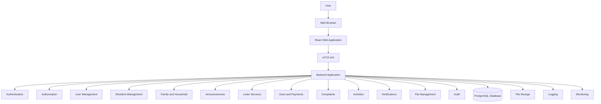
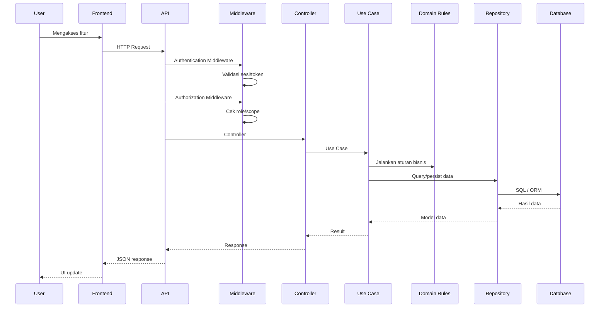
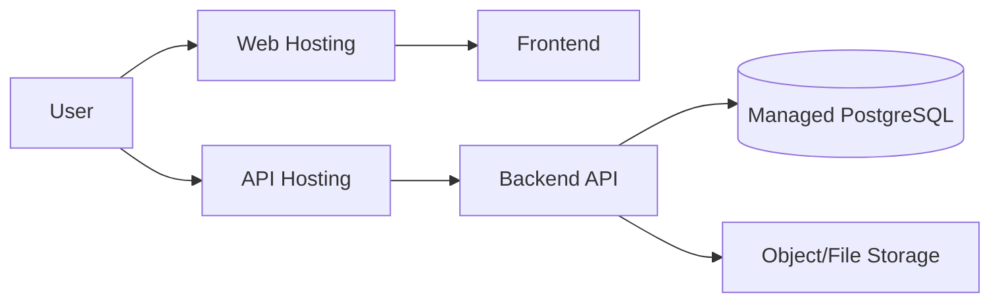
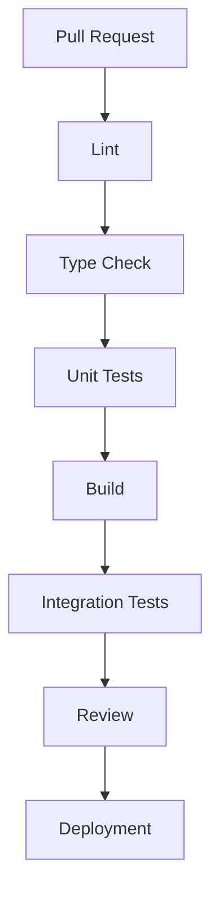
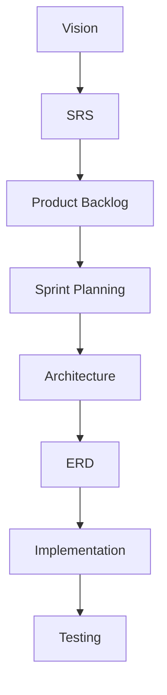

# WargaHub Software Architecture Document

## 1. Document Control

- Document Title: WargaHub Software Architecture Document
- Product Name: WargaHub
- Version: 0.1.0
- Status: Draft
- Owner: Product and Engineering Team
- Last Updated: 2026-07-18
- Related Documents:
  - [PROJECT_MANIFEST.md](../PROJECT_MANIFEST.md)
  - [.ai/AI_CONTEXT.md](../.ai/AI_CONTEXT.md)
  - [.ai/PROJECT_RULES.md](../.ai/PROJECT_RULES.md)
  - [.ai/SYSTEM_PROMPT.md](../.ai/SYSTEM_PROMPT.md)
  - [docs/01-VISION.md](01-VISION.md)
  - [docs/02-SRS.md](02-SRS.md)
  - [docs/03-PRODUCT-BACKLOG.md](03-PRODUCT-BACKLOG.md)
  - [docs/04-SPRINT-PLANNING.md](04-SPRINT-PLANNING.md)
- Change History:
  - 2026-07-18: Initial architecture draft created based on manifest, SRS, backlog, and sprint planning.

---

## 2. Architecture Purpose

Dokumen ini menjelaskan arsitektur perangkat lunak WargaHub untuk fase MVP. Tujuannya adalah memastikan bahwa sistem dibangun dengan pendekatan yang:

- praktis
- mudah dipahami
- mudah dipelihara
- cukup scalable untuk MVP
- sesuai untuk portfolio profesional
- cocok untuk tim kecil
- konsisten dengan struktur repository yang sudah ada

Dokumen ini mendefinisikan keputusan arsitektural utama yang akan menjadi acuan pengembangan, pengujian, deployment, dan evolusi berikutnya.

Hubungan dokumen ini dengan dokumen lain:

- [docs/01-VISION.md](01-VISION.md): memberi arah bisnis dan nilai produk
- [docs/02-SRS.md](02-SRS.md): menjelaskan kebutuhan fungsional dan non-fungsional
- [docs/03-PRODUCT-BACKLOG.md](03-PRODUCT-BACKLOG.md): mengubah kebutuhan menjadi item kerja terprioritas
- [docs/04-SPRINT-PLANNING.md](04-SPRINT-PLANNING.md): mengurutkan backlog menjadi sprint yang realistis

Keputusan arsitektur yang muncul selama pengembangan selanjutnya harus didokumentasikan secara terpisah, terutama jika memengaruhi batasan MVP atau memerlukan perubahan desain yang signifikan.

---

## 3. Architecture Principles

Arsitektur WargaHub mengikuti prinsip berikut:

1. Simplicity first
   - Solusi harus sederhana dan langsung dipahami.
   - Hindari kompleksitas teknis yang tidak memberi nilai nyata untuk MVP.

2. Modular monolith untuk MVP
   - MVP dibangun sebagai modular monolith, bukan sistem terdistribusi.
   - Fitur dipisahkan secara konseptual dalam modul yang jelas.

3. Clear separation of concerns
   - Frontend bertanggung jawab atas presentasi dan interaksi.
   - Backend bertanggung jawab atas logika bisnis, otorisasi, validasi, dan data.
   - Database bertanggung jawab atas persistensi dan integritas data.

4. Secure by default
   - Akses harus dibatasi secara default.
   - Data sensitif tidak boleh diperlakukan sebagai data publik.

5. Least privilege
   - Setiap peran hanya mendapat hak akses yang diperlukan untuk tugasnya.

6. API-first backend boundary
   - Frontend berkomunikasi dengan backend melalui API yang jelas.
   - Backend tidak boleh bergantung pada UI secara langsung.

7. Reusable shared packages
   - Shared packages dipakai untuk jenis, komponen UI, dan konfigurasi agar konsistensi terjaga.

8. Strong typing where practical
   - TypeScript dipakai secara luas untuk mengurangi bug dan meningkatkan pemeliharaan.

9. Validation at boundaries
   - Validasi dilakukan di frontend untuk UX dan di backend untuk keamanan dan integritas.

10. Testability
   - Arsitektur harus memudahkan pengujian unit, integrasi, API, dan UI.

11. Observability
   - Sistem harus menyediakan log, error tracking, dan kesehatan aplikasi yang cukup untuk mendukung operasional awal.

12. Responsive user experience
   - Antarmuka harus tetap nyaman dipakai di desktop, tablet, dan mobile.

13. Accessibility
   - Aksesibilitas merupakan bagian dari desain dan implementasi, bukan bonus.

14. Avoid premature optimization
   - Optimasi hanya dilakukan bila ada bukti kebutuhan nyata.

15. Avoid unnecessary microservices
   - Tidak ada mikroservice untuk MVP kecuali kebutuhan nyata dan terverifikasi muncul.

---

## 4. Architecture Overview

Secara konseptual, WargaHub MVP terdiri dari tiga lapisan utama:

- Web Client sebagai antarmuka pengguna
- Backend API sebagai pusat logika bisnis
- Relational Database sebagai sumber data utama

Diagram arsitektur secara umum:



Komponen pendukung opsional:

- File Storage: untuk dokumen pendukung surat, bukti pembayaran, atau lampiran pengaduan.
- Logging: untuk error, request, dan aktivitas penting.
- Monitoring: untuk health check, error rate, dan performa dasar.
- Cache: hanya jika ada kebutuhan nyata di kemudian hari; tidak diprioritaskan di MVP.
- Background jobs: hanya untuk pekerjaan yang memang perlu dijalankan secara asinkron, misalnya notifikasi internal atau pembersihan file temporer; tidak perlu menjadi arsitektur utama.

Arsitektur ini dipilih karena sederhana, kuat, dan sesuai dengan MVP yang terbatas namun penting.

---

## 5. Architectural Style

### 5.1 Gaya Arsitektur MVP

Arsitektur MVP WargaHub adalah:

- Modular Monolith
- Web Client
- Relational Database

Ini berarti aplikasi backend dibangun sebagai satu unit deployable yang terorganisasi dalam modul-modul yang jelas. Fitur-fitur utama seperti auth, residents, letters, dues, complaints, dan audit ditempatkan sebagai modul yang terpisah secara konseptual, tetapi tetap berjalan dalam satu aplikasi backend.

### 5.2 Web Client

Frontend bertanggung jawab atas:

- presentasi antarmuka
- interaksi pengguna
- state UI dan lokal
- validasi sisi klien untuk pengalaman pengguna
- komunikasi dengan backend melalui HTTP API

Tujuan frontend adalah menyediakan antarmuka yang cepat, jelas, dan dapat digunakan oleh pengguna dengan berbagai tingkat kenyamanan teknologi.

### 5.3 Backend API

Backend bertanggung jawab atas:

- autentikasi
- otorisasi
- validasi server-side
- aturan bisnis
- akses data
- audit
- kontrol akses file
- integritas data

Backend harus menjadi satu-satunya lapisan yang benar-benar memahami aturan bisnis utama dan batasan akses.

### 5.4 Database

Database bertanggung jawab atas:

- data relasional yang tahan lama
- integritas referensial
- transaksi
- constraint
- indeks dan query yang efisien

PostgreSQL dipilih karena cocok untuk kebutuhan relasional seperti data warga, hubungan keluarga, surat, keuangan, dan audit.

### 5.5 Mengapa ini sesuai untuk WargaHub MVP

Pendekatan modular monolith cocok karena:

- tim kecil dapat mengelola lebih mudah
- deployment lebih sederhana
- debugging lebih mudah
- perubahan antar modul relatif lebih terkontrol
- tidak perlu biaya arsitektural yang besar untuk MVP
- memudahkan portofolio karena arsitektur terlihat jelas dan realistis

---

## 6. Repository Architecture

Repositori WargaHub saat ini memiliki struktur yang konsisten dengan arsitektur yang disarankan.

```text
WargaHub/
├── .ai/
├── .github/
├── apps/
│   ├── api/
│   └── web/
├── docker/
├── docs/
├── packages/
│   ├── config/
│   ├── types/
│   └── ui/
└── scripts/
```

### 6.1 .ai/

Responsibility:
- menyimpan konteks AI, aturan proyek, dan instruksi operasional

Yang boleh ada di sini:
- dokumen kebijakan AI
- instruksi pengembangan
- context proyek

Yang tidak boleh ada di sini:
- kode aplikasi produksi
- konfigurasi runtime sensitif

### 6.2 .github/

Responsibility:
- workflow CI/CD, konfigurasi automation, dan standar kualitas repositori

Yang boleh ada di sini:
- workflow linting, testing, build
- templates pull request atau issue

Yang tidak boleh ada di sini:
- log aplikasi
- data sensitif

### 6.3 apps/api/

Responsibility:
- aplikasi backend utama

Yang boleh ada di sini:
- router, controller, service, validation, persistence, module bisnis
- konfigurasi server dan environment

Yang tidak boleh ada di sini:
- UI komponen presentasi
- kode frontend yang dipakai langsung oleh browser

### 6.4 apps/web/

Responsibility:
- aplikasi frontend utama

Yang boleh ada di sini:
- page, layout, feature module, form, hook, service komunikasi API
- komponen UI yang spesifik untuk web

Yang tidak boleh ada di sini:
- logika bisnis yang kompleks yang seharusnya dipindahkan ke backend
- kode akses data langsung ke database

### 6.5 docker/

Responsibility:
- konfigurasi container untuk pengembangan, testing, dan deployment

Yang boleh ada di sini:
- Dockerfile, docker-compose, konfigurasi container terkait

Yang tidak boleh ada di sini:
- kode aplikasi bisnis
- secrets yang tidak dienkripsi

### 6.6 docs/

Responsibility:
- dokumentasi produk, arsitektur, kebutuhan, backlog, dan perencanaan

Yang boleh ada di sini:
- SRS, vision, backlog, architecture, ERD, API contract, ADR

Yang tidak boleh ada di sini:
- implementasi kode aplikasi
- konfigurasi runtime yang aktif

### 6.7 packages/config/

Responsibility:
- konfigurasi linting, formatter, TypeScript, dan standar build

Yang boleh ada di sini:
- tsconfig, lint rules, shared config

Yang tidak boleh ada di sini:
- secrets
- kode aplikasi bisnis

### 6.8 packages/types/

Responsibility:
- shared type dan contract domain

Yang boleh ada di sini:
- interface, type alias, enums, DTO types, shared domain primitives

Yang tidak boleh ada di sini:
- implementasi database
- logika UI
- kode backend spesifik

### 6.9 packages/ui/

Responsibility:
- shared UI primitives dan desain sistem

Yang boleh ada di sini:
- button, input, card, dialog, layout primitives

Yang tidak boleh ada di sini:
- integrasi API bisnis
- state yang mengandung aturan domain tertentu

### 6.10 scripts/

Responsibility:
- utility automation untuk pengembangan atau validasi

Yang boleh ada di sini:
- script setup, helper, validation, migration bootstrap

Yang tidak boleh ada di sini:
- file konfigurasi aplikasi yang seharusnya berada di app atau config

---

## 7. Frontend Architecture

Frontend WargaHub akan dibangun menggunakan React dan TypeScript dengan pendekatan feature-oriented.

### 7.1 Tujuan Arsitektur Frontend

Frontend harus mampu:

- menampilkan data dengan jelas
- menangani form dengan baik
- memproteksi route berdasarkan peran
- menampilkan loading, empty, error, dan success state
- berkomunikasi dengan backend melalui API
- mematuhi prinsip aksesibilitas
- tetap sederhana untuk tim kecil

### 7.2 Struktur Logis yang Disarankan

```text
apps/web/
├── src/
│   ├── app/
│   ├── routes/
│   ├── layouts/
│   ├── features/
│   │   ├── auth/
│   │   ├── dashboard/
│   │   ├── residents/
│   │   ├── families/
│   │   ├── announcements/
│   │   ├── letters/
│   │   ├── dues/
│   │   ├── complaints/
│   │   ├── activities/
│   │   └── administration/
│   ├── components/
│   ├── lib/
│   ├── hooks/
│   ├── services/
│   ├── stores/
│   ├── styles/
│   └── main entry point
```

### 7.3 Prinsip Organisasi Frontend

- features/ dipakai untuk fitur bisnis utama
- components/ dipakai untuk komponen reusable yang tidak terkait fitur tertentu
- services/ untuk komunikasi API dan adapter data
- hooks/ untuk logika UI yang dapat dipakai kembali
- stores/ dipakai untuk state global yang benar-benar diperlukan
- routes/ untuk definisi navigasi dan proteksi rute
- layouts/ untuk layout shell aplikasi
- styles/ untuk tema, utilities, dan style global

### 7.4 Fitur Frontend yang Diperlukan di MVP

- routing utama untuk login, dashboard, residents, announcements, letters, dues, complaints, administration
- route protection berdasarkan role dan scope
- form state, validation, dan error feedback
- loading, empty, error, dan success UI
- responsive layout
- accessibility baseline

### 7.5 Catatan Implementasi

Struktur ini bersifat logis. Detail implementasi dapat disesuaikan saat pengembangan dimulai. Yang penting adalah mempertahankan pemisahan fitur dan konsistensi struktur.

---

## 8. Backend Architecture

Backend WargaHub akan dibangun sebagai modular monolith dengan modul yang jelas untuk setiap domain bisnis.

### 8.1 Struktur Logis Backend yang Disarankan

```text
apps/api/
├── src/
│   ├── app/
│   ├── config/
│   ├── modules/
│   │   ├── auth/
│   │   ├── users/
│   │   ├── residents/
│   │   ├── families/
│   │   ├── households/
│   │   ├── announcements/
│   │   ├── letters/
│   │   ├── dues/
│   │   ├── payments/
│   │   ├── complaints/
│   │   ├── activities/
│   │   ├── notifications/
│   │   ├── files/
│   │   ├── audit/
│   │   └── administration/
│   ├── database/
│   ├── middleware/
│   ├── common/
│   └── main entry point
```

### 8.2 Pemisahan Layer pada Setiap Modul

Setiap modul domain sebaiknya dibagi menjadi beberapa lapisan:

- Controller / Route layer
  - menerima request HTTP
  - memanggil use case atau service
  - mengembalikan response yang konsisten

- Application / Use Case layer
  - mengatur alur bisnis utama
  - menggabungkan domain logic dan repository

- Domain / Business Rule layer
  - berisi aturan bisnis inti
  - memegang logika yang tidak boleh tersebar di controller

- Repository / Persistence layer
  - mengakses database
  - mengimplementasikan operasi CRUD atau query kompleks

- Validation / DTO layer
  - memvalidasi input request
  - memetakan data request ke model domain

Pemisahan ini tetap sederhana karena WargaHub tidak memerlukan kompleksitas DDD yang terlalu berat. Fokusnya adalah menjaga kode mudah dipahami dan tidak terlalu saling terkait.

### 8.3 Prinsip Backend MVP

- Satu aplikasi backend untuk semua modul inti
- Modul dipisah berdasarkan domain bisnis, bukan hanya berdasarkan teknologi
- Tidak ada service terpisah untuk setiap fitur kecil
- Semua aturan akses dan scope dipaksa di backend
- Repository dan use case dibuat dengan pola yang konsisten

---

## 9. Shared Packages

### 9.1 packages/types

Purpose:
- shared TypeScript types
- enums
- shared domain primitives
- API contract types bila diperlukan

Rules:
- tidak boleh berisi implementasi database
- tidak boleh berisi UI logic
- tidak boleh berisi kode backend yang sangat spesifik

### 9.2 packages/ui

Purpose:
- reusable UI components
- design system primitives
- pola aksesibilitas

Rules:
- harus tetap presentation-focused
- tidak boleh berisi business-specific API calls
- tidak boleh mengandung aturan domain yang sangat spesifik

### 9.3 packages/config

Purpose:
- shared linting, formatting, dan TypeScript config
- konfigurasi development yang sama antar aplikasi

Rules:
- tidak boleh berisi secrets
- tidak boleh berisi konfigurasi bisnis sensitif

---

## 10. Domain Module Map

| Module | Responsibility | Primary Users | Core Data |
|---|---|---|---|
| Auth | Login, logout, session, role-based access | Semua pengguna | user credentials, session, roles |
| Users | Profil pengguna dan manajemen akun dasar | Semua pengguna, Admin | user profile, account metadata |
| Residents | Data warga, detail, pencarian, status | RT, RW, Admin | resident, household, status |
| Families | Hubungan keluarga dan relasi administratif | RT, RW, Admin | family, household members |
| Households | Data rumah dan asosiasi administratif | RT, RW, Admin | household, address, ownership |
| Announcements | Pengumuman lingkungan | Warga, RT, RW, Admin | announcement, visibility, schedule |
| Letters | Pengajuan surat dan workflow persetujuan | Warga, RT, RW, Admin | letter request, status, reviewer |
| Dues | Iuran, tagihan, pembayaran, riwayat | Bendahara, RT, Warga | dues, invoice, payment |
| Payments | Pencatatan dan pelacakan pembayaran | Bendahara, Warga | payment record, amount, status |
| Complaints | Pengaduan dan penanganan | Warga, RT, RW, Admin | complaint, category, status |
| Activities | Dokumentasi kegiatan lingkungan | RT, RW, Admin | activity, organizer, date |
| Notifications | Notifikasi internal yang relevan | Semua pengguna | notification, recipient, status |
| Files | Dokumen pendukung dan lampiran | Semua modul terkait | file metadata, ownership |
| Audit | Pelacakan perubahan penting | Admin, operator | actor, action, entity, timestamp |
| Administration | Pengelolaan pengguna, peran, pengaturan sistem dasar | Admin | roles, config, users |

---

## 11. Request Flow

Alur request yang umum pada WargaHub adalah sebagai berikut:



Penjelasan lapisan:

- Validasi terjadi di boundary request: frontend untuk pengalaman pengguna dan backend untuk keamanan.
- Authorization terjadi pada middleware atau guard sebelum proses bisnis yang sensitif.
- Business rules dijalankan di use case atau domain service.
- Audit events dapat dicatat setelah operasi berhasil atau setelah operasi gagal yang penting.

---

## 12. Authentication and Authorization Architecture

### 12.1 Authentication Boundary

Authentication bertanggung jawab untuk menjawab pertanyaan:

- Siapa pengguna ini?

Pada arsitektur MVP, autentikasi dilakukan melalui backend API menggunakan mekanisme session atau token berbasis standar yang aman. Detail implementasi teknis dapat disesuaikan saat implementasi dimulai, tetapi arsitektur harus memastikan:

- password tidak disimpan dalam bentuk plaintext
- password hash menggunakan algoritma yang aman
- sesi atau token memiliki masa berlaku yang jelas
- logout mengakhiri sesi dengan benar

### 12.2 Session atau Token Strategy

Untuk MVP, pendekatan yang disarankan adalah:

- backend mengelola sesi otentikasi secara terpusat
- frontend menyimpan credential dalam bentuk aman sesuai framework yang dipakai
- semua request yang memerlukan akses dilindungi middleware otorisasi

Alternatif token berbasis JWT dapat dipakai jika memang sesuai dengan implementasi yang dipilih, tetapi arsitektur harus tetap menjaga kontrol session dan refresh yang jelas.

### 12.3 Password Handling

- Password tidak pernah dikembalikan ke client.
- Password disimpan menggunakan hashing yang aman.
- Kebijakan password minimum dapat diterapkan sesuai kebutuhan.

### 12.4 Role-Based Access Control

Sistem menjaga model peran berikut:

- WARGA
- PENGURUS_RT
- PENGURUS_RW
- BENDAHARA
- ADMIN

Peran-peran ini memengaruhi apa yang bisa dilihat, dibuat, diubah, atau dihapus pengguna.

### 12.5 Authorization Strategy

Authorization bertanggung jawab untuk menjawab pertanyaan:

- Apa yang boleh dilakukan pengguna ini?

Authorization dipisahkan dari autentikasi. Setelah pengguna teridentifikasi, middleware atau guard akan memeriksa:

- role pengguna
- scope wilayah/organisasi yang relevan
- hak akses untuk fitur tertentu

### 12.6 Scope-Based Access

Scope bertanggung jawab untuk menjawab pertanyaan:

- Data wilayah mana yang boleh diakses?

Ini penting untuk WargaHub karena data lingkungan bersifat terbatas pada cakupan RT/RW tertentu.

Hubungan peran secara konseptual:

- WARGA: melihat data dirinya dan konteks yang relevan
- PENGURUS_RT: mengelola data dalam cakupan RT yang ditugaskan
- PENGURUS_RW: melihat data lintas RT sesuai cakupan RW dan otoritas
- BENDAHARA: mengakses data keuangan dalam cakupan yang sesuai
- ADMIN: mengelola sistem sesuai kebijakan administrasi

### 12.7 Unauthorized and Failure Handling

- request tanpa autentikasi ditolak dengan response yang aman
- request dengan akses tidak sah ditolak dengan status yang sesuai
- session kadaluarsa ditangani dengan redirect atau response error yang jelas
- logout harus memastikan sesi dinonaktifkan dengan benar

---

## 13. Data Access and Scope Architecture

Arsitektur scope sangat penting untuk WargaHub karena data komunitas tidak boleh diakses secara bebas.

### 13.1 Konsep Scope

Setiap operasi data harus dinilai berdasarkan:

- role pengguna
- scope wilayah atau organisasi
- hubungan entitas dengan pengguna

### 13.2 Peran dan Scope

- WARGA:
  - melihat profil sendiri
  - melihat konteks keluarga sendiri bila diizinkan
  - melihat surat yang dibuatnya
  - melihat pembayaran yang terkait dengannya
  - melihat pengaduan yang dibuatnya

- PENGURUS_RT:
  - melihat dan mengelola data dalam cakupan RT yang ditugaskan
  - memproses surat yang relevan
  - mengelola pengaduan RT yang relevan
  - melihat iuran yang terkait dengan cakupan RT tersebut

- PENGURUS_RW:
  - melihat data agregat dan ringkasan lintas RT sesuai cakupan RW
  - memantau situasi administratif pada wilayah yang berwenang

- BENDAHARA:
  - melihat data keuangan dalam cakupan yang ditugaskan
  - mengelola tagihan dan pembayaran yang relevan

- ADMIN:
  - melihat atau mengelola data sesuai kebijakan administratif sistem

### 13.3 Prinsip Enforcemen Scope

Scope harus diterapkan di backend. Frontend hanya boleh menampilkan data yang sudah diizinkan; frontend tidak boleh menjadi satu-satunya mekanisme filter.

Prinsip penting:

- backend harus selalu memeriksa hak akses
- query data harus dibatasi berdasarkan scope
- data sensitif tidak boleh muncul dalam response yang tidak sah

---

## 14. API Architecture

API WargaHub akan diposisikan sebagai boundary antara frontend dan backend.

### 14.1 Prinsip API

- API harus versioned, misalnya /api/v1/
- resource-oriented endpoints
- response format konsisten
- error format konsisten
- pagination untuk daftar data
- filtering dan sorting bila relevan
- authentication dan authorization di semua endpoint yang membutuhkan akses
- validation di boundary
- idempotency diterapkan bila cocok untuk operasi tertentu

### 14.2 Struktur Endpoint Konseptual

Contoh konsep endpoint:

- GET /api/v1/residents
- GET /api/v1/residents/:id
- POST /api/v1/residents
- PATCH /api/v1/residents/:id

- GET /api/v1/letters
- POST /api/v1/letters
- PATCH /api/v1/letters/:id

- GET /api/v1/dues
- POST /api/v1/dues
- GET /api/v1/payments

Detail spesifikasi API akan dibahas di dokumen kontrak API yang terpisah. Dokumen ini hanya menetapkan prinsip arsitektural.

### 14.3 Format Response

Response yang baik harus konsisten untuk sukses dan error, misalnya:

- data atau entity
- metadata pagination bila diperlukan
- pesan ringkas untuk status
- error code yang konsisten

---

## 15. Error Handling Architecture

Error handling harus konsisten di seluruh aplikasi.

### 15.1 Jenis Error

- Validation errors: input tidak valid atau data tidak lengkap
- Authentication errors: kredensial tidak valid atau sesi tidak sah
- Authorization errors: pengguna tidak punya hak akses
- Not found errors: resource tidak ditemukan
- Conflict errors: data bentrok dengan aturan bisnis atau constraint database
- Business rule errors: aturan bisnis dilanggar
- Unexpected errors: bug atau kondisi tak terduga

### 15.2 Prinsip Error Handling

- pesan client-safe hanya yang aman untuk ditampilkan
- detail internal tidak boleh terekspos ke frontend
- error harus dicatat secara aman di log server
- request identifier dapat dipakai untuk trace
- error response harus konsisten

### 15.3 Logging Error

Error log harus mencatat informasi yang berguna, namun tidak mengandung:

- password
- token
- credential sensitif
- data pribadi yang tidak perlu

---

## 16. File and Document Architecture

Dokumen dan file pendukung perlu dikelola secara aman dan terstruktur.

### 16.1 Prinsip File Handling

- file memiliki metadata seperti nama, tipe, ukuran, owner, terkait entity, timestamp
- file terkait dengan entitas bisnis tertentu, misalnya surat, pengaduan, atau pembayaran
- akses file harus diatur berdasarkan otorisasi bisnis dan scope
- file tidak boleh diproses langsung dari lokasi yang tidak aman
- storage implementation harus dapat diganti nanti

### 16.2 Kebutuhan MVP

MVP cukup mengakomodasi:

- upload dokumen pendukung
- penyimpanan file yang terhubung dengan record bisnis
- retrieval yang aman
- pemisahan antara metadata dan storage

### 16.3 Storage Abstraction

Arsitektur harus memungkinkan pergantian storage ke layanan object storage di masa depan tanpa mengubah aturan bisnis utama. Dengan kata lain, modul file harus berinteraksi melalui abstraction layer, bukan langsung ke implementasi storage tertentu.

---

## 17. Audit Architecture

Audit adalah bagian penting dari sistem ini karena melibatkan data administrasi, keuangan, dan proses layanan.

### 17.1 Aksi yang Harus Di-audit

- events autentikasi
- perubahan data pengguna
- perubahan data warga
- perubahan status surat
- perubahan data keuangan
- perubahan status pengaduan
- perubahan administrasi sistem

### 17.2 Informasi Minimum Audit

Setiap audit record minimal harus menyimpan:

- actor
- action
- entity type
- entity identifier
- timestamp
- result
- metadata tambahan bila perlu

### 17.3 Prinsip Audit

- audit harus dicatat di backend, bukan di frontend
- audit tidak boleh diabaikan untuk operasi sensitif
- audit harus aman dari manipulasi yang tidak sah

---

## 18. Notification Architecture

Untuk MVP, arsitektur notifikasi harus sederhana dan internal terlebih dahulu.

### 18.1 Model Notifikasi MVP

- notifikasi disimpan sebagai record internal
- user dapat melihat daftar notifikasi yang relevan
- status read/unread dipertahankan
- notifikasi dipicu oleh event bisnis penting

### 18.2 Contoh Event yang Menyebabkan Notifikasi

- surat diajukan
- surat disetujui atau ditolak
- pengaduan diperbarui
- pembayaran tercatat
- pengumuman dibuat

### 18.3 Evolusi ke Masa Depan

Di masa depan, notifikasi internal dapat diperluas menjadi:

- email
- WhatsApp
- push notification
- channel lain

Namun ini bukan bagian dari MVP architecture yang harus segera dibangun.

---

## 19. Database Architecture

Database WargaHub akan menggunakan PostgreSQL sebagai basis data relasional.

### 19.1 Pendekatan Database

- data disimpan secara relasional
- relasi antar entitas dijaga melalui foreign key
- integritas data dijaga dengan constraint dan transaksi
- unique constraint dipakai untuk mencegah duplikasi yang tidak diinginkan

### 19.2 Transaction Boundaries

Transaksi yang penting harus dibatasi pada operasi yang benar-benar terkait, misalnya:

- pembuatan surat beserta lampiran metadata
- pencatatan pembayaran dan update saldo/riwayat
- perubahan status pengaduan dan pencatatan audit

### 19.3 Indexing Principles

- indeks dibuat untuk kolom yang sering dipakai dalam filter, sort, dan join
- indeks tidak boleh dibuat secara berlebihan tanpa kebutuhan jelas

### 19.4 Soft Delete atau Archive

Untuk data penting, pendekatan soft delete atau archive dapat dipakai bila perlu untuk menjaga sejarah data dan audit. Ini harus ditentukan secara konsisten di desain database nanti.

### 19.5 ERD

Detail ERD akan dibuat di dokumen terpisah, [docs/06-ERD.md](06-ERD.md), jika dokumen tersebut kemudian dibuat. Saat ini arsitektur hanya menetapkan pendekatan dan prinsipnya.

---

## 20. Security Architecture

Security adalah bagian integral dari desain WargaHub.

### 20.1 Password Security

- password harus di-hash menggunakan algoritma yang aman
- tidak ada password plaintext dalam log atau response

### 20.2 Authentication Security

- sesi harus aman dan memiliki batas timeout yang wajar
- logout harus menghentikan akses sesi secara efektif
- brute-force protection dapat diterapkan pada level aplikasi bila perlu

### 20.3 Authorization

- hak akses harus dikontrol di server
- role dan scope harus diperiksa untuk setiap operasi sensitif

### 20.4 Input Validation

- semua input dari client harus divalidasi di backend
- validasi yang ketat mencegah injection dan data invalid

### 20.5 Output Safety

- data yang dikembalikan harus dibatasi berdasarkan hak akses
- tidak ada data sensitif yang muncul di response yang tidak seharusnya

### 20.6 Sensitive Data Protection

- data pribadi, keuangan, dan audit harus dilindungi secara khusus
- kebijakan akses harus jelas dan terdokumentasi

### 20.7 File Security

- file hanya dapat diakses oleh pemilik atau pihak yang berwenang
- type dan size file dibatasi
- file upload harus divalidasi dan diproses dengan aman

### 20.8 Secure Configuration

- konfigurasi dan secret disimpan di environment yang aman
- tidak ada secret yang tercantum di source code

### 20.9 Logging Hygiene

Tidak boleh ada log yang menyimpan:

- password
- token
- secret
- credential

---

## 21. Frontend UX Architecture

Frontend WargaHub harus memberi pengalaman yang jelas dan efektif.

### 21.1 State UI yang Umum

- Loading: saat data sedang dimuat
- Empty: saat tidak ada data yang tersedia
- Error: saat request gagal atau data tidak bisa dibaca
- Success: saat operasi berhasil
- Permission denied: saat pengguna tidak punya hak akses
- Offline/network failure: bila perlu, terutama pada request yang sensitif

### 21.2 Responsive Behavior

Antarmuka harus nyaman digunakan di:

- desktop
- tablet
- mobile

Desain harus menjaga pengalaman yang konsisten walaupun layar berubah ukuran.

### 21.3 Accessibility Principles

- navigasi keyboard harus dapat dijalankan
- fokus harus dikelola dengan jelas
- label form harus tersedia
- semantic HTML dipakai
- kontras warna cukup baik
- fitur harus dapat diakses oleh screen reader secara layak

---

## 22. Observability Architecture

Observability pada MVP cukup sederhana namun tetap berguna.

### 22.1 Application Logs

- log request dan error penting
- log operasi yang relevan untuk debugging
- log harus dapat dikaitkan dengan request id bila memungkinkan

### 22.2 Audit Logs

- dipisahkan dari application logs
- mencatat kejadian penting yang mengubah sistem atau data

### 22.3 Health Checks

- endpoint health check tersedia untuk deployment dan monitoring dasar
- aplikasi bisa memberi indikasi apakah service berjalan dengan baik

### 22.4 Basic Metrics

- request count
- error count
- latency dasar
- health status

Observability tidak perlu rumit untuk MVP, tetapi harus cukup agar tim dapat memantau sistem secara dasar.

---

## 23. Testing Architecture

Testing harus diprioritaskan sesuai risiko fitur.

### 23.1 Unit Tests

- business logic
- validation rule
- domain functions
- helper logic sederhana

### 23.2 Integration Tests

- interaksi modul dengan database
- operasi repository dan service
- integrasi modul business

### 23.3 API Tests

- endpoint behavior
- auth dan authorization
- response format dan error handling

### 23.4 Component Tests

- UI penting seperti login form, form surat, tabel data, list pengumuman, dashboard card

### 23.5 End-to-End Tests

- critical user journeys
- login dan logout
- resident data access
- letter lifecycle
- financial records
- complaint lifecycle

### 23.6 Prioritas Testing MVP

Prioritas utama:

- autentikasi
- otorisasi
- scope akses resident
- lifecycle surat
- data keuangan
- lifecycle pengaduan

---

## 24. Deployment Architecture

Arsitektur deployment WargaHub untuk MVP bersifat konseptual dan realistis.



### 24.1 Environment Separation

- Development: lingkungan pengembangan lokal dan tim
- Test/CI: pipeline otomatis untuk test dan build
- Production: lingkungan operasional yang terbatas dan aman

### 24.2 Deployment Principles

- deployment harus dapat diulang
- konfigurasi environment dipisahkan dari code
- sistem harus dapat dideploy secara sederhana untuk MVP

Tidak ada kebutuhan untuk mengikat arsitektur deployment ke vendor cloud tertentu pada tahap ini.

---

## 25. Environment Configuration

Konfigurasi aplikasi harus dipisahkan dari kode sumber.

### 25.1 Environment Variables

Variabel lingkungan harus digunakan untuk:

- database connection
- API port
- auth secret
- storage configuration
- feature flags bila diperlukan
- environment name

### 25.2 Configuration Strategy

- development configuration untuk local development
- test configuration untuk CI dan validation
- production configuration untuk deployment yang aman

### 25.3 Secret Handling

- secrets tidak boleh di-commit ke repository
- secrets harus disimpan dengan mekanisme yang aman dan terkelola

---

## 26. CI/CD Architecture

Pipeline CI/CD WargaHub harus sederhana namun konsisten dengan struktur repository yang ada.



### 26.1 Tahapan Umum

- lint
- type check
- unit tests
- build
- integration tests bila relevan
- review
- deployment

### 26.2 Alignment dengan Repository

Struktur [.github](../.github) akan menjadi tempat yang tepat untuk workflow CI/CD yang konsisten dengan proyek.

---

## 27. Architectural Decision Records

Untuk keputusan arsitektur yang penting ke depan, disarankan menggunakan dokumentasi ADR.

### 27.1 Format yang Disarankan

Folder yang direkomendasikan:

- docs/adr/

File naming:

- ADR-0001-title.md

Setiap ADR minimal harus mencakup:

- Context
- Decision
- Alternatives
- Consequences
- Status

Keputusan teknis yang memengaruhi arsitektur, deployment, data model, atau security sebaiknya didokumentasikan di ADR.

---

## 28. Architectural Risks

| Risk | Impact | Mitigation |
|---|---|---|
| Over-engineering | Arsitektur menjadi terlalu kompleks untuk MVP | Tetap fokus pada modul inti dan hindari solusi yang belum dibutuhkan |
| Poor access control | Data dapat diakses secara tidak sah | Enforce authorization di backend dan uji skenario hak akses |
| Data model instability | Perubahan skema memengaruhi banyak modul | Gunakan domain yang jelas dan lakukan refinement sebelum implementasi besar |
| Sensitive data leakage | Risiko keamanan dan kepercayaan | Batasi response, validasi input, dan lindungi audit serta data keuangan |
| Excessive coupling | Perubahan satu modul memengaruhi modul lain | Jaga pemisahan modul dan batasan klarifikasi per layer |
| Inadequate testing | Bug muncul dan regresi sulit ditangani | Prioritaskan testing untuk fitur kritis |
| Storage lock-in | Sulit mengganti storage di masa depan | Pakai abstraction layer untuk file storage |
| Scope creep | MVP tidak selesai tepat waktu | Jaga backlog tetap fokus dan pisahkan future scope |

---

## 29. MVP Architecture Boundary

### 29.1 Included in MVP

Arsitektur MVP mencakup:

- web application
- backend API
- relational database
- authentication
- authorization
- core community modules
- internal notifications
- basic file handling
- audit trail
- basic observability

### 29.2 Not Required for MVP

Arsitektur MVP tidak memerlukan:

- native mobile application
- microservices
- event-driven distributed architecture
- advanced AI
- external government integrations
- complex analytics platform
- multi-region deployment

---

## 30. Future Evolution

Arsitektur WargaHub dapat berkembang di masa depan tanpa mengubah fondasi MVP.

Potensi evolusi:

- ekstraksi layanan ke service terpisah bila memang perlu dan terbukti
- penambahan channel notifikasi eksternal
- pengembangan mobile client
- analitik yang lebih canggih
- integrasi dengan sistem eksternal
- penambahan cache bila ada kebutuhan performa yang terukur

Namun evolusi ini tidak boleh diprioritaskan sebelum MVP stabil dan terbukti memberikan nilai.

---

## 31. Architecture Traceability



Arsitektur ini mendukung dokumen-dokumen sebelumnya dengan cara:

- Vision memberi arah produk dan nilai bisnis
- SRS memberi kebutuhan fungsional dan non-fungsional
- Backlog memberi prioritas implementasi
- Sprint Planning memberi urutan kerja
- Architecture memberi kerangka desain teknis
- ERD memberi detail data
- Implementation dan testing menerjemahkan desain menjadi fungsionalitas yang terverifikasi

---

## 32. Architecture Quality Checklist

Checklist kualitas arsitektur:

- Apakah arsitektur mudah dipahami?
- Apakah scope MVP sudah terkendali?
- Apakah tanggung jawab tiap layer sudah jelas?
- Apakah authorization diterapkan di server?
- Apakah data scope sudah eksplisit?
- Apakah operasi sensitif diaudit?
- Apakah error handling konsisten?
- Apakah sistem dapat diuji dengan baik?
- Apakah deployment realistis untuk MVP?
- Apakah fitur masa depan sudah dipisahkan dari MVP?

---

## 33. Change Log

| Version | Date | Summary |
|---|---|---|
| 0.1.0 | 2026-07-18 | Initial draft of the software architecture document for WargaHub MVP |
