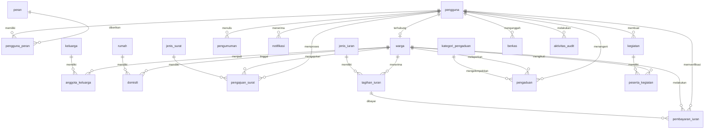
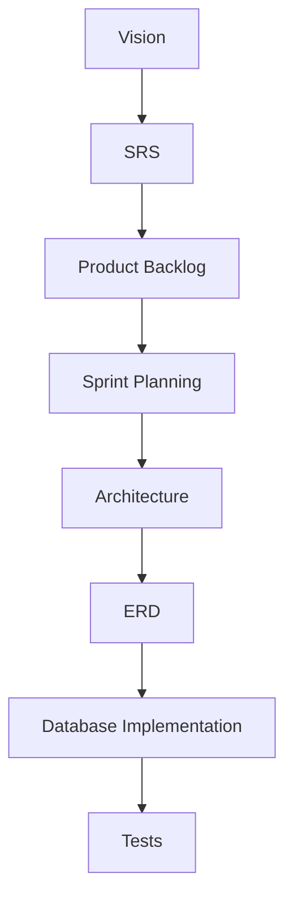

# WargaHub Entity Relationship Design

## 1. Document Control

- Document Title: WargaHub Entity Relationship Design
- Product Name: WargaHub
- Version: 0.1.0
- Status: Draft
- Owner: Product and Engineering Team
- Last Updated: 2026-07-18
- Related Documents:
  - [PROJECT_MANIFEST.md](../PROJECT_MANIFEST.md)
  - [.ai/AI_CONTEXT.md](../.ai/AI_CONTEXT.md)
  - [.ai/PROJECT_RULES.md](../.ai/PROJECT_RULES.md)
  - [.ai/SYSTEM_PROMPT.md](../.ai/SYSTEM_PROMPT.md)
  - [docs/01-VISION.md](01-VISION.md)
  - [docs/02-SRS.md](02-SRS.md)
  - [docs/03-PRODUCT-BACKLOG.md](03-PRODUCT-BACKLOG.md)
  - [docs/04-SPRINT-PLANNING.md](04-SPRINT-PLANNING.md)
  - [docs/05-ARCHITECTURE.md](05-ARCHITECTURE.md)
- Change History:
  - 2026-07-18: Initial ERD draft created for the WargaHub MVP.

---

## 2. ERD Purpose

Dokumen ini adalah desain relasional untuk WargaHub MVP. Tujuannya adalah menerjemahkan kebutuhan produk dan arsitektur menjadi struktur data yang jelas, konsisten, dan dapat diimplementasikan menggunakan PostgreSQL atau database relasional yang kompatibel.

Dokumen ini penting karena:

- menghubungkan kebutuhan bisnis dari [docs/02-SRS.md](02-SRS.md) ke representasi data yang konkret
- memberi fondasi untuk implementasi backend dan database
- memastikan setiap domain utama memiliki representasi data yang jelas
- membantu menjaga integritas data, auditabilitas, dan konsistensi akses
- memisahkan entitas MVP dari konsep yang sebaiknya ditunda

Dokumen ini terkait erat dengan [docs/05-ARCHITECTURE.md](05-ARCHITECTURE.md). Arsitektur menentukan pendekatan sistem secara keseluruhan, sedangkan ERD menentukan struktur data yang mendukung arsitektur tersebut. Perubahan skema nanti harus didokumentasikan secara terpisah jika memengaruhi model bisnis atau implementasi yang sudah direncanakan.

---

## 3. Database Design Principles

Desain database WargaHub mengikuti prinsip-prinsip berikut:

- Relational database: data disimpan dalam relasi yang jelas dan dapat dipertahankan.
- Clear ownership of data: setiap record memiliki pemilik domain yang jelas, misalnya warga, pengajuan surat, tagihan, atau pengaduan.
- Referential integrity: hubungan antar tabel dijaga dengan foreign key.
- Explicit relationships: relasi antar entitas tidak disembunyikan dalam kolom teks.
- Normalization: data yang sama tidak diulang secara tidak perlu.
- Least privilege: akses data diatur melalui otorisasi server-side, bukan berdasarkan desain tabel saja.
- Auditability: perubahan penting harus tercatat.
- Data consistency: constraint dan nilai status yang terkontrol membantu menjaga konsistensi.
- Soft deletion/archive where appropriate: data operasional dapat ditandai sebagai dihapus tanpa menghapus jejak sejarah yang penting.
- Avoid storing derived data unnecessarily: nilai yang bisa dihitung dari data lain sebaiknya tidak disimpan berulang.
- Sensitive data protection: data pribadi, keuangan, dan audit harus diperlakukan secara hati-hati.

---

## 4. Database Technology Direction

Arsitektur database WargaHub akan menggunakan database relasional yang kompatibel dengan PostgreSQL.

Kebijakan desain teknis:

- Database yang dipilih harus mendukung transaksi.
- Foreign key constraints harus digunakan untuk hubungan yang penting.
- Unique constraints harus dipakai untuk mencegah duplikasi yang tidak diinginkan.
- Indexes harus ditambahkan berdasarkan pola query yang diperkirakan.
- Implementasi database akan menggunakan kontrol versi migrasi ketika pengembangan dimulai.
- Dokumen ini tidak membuat file migrasi; file migrasi akan dibuat ketika implementasi dimulai.

Provider hosting tidak ditetapkan secara spesifik pada tahap ini. Yang penting adalah desain database bekerja pada database relasional modern dan dapat dipindahkan ke lingkungan cloud atau self-hosted tanpa mengubah model bisnis secara mendasar.

---

## 5. Naming Convention

Konvensi penamaan yang dipakai dalam dokumen ini adalah:

### Tabel
- lowercase
- snake_case
- plural where appropriate

Contoh:
- pengguna
- peran
- warga
- keluarga
- rumah
- pengumuman
- jenis_surat
- pengajuan_surat
- iuran
- tagihan_iuran
- pembayaran_iuran
- pengaduan
- kegiatan
- notifikasi
- berkas
- aktivitas_audit

### Kolom
- lowercase
- snake_case

### Primary key
- id

### Foreign key
- <nama_tabel_singular>_id

Contoh:
- pengguna_id
- warga_id
- keluarga_id
- rumah_id
- pengajuan_surat_id

### Timestamp
- dibuat_pada
- diperbarui_pada

Untuk tabel yang perlu menunjukkan penghapusan atau arsip, penamaan dapat memakai:
- dihapus_pada
- dihapus_oleh
- diarsipkan_pada

Konvensi ini dipakai secara konsisten di seluruh dokumen.

---

## 6. High-Level Domain Model

Skema data WargaHub MVP dibagi ke dalam domain utama berikut:

### Identity and Access
- pengguna
- peran
- pengguna_peran

Domain ini menyimpan identitas akun, peran, dan hubungan akun-peran.

### Resident and Household
- warga
- keluarga
- anggota_keluarga
- rumah
- domisili

Domain ini menyimpan profil warga dan hubungan administratif dengan keluarga serta rumah.

### Communication
- pengumuman
- notifikasi

Domain ini menyimpan komunikasi internal dan pemberitahuan penting.

### Letter Services
- jenis_surat
- pengajuan_surat
- berkas

Domain ini menyimpan mekanisme surat dan dokumen pendukung.

### Financial
- jenis_iuran
- tagihan_iuran
- pembayaran_iuran

Domain ini menyimpan jenis iuran, tagihan, dan pembayaran.

### Community Operations
- pengaduan
- kategori_pengaduan
- kegiatan
- peserta_kegiatan (opsional, hanya bila kebutuhan partisipasi memang dijalankan)

Domain ini menyimpan pengaduan dan dokumentasi kegiatan lingkungan.

### Governance and Audit
- aktivitas_audit

Domain ini mencatat perubahan penting dan aktivitas sistem.

### Administration
- konfigurasi_sistem (hanya bila perlu untuk kebutuhan administratif yang jelas)

Beberapa konsep ada di domain bisnis, tetapi belum tentu perlu tabel tersendiri. Dokumen ini hanya membuat tabel bila konsep tersebut penting untuk MVP dan memiliki data yang nyata.

---

## 7. Complete Entity List

| No | Nama Tabel | Domain | Tujuan | MVP/Future |
|---|---|---|---|---|
| 1 | pengguna | Identity and Access | identitas akun sistem | MVP |
| 2 | peran | Identity and Access | daftar peran sistem | MVP |
| 3 | pengguna_peran | Identity and Access | hubungan banyak-ke-banyak antara akun dan peran | MVP |
| 4 | warga | Resident and Household | profil warga | MVP |
| 5 | keluarga | Resident and Household | kelompok keluarga | MVP |
| 6 | anggota_keluarga | Resident and Household | relasi warga ke keluarga | MVP |
| 7 | rumah | Resident and Household | lokasi rumah | MVP |
| 8 | domisili | Resident and Household | riwayat hubungan warga dengan rumah | MVP |
| 9 | pengumuman | Communication | pengumuman komunitas | MVP |
| 10 | notifikasi | Communication | notifikasi internal | MVP |
| 11 | jenis_surat | Letter Services | katalog jenis surat | MVP |
| 12 | pengajuan_surat | Letter Services | permohonan surat warga | MVP |
| 13 | jenis_iuran | Financial | katalog jenis iuran | MVP |
| 14 | tagihan_iuran | Financial | tagihan iuran per warga | MVP |
| 15 | pembayaran_iuran | Financial | pencatatan pembayaran | MVP |
| 16 | kategori_pengaduan | Community Operations | kategori pengaduan | MVP |
| 17 | pengaduan | Community Operations | pengaduan warga | MVP |
| 18 | kegiatan | Community Operations | kegiatan lingkungan | MVP |
| 19 | peserta_kegiatan | Community Operations | partisipasi kegiatan, opsional | MVP-lite |
| 20 | berkas | File Management | dokumen pendukung | MVP |
| 21 | aktivitas_audit | Governance and Audit | jejak audit | MVP |
| 22 | konfigurasi_sistem | Administration | konfigurasi sistem dasar | Future |

---

## 8. Entity Definitions

Berikut definisi setiap tabel MVP.

### 8.1 pengguna

- Table name: pengguna
- Purpose: menyimpan identitas akun sistem untuk pengguna WargaHub.
- Ownership: dikelola oleh administrator dan sistem autentikasi.
- Important business rules:
  - password tidak boleh disimpan dalam plaintext.
  - setiap akun harus memiliki status yang jelas.
  - akun yang diblokir tidak boleh dipakai untuk login.
- Primary key: id
- Foreign keys: none directly, but referenced by many tables.
- Important indexes:
  - unique index pada nama_pengguna atau alamat_email
  - index pada status
  - index pada terakhir_login_pada
- Soft delete/archive strategy: soft delete dapat dipakai untuk akun yang tidak aktif; akun lama dapat ditandai sebagai non-aktif daripada dihapus penuh.
- Audit considerations: login, logout, perubahan status akun, dan perubahan akses harus dicatat.
- SRS traceability: autentikasi, role-based access, security.

### 8.2 peran

- Table name: peran
- Purpose: daftar peran sistem yang valid.
- Ownership: dikelola oleh administrator.
- Important business rules:
  - peran harus terkontrol dan tidak dibuat secara bebas.
  - peran kunci terdiri dari WARGA, PENGURUS_RT, PENGURUS_RW, BENDAHARA, ADMIN.
- Primary key: id
- Foreign keys: none.
- Important indexes:
  - unique index pada kode_peran atau nama_peran
- Soft delete/archive strategy: biasanya tidak perlu dihapus; cukup non-aktif bila diperlukan.
- Audit considerations: perubahan peran dan pemberian hak akses harus diaudit.
- SRS traceability: role-based access dan administrasi akun.

### 8.3 pengguna_peran

- Table name: pengguna_peran
- Purpose: menghubungkan pengguna dengan satu atau lebih peran.
- Ownership: dikelola oleh administrator atau mekanisme role assignment.
- Important business rules:
  - satu pengguna dapat memiliki banyak peran.
  - kombinasi pengguna-peran tidak boleh duplikat.
- Primary key: id
- Foreign keys:
  - pengguna_id → pengguna.id
  - peran_id → peran.id
- Important indexes:
  - unique index pada (pengguna_id, peran_id)
  - index pada peran_id
- Soft delete/archive strategy: record dapat dihapus saat hubungan peran dihentikan.
- Audit considerations: pemberian dan pencabutan peran harus diaudit.
- SRS traceability: authorization dan role-based access.

### 8.4 warga

- Table name: warga
- Purpose: profil resident utama dalam sistem.
- Ownership: dikelola oleh pengurus RT atau administrator sesuai otoritas.
- Important business rules:
  - data pribadi harus disimpan secara hati-hati.
  - tidak semua warga harus memiliki akun pengguna.
  - setiap warga harus memiliki status yang jelas.
- Primary key: id
- Foreign keys:
  - pengguna_id → pengguna.id (nullable)
- Important indexes:
  - unique index pada nomor_induk_warga bila terpakai
  - index pada nama_lengkap
  - index pada status_warga
- Soft delete/archive strategy: soft delete disarankan bila warga dihapus dari registri operasional.
- Audit considerations: perubahan profil warga harus dicatat.
- SRS traceability: resident management, family and household, data warga.

### 8.5 keluarga

- Table name: keluarga
- Purpose: mengelompokkan warga ke dalam satu keluarga atau unit rumah tangga.
- Ownership: dikelola oleh RT, RW, atau administrator yang berwenang.
- Important business rules:
  - tidak semua keluarga harus memiliki kepala_keluarga_id yang terisi.
  - nomor identitas keluarga harus unik bila digunakan.
- Primary key: id
- Foreign keys:
  - kepala_keluarga_id → warga.id (nullable)
- Important indexes:
  - unique index pada nomor_kartu_keluarga bila memang dipakai
  - index pada status
- Soft delete/archive strategy: record keluarga dapat ditandai sebagai non-aktif atau dihapus secara lunak.
- Audit considerations: perubahan anggota keluarga dan status keluarga harus dicatat.
- SRS traceability: family and household data.

### 8.6 anggota_keluarga

- Table name: anggota_keluarga
- Purpose: relasi warga ke keluarga.
- Ownership: dikelola oleh RT atau admin.
- Important business rules:
  - satu warga tidak boleh menjadi anggota keluarga yang sama lebih dari satu kali.
  - hubungan seperti kepala keluarga, istri, anak, atau lainnya harus dinyatakan secara eksplisit.
- Primary key: id
- Foreign keys:
  - keluarga_id → keluarga.id
  - warga_id → warga.id
- Important indexes:
  - unique index pada (keluarga_id, warga_id)
  - index pada warga_id
- Soft delete/archive strategy: record dapat dihapus jika relasi tidak lagi valid.
- Audit considerations: perubahan relasi keluarga harus tercatat.
- SRS traceability: family and household management.

### 8.7 rumah

- Table name: rumah
- Purpose: menyimpan lokasi fisik rumah yang menjadi basis administrasi.
- Ownership: dikelola oleh RT dan admin.
- Important business rules:
  - alamat dan rt/rw harus disimpan secara jelas.
  - data lokasi harus tetap sederhana dan tidak terlalu detail untuk MVP.
- Primary key: id
- Foreign keys: none.
- Important indexes:
  - index pada rt
  - index pada rw
  - index pada alamat
- Soft delete/archive strategy: dapat ditandai non-aktif bila rumah sudah tidak dipakai.
- Audit considerations: perubahan data rumah dapat dicatat.
- SRS traceability: resident and household location data.

### 8.8 domisili

- Table name: domisili
- Purpose: menghubungkan warga dengan rumah dan menjaga riwayat domisili.
- Ownership: dikelola oleh administrator atau pengurus RT.
- Important business rules:
  - satu warga bisa memiliki banyak domisili historis.
  - hanya satu domisili aktif yang boleh berlaku pada satu waktu untuk kasus yang sama.
- Primary key: id
- Foreign keys:
  - warga_id → warga.id
  - rumah_id → rumah.id
- Important indexes:
  - index pada warga_id
  - index pada rumah_id
  - index pada status
- Soft delete/archive strategy: record dapat ditandai non-aktif bila domisili sudah tidak berlaku.
- Audit considerations: perubahan domisili harus dicatat.
- SRS traceability: resident residence data.

### 8.9 pengumuman

- Table name: pengumuman
- Purpose: menyimpan pengumuman lingkungan.
- Ownership: dikelola oleh RT, RW, atau admin sesuai peran.
- Important business rules:
  - pengumuman harus memiliki penulis yang jelas.
  - status publikasi harus eksplisit.
  - pengumuman yang sudah kedaluwarsa harus ditandai sebagai tidak aktif.
- Primary key: id
- Foreign keys:
  - penulis_id → pengguna.id
- Important indexes:
  - index pada status
  - index pada dipublikasikan_pada
  - index pada kedaluwarsa_pada
- Soft delete/archive strategy: soft delete memungkinkan pengumuman lama tetap tersedia untuk audit.
- Audit considerations: perubahan pengumuman dan status publikasi harus dicatat.
- SRS traceability: announcement module.

### 8.10 notifikasi

- Table name: notifikasi
- Purpose: menyimpan pemberitahuan internal untuk pengguna.
- Ownership: dikelola oleh sistem dan pengguna penerima.
- Important business rules:
  - notifikasi harus selalu ditujukan kepada pengguna tertentu.
  - status dibaca/tidak dibaca harus jelas.
- Primary key: id
- Foreign keys:
  - pengguna_id → pengguna.id
- Important indexes:
  - index pada pengguna_id
  - index pada dibaca_pada
  - index pada dibuat_pada
- Soft delete/archive strategy: record notifikasi dapat dihapus secara lunak bila sistem menganggapnya tidak lagi relevan.
- Audit considerations: notifikasi biasanya tidak perlu audit yang sangat rinci, tetapi event yang memicu notifikasi harus tercatat.
- SRS traceability: notification module.

### 8.11 jenis_surat

- Table name: jenis_surat
- Purpose: katalog jenis surat yang tersedia untuk warga.
- Ownership: dikelola oleh admin atau pihak yang berwenang.
- Important business rules:
  - nama dan kode jenis surat harus unik.
  - jenis surat yang tidak aktif tidak boleh dipakai untuk pengajuan baru.
- Primary key: id
- Foreign keys: none.
- Important indexes:
  - unique index pada kode
  - index pada aktif
- Soft delete/archive strategy: cukup non-aktif untuk menghindari penghapusan data historis.
- Audit considerations: perubahan jenis surat perlu dipantau karena memengaruhi workflow.
- SRS traceability: letter services.

### 8.12 pengajuan_surat

- Table name: pengajuan_surat
- Purpose: menyimpan permohonan surat warga.
- Ownership: dikelola oleh warga sebagai pemohon dan pihak berwenang sebagai pengolah.
- Important business rules:
  - status harus berada dalam lifecycle yang terkontrol.
  - penolakan harus memiliki alasan penolakan yang jelas.
  - tidak semua pengajuan ditolak atau disetujui secara otomatis.
- Primary key: id
- Foreign keys:
  - jenis_surat_id → jenis_surat.id
  - pemohon_id → warga.id
  - diproses_oleh → pengguna.id (nullable)
- Important indexes:
  - index pada pemohon_id
  - index pada status
  - index pada jenis_surat_id
  - index pada diajukan_pada
- Soft delete/archive strategy: pengajuan surat dapat ditandai non-aktif atau disimpan secara historis.
- Audit considerations: setiap perubahan status harus dicatat.
- SRS traceability: letter workflow and approval.

### 8.13 jenis_iuran

- Table name: jenis_iuran
- Purpose: katalog jenis iuran atau tagihan yang berlaku di lingkungan.
- Ownership: dikelola oleh bendahara atau admin.
- Important business rules:
  - nama dan kode iuran harus unik.
  - nominal dan periode harus jelas bila digunakan.
- Primary key: id
- Foreign keys: none.
- Important indexes:
  - unique index pada kode
  - index pada aktif
- Soft delete/archive strategy: non-aktif lebih disukai daripada menghapus data lama.
- Audit considerations: perubahan tarif dan penetapan iuran harus dicatat.
- SRS traceability: dues and billing.

### 8.14 tagihan_iuran

- Table name: tagihan_iuran
- Purpose: tagihan iuran yang dibebankan kepada warga atau household target tertentu.
- Ownership: dikelola oleh bendahara atau admin.
- Important business rules:
  - tagihan harus terkait dengan jenis iuran yang valid.
  - setiap tagihan harus memiliki status yang jelas.
  - nominal tagihan harus konsisten dengan jenis iuran.
- Primary key: id
- Foreign keys:
  - jenis_iuran_id → jenis_iuran.id
  - warga_id → warga.id
- Important indexes:
  - index pada warga_id
  - index pada status
  - index pada jatuh_tempo
- Soft delete/archive strategy: tagihan lama dapat diarsipkan atau ditandai sebagai batal.
- Audit considerations: perubahan status tagihan dan nominal harus dicatat.
- SRS traceability: dues and payments.

### 8.15 pembayaran_iuran

- Table name: pembayaran_iuran
- Purpose: mencatat pembayaran iuran yang diterima.
- Ownership: dikelola oleh bendahara atau admin.
- Important business rules:
  - setiap pembayaran harus terkait dengan sebuah tagihan yang valid.
  - status pembayaran harus dikendalikan.
  - pembayaran yang sudah diverifikasi harus tetap tercatat secara immutable.
- Primary key: id
- Foreign keys:
  - tagihan_iuran_id → tagihan_iuran.id
  - warga_id → warga.id
  - diverifikasi_oleh → pengguna.id (nullable)
- Important indexes:
  - index pada tagihan_iuran_id
  - index pada warga_id
  - index pada status
  - index pada dibayar_pada
- Soft delete/archive strategy: pembayaran tidak sebaiknya dihapus; cukup ditandai sebagai batal bila perlu.
- Audit considerations: setiap verifikasi dan perubahan status harus dicatat.
- SRS traceability: financial records and payment history.

### 8.16 kategori_pengaduan

- Table name: kategori_pengaduan
- Purpose: katalog kategori pengaduan yang bisa dipakai untuk mengkategorikan laporan warga.
- Ownership: dikelola oleh admin atau pihak yang berwenang.
- Important business rules:
  - kategori harus punya nama yang jelas dan tidak ambigu.
  - kategori tidak boleh dibuat tanpa nama yang valid.
- Primary key: id
- Foreign keys: none.
- Important indexes:
  - unique index pada nama
- Soft delete/archive strategy: non-aktif lebih baik daripada penghapusan penuh.
- Audit considerations: perubahan kategori harus dicatat jika memengaruhi proses pengaduan.
- SRS traceability: complaint handling.

### 8.17 pengaduan

- Table name: pengaduan
- Purpose: menyimpan pengaduan warga atau pihak terkait.
- Ownership: dikelola oleh warga sebagai pelapor dan pengurus RT/RW/admin sebagai penangan.
- Important business rules:
  - setiap pengaduan harus memiliki status yang jelas.
  - tanggapan bisa ditambahkan saat pengaduan ditangani.
  - penutupan pengaduan harus melalui status yang terkontrol.
- Primary key: id
- Foreign keys:
  - pelapor_id → warga.id
  - kategori_pengaduan_id → kategori_pengaduan.id
  - ditangani_oleh → pengguna.id (nullable)
- Important indexes:
  - index pada pelapor_id
  - index pada status
  - index pada kategori_pengaduan_id
  - index pada dibuat_pada
- Soft delete/archive strategy: soft delete atau archive dapat dipakai untuk pengaduan lama.
- Audit considerations: perubahan status, penugasan, dan tanggapan harus dicatat.
- SRS traceability: complaint lifecycle.

### 8.18 kegiatan

- Table name: kegiatan
- Purpose: menyimpan kegiatan lingkungan yang penting untuk komunitas.
- Ownership: dikelola oleh pengurus RT/RW atau admin.
- Important business rules:
  - kegiatan harus memiliki penanggung jawab yang jelas.
  - status kegiatan harus terkontrol.
- Primary key: id
- Foreign keys:
  - dibuat_oleh → pengguna.id
- Important indexes:
  - index pada status
  - index pada mulai_pada
  - index pada selesai_pada
- Soft delete/archive strategy: soft delete atau archive untuk sejarah kegiatan.
- Audit considerations: perubahan kegiatan dan status harus dicatat.
- SRS traceability: activities module.

### 8.19 peserta_kegiatan

- Table name: peserta_kegiatan
- Purpose: menyimpan partisipasi warga dalam kegiatan.
- Ownership: dikelola oleh pengurus kegiatan atau admin.
- Important business rules:
  - seorang warga tidak boleh didaftarkan lebih dari sekali untuk kegiatan yang sama.
- Primary key: id
- Foreign keys:
  - kegiatan_id → kegiatan.id
  - warga_id → warga.id
- Important indexes:
  - unique index pada (kegiatan_id, warga_id)
- Soft delete/archive strategy: relasi dapat dihapus jika partisipasi dibatalkan.
- Audit considerations: perubahan kehadiran dapat dicatat bila diterapkan.
- SRS traceability: optional participation tracking.

### 8.20 berkas

- Table name: berkas
- Purpose: menyimpan dokumen pendukung yang terkait dengan entity bisnis.
- Ownership: dikelola oleh sistem file handling dan pemilik data.
- Important business rules:
  - metadata file harus jelas.
  - jenis file dan ukuran harus divalidasi.
  - akses file harus dikendalikan server-side.
- Primary key: id
- Foreign keys:
  - diunggah_oleh → pengguna.id
- Important indexes:
  - index pada entitas_tipe
  - index pada entitas_id
  - index pada diunggah_oleh
- Soft delete/archive strategy: berkas lama dapat ditandai non-aktif atau diarsipkan.
- Audit considerations: upload, penggantian, dan penghapusan file harus dicatat.
- SRS traceability: file management and document support.

### 8.21 aktivitas_audit

- Table name: aktivitas_audit
- Purpose: menyimpan jejak audit aktivitas sistem dan pengguna.
- Ownership: dikelola oleh sistem.
- Important business rules:
  - record tidak boleh mengandung password, token, atau credential sensitif.
  - setiap record audit harus memiliki timestamp.
- Primary key: id
- Foreign keys:
  - pengguna_id → pengguna.id (nullable)
- Important indexes:
  - index pada pengguna_id
  - index pada entitas_tipe
  - index pada dibuat_pada
- Soft delete/archive strategy: audit history sebaiknya tidak dihapus secara rutin; mungkin diarsipkan bila volume besar.
- Audit considerations: ini adalah tabel audit inti dan harus dilindungi.
- SRS traceability: audit trail and security.

---

## 9. Required MVP Tables

Dokumen ini menganggap tabel-tabel berikut sebagai bagian penting dari MVP:

- pengguna
- peran
- pengguna_peran
- warga
- keluarga
- anggota_keluarga
- rumah
- domisili
- pengumuman
- notifikasi
- jenis_surat
- pengajuan_surat
- jenis_iuran
- tagihan_iuran
- pembayaran_iuran
- kategori_pengaduan
- pengaduan
- kegiatan
- peserta_kegiatan
- berkas
- aktivitas_audit

Tabel `peserta_kegiatan` tetap dimasukkan sebagai bagian yang ringan dan hanya dipakai jika partisipasi kegiatan memang menjadi bagian fungsi yang ditentukan. Bila tim ingin memulai lebih sederhana, tabel ini dapat ditunda sampai fase berikutnya tanpa merusak model inti.

---

## 10. Relationship Model

Hubungan penting dalam model data WargaHub adalah sebagai berikut:

- pengguna
  - 1 ke banyak pengguna_peran
- peran
  - 1 ke banyak pengguna_peran
- pengguna
  - 1 ke 0..1 warga
- keluarga
  - 1 ke banyak anggota_keluarga
- warga
  - 1 ke banyak anggota_keluarga
- rumah
  - 1 ke banyak domisili
- warga
  - 1 ke banyak domisili
- jenis_surat
  - 1 ke banyak pengajuan_surat
- warga
  - 1 ke banyak pengajuan_surat
- jenis_iuran
  - 1 ke banyak tagihan_iuran
- warga
  - 1 ke banyak tagihan_iuran
- tagihan_iuran
  - 1 ke banyak pembayaran_iuran
- warga
  - 1 ke banyak pembayaran_iuran
- kategori_pengaduan
  - 1 ke banyak pengaduan
- warga
  - 1 ke banyak pengaduan
- kegiatan
  - 1 ke banyak peserta_kegiatan
- warga
  - 1 ke banyak peserta_kegiatan
- pengguna
  - 1 ke banyak notifikasi
- pengguna
  - 1 ke banyak aktivitas_audit

Hubungan ini bersifat eksplisit dan diwakili oleh foreign key.

---

## 11. Complete ERD Diagram

Berikut diagram ER utama untuk MVP:

Diagram ini fokus pada tabel inti MVP dan hubungan yang paling penting. Diagram yang lebih rinci dapat dipecah jika implementasi database nanti memerlukan visualisasi khusus untuk modul tertentu.

---

## 12. Cardinality and Optionality

### One-to-one
- Contoh: satu pengguna dapat memiliki satu profil warga, tetapi hubungan ini bersifat opsional.

### One-to-many
- Contoh: satu keluarga memiliki banyak anggota keluarga.
- Contoh: satu jenis surat memiliki banyak pengajuan surat.
- Contoh: satu warga memiliki banyak tagihan iuran.

### Many-to-many
- Hubungan antara pengguna dan peran diwakili oleh tabel perantara `pengguna_peran`.
- Hubungan antara kegiatan dan warga, jika dipakai, diwakili oleh `peserta_kegiatan`.

### Optional relationships
- `pengguna` ke `warga` bersifat optional karena tidak semua akun harus mewakili warga.
- `pengajuan_surat.diproses_oleh` nullable karena belum tentu langsung diproses saat pembuatan.
- `pembayaran_iuran.diverifikasi_oleh` nullable karena verifikasi bisa dilakukan kemudian.

### Required relationships
- `pengajuan_surat` harus memiliki jenis surat dan pemohon yang valid.
- `tagihan_iuran` harus terkait dengan jenis iuran yang valid.
- `pengaduan` harus terkait dengan kategori yang valid dan pelapor yang valid.

---

## 13. Status Model

Model status dibuat dengan nilai yang terkontrol dan tidak dibiarkan berupa string bebas.

### 13.1 pengguna.status

Nilai yang diizinkan:
- AKTIF
- NON_AKTIF
- BLOKIR

Makna:
- AKTIF: akun bisa dipakai.
- NON_AKTIF: akun tidak aktif untuk login.
- BLOKIR: akun ditahan karena alasan keamanan atau administrasi.

### 13.2 warga.status_warga

Nilai yang diizinkan:
- AKTIF
- PINDAH
- MENINGGAL
- TIDAK_AKTIF

Makna:
- AKTIF: warga masih aktif di lingkungan.
- PINDAH: warga pindah lokasi.
- MENINGGAL: warga sudah meninggal.
- TIDAK_AKTIF: warga tidak aktif untuk administrasi saat ini.

### 13.3 pengajuan_surat.status

Nilai yang diizinkan:
- DIAJUKAN
- DIPERIKSA
- DISETUJUI
- DITOLAK
- SELESAI

Makna:
- DIAJUKAN: diterima dan menunggu pemeriksaan.
- DIPERIKSA: sedang ditinjau.
- DISETUJUI: disetujui.
- DITOLAK: ditolak dengan alasan tertentu.
- SELESAI: proses akhir selesai.

### 13.4 tagihan_iuran.status

Nilai yang diizinkan:
- BELUM_LUNAS
- LUNAS
- JATUH_TEMPO
- BATAL

### 13.5 pembayaran_iuran.status

Nilai yang diizinkan:
- MENUNGGU_VERIFIKASI
- DITERIMA
- DITOLAK
- BATAL

### 13.6 pengaduan.status

Nilai yang diizinkan:
- DIAJUKAN
- DITINJAU
- DITANGANI
- SELESAI
- DITUTUP

### 13.7 kegiatan.status

Nilai yang diizinkan:
- DRAFT
- TERJADWAL
- BERLANGSUNG
- SELESAI
- DIBATALKAN

Transisi status sebaiknya dikendalikan oleh logic bisnis, bukan hanya oleh nilai string bebas.

---

## 14. Data Integrity Rules

Beberapa aturan integritas data yang dipakai:

- Foreign key rules: setiap relasi harus mengacu pada data yang valid.
- Unique constraints:
  - nama_pengguna atau alamat_email unik
  - kode peran atau kode jenis surat unik
  - kombinasi (pengguna_id, peran_id) unik
  - kombinasi (keluarga_id, warga_id) unik
  - kombinasi (kegiatan_id, warga_id) unik bila tabel peserta_kegiatan dipakai
- Required fields:
  - tabel pengguna harus memiliki identitas akun
  - tabel warga harus memiliki nama yang jelas dan status
  - tabel pengajuan_surat harus memiliki pemohon, jenis surat, dan status
  - tabel tagihan_iuran harus memiliki jenis iuran dan target warga
  - tabel pembayaran_iuran harus memiliki tagihan terkait
- Nullable fields:
  - `pengguna_id` pada `warga` nullable karena tidak semua warga memiliki akun
  - `diproses_oleh` dan `diverifikasi_oleh` nullable untuk alur yang belum diproses
  - `alasan_penolakan` nullable untuk pengajuan yang belum ditolak
- Check constraints:
  - nilai status harus berada dalam daftar yang ditetapkan
  - nominal tidak boleh negatif
  - ukuran file positif
- Duplicate prevention:
  - mencegah konflik akun ganda
  - mencegah pendaftaran peserta kegiatan yang ganda
- Transaction boundaries:
  - pembayaran dan perubahan status surat/komplain harus diproses dalam transaksi yang jelas

---

## 15. Indexing Strategy

Index sebaiknya ditambahkan berdasarkan pola query yang diperkirakan, bukan secara acak.

### pengguna
- unique index pada nama_pengguna atau alamat_email
- index pada status

### warga
- unique index pada nomor_induk_warga bila dipakai
- index pada nama_lengkap
- index pada status_warga
- index pada pengguna_id

### pengajuan_surat
- index pada pemohon_id
- index pada status
- index pada jenis_surat_id
- index pada diajukan_pada

### tagihan_iuran
- index pada warga_id
- index pada status
- index pada jatuh_tempo
- index pada jenis_iuran_id

### pembayaran_iuran
- index pada tagihan_iuran_id
- index pada warga_id
- index pada status
- index pada dibayar_pada

### pengaduan
- index pada pelapor_id
- index pada status
- index pada kategori_pengaduan_id
- index pada dibuat_pada

### notifikasi
- index pada pengguna_id
- index pada dibaca_pada

### aktivitas_audit
- index pada pengguna_id
- index pada entitas_tipe
- index pada dibuat_pada

Index harus dievaluasi ulang saat query nyata mulai dipakai dalam implementasi.

---

## 16. Soft Delete and Archive Strategy

Strategi data untuk MVP:

- Hard delete hanya untuk data yang benar-benar transient atau tidak bermakna secara historis.
- Soft delete dipakai untuk data bisnis yang perlu tetap ada untuk referensi atau audit, seperti warga, pengumuman, tagihan, pengaduan, dan berkas.
- Archive dipakai untuk data lama yang sudah tidak aktif namun masih penting untuk histori.
- Audit history tidak boleh dihapus secara casual; audit harus tetap tersedia sebagai jejak operasi penting.

### Kapan memakai soft delete
- warga yang sudah tidak aktif
- tagihan yang dibatalkan
- pengajuan surat yang sudah tidak relevan
- pengaduan yang dihapus dari view operasional
- berkas yang tidak lagi digunakan

### Kapan memakai hard delete
- row temporary dari sesi atau cache
- record yang belum tersimpan dengan benar
- data yang memang tidak pernah seharusnya menjadi bagian dari history bisnis

### Kapan memakai archive
- histori tagihan dan pembayaran lama
- histori surat lama
- data pengaduan yang sudah ditutup dalam jangka panjang

---

## 17. Data Privacy

Data WargaHub mencakup informasi yang bisa bersifat pribadi dan sensitif.

### Data sensitif yang perlu dilindungi
- identitas warga
- kontak pribadi
- data keuangan
- dokumen pendukung
- metadata audit

### Prinsip privasi
- least access: akses hanya untuk pengguna yang berwenang
- server-side authorization: backend harus memastikan akses data yang benar
- minimal exposure: data tidak dikirimkan ke client lebih dari yang diperlukan
- secure storage: file dan data sensitif disimpan melalui mekanisme aman
- no unnecessary data duplication: data yang sama tidak disimpan berulang dengan cara yang tidak perlu

### Penerapan untuk tabel tertentu
- `warga` dan `domisili` harus memegang data yang relevan namun tetap terbatas
- `pembayaran_iuran` harus menyimpan data keuangan secara aman
- `berkas` perlu dikontrol aksesnya secara hati-hati
- `aktivitas_audit` tidak boleh mengandung secret atau credential

---

## 18. Auditability

Tabel `aktivitas_audit` menjadi sarana utama untuk pencatatan aktivitas penting.

| Action | Entity | Actor | Required Audit |
|---|---|---|---|
| Login | pengguna | pengguna | yes |
| Logout | pengguna | pengguna | yes |
| Resident changes | warga | RT/Admin | yes |
| Letter submission | pengajuan_surat | warga | yes |
| Letter approval | pengajuan_surat | pengolah | yes |
| Letter rejection | pengajuan_surat | pengolah | yes |
| Payment verification | pembayaran_iuran | bendahara/admin | yes |
| Complaint state change | pengaduan | penangan | yes |
| Administrative changes | pengguna/peran | admin | yes |

Audit event harus mencatat:
- actor
- aksi
- entitas tipe
- entitas id
- hasil operasi
- timestamp
- metadata tambahan bila diperlukan

---

## 19. Data Lifecycle

Data dalam WargaHub mengikuti siklus sederhana:

1. Creation
   - record dibuat saat proses bisnis dimulai
2. Active Use
   - record dipakai untuk operasi harian
3. Update
   - record diperbarui berdasarkan perubahan status atau data
4. Archive
   - record lama dapat dipindah ke arsip operasional
5. Retention
   - data tetap disimpan sesuai kebutuhan bisnis dan audit
6. Deletion where appropriate
   - record yang tidak lagi relevan dapat dihapus secara aman sesuai kebijakan operasional

Tidak ada asumsi bahwa semua data harus dihapus; beberapa data tetap penting untuk histori dan audit.

---

## 20. MVP vs Future Entities

### MVP
Entitas berikut adalah bagian inti dari MVP:

- pengguna
- peran
- pengguna_peran
- warga
- keluarga
- anggota_keluarga
- rumah
- domisili
- pengumuman
- notifikasi
- jenis_surat
- pengajuan_surat
- jenis_iuran
- tagihan_iuran
- pembayaran_iuran
- kategori_pengaduan
- pengaduan
- kegiatan
- peserta_kegiatan
- berkas
- aktivitas_audit

### Future
Konsep berikut dapat ditambahkan di masa depan bila kebutuhan muncul:

- konfigurasi_sistem
- external_integrations
- kanal_notifikasi
- analitik
- konfigurasi_multi_tenant
- perangkat_pengguna

Konsep-konsep ini tidak dimasukkan ke ERD inti MVP karena saat ini belum diperlukan dan dapat menambah kompleksitas yang tidak perlu.

---

## 21. SRS Traceability

| Entity | Related SRS Requirements | Related Epic |
|---|---|---|
| pengguna, peran, pengguna_peran | FR-001, FR-002, FR-003, SEC-001, SEC-003 | EPIC-AUTH, EPIC-ADMIN |
| warga, keluarga, anggota_keluarga, rumah, domisili | FR-010, FR-011, FR-012, FR-013 | EPIC-RESIDENT, EPIC-FAMILY |
| pengumuman, notifikasi | FR-020, FR-021, FR-022 | EPIC-ANNOUNCEMENT, EPIC-NOTIFICATION |
| jenis_surat, pengajuan_surat, berkas | FR-030, FR-031, FR-032 | EPIC-LETTER, EPIC-FILE |
| jenis_iuran, tagihan_iuran, pembayaran_iuran | FR-040, FR-041, FR-042 | EPIC-DUES |
| kategori_pengaduan, pengaduan | FR-050, FR-051, FR-052 | EPIC-COMPLAINT |
| kegiatan, peserta_kegiatan | FR-060, FR-061 | EPIC-ACTIVITY |
| aktivitas_audit | SEC-010, NFR-010 | EPIC-AUDIT |

Mapping ini bersifat konseptual dan disesuaikan dengan kebutuhan MVP. Implementasi detail akan diperjelas pada tahap desain API dan migrasi lanjutan.

---

## 22. Architectural Traceability

Setiap tahap memengaruhi tahap berikutnya:

- Vision memberi arah produk.
- SRS memberi kebutuhan yang harus dipenuhi.
- Product Backlog memberi urutan prioritas kerja.
- Sprint Planning memberi urutan implementasi.
- Architecture memberi fondasi desain sistem.
- ERD memberi struktur data.
- Database implementation menerapkan desain.
- Tests memastikan bahwa desain berjalan sesuai kebutuhan.

---

## 23. Future Database Evolution

Saat implementasi dimulai, perubahan skema akan dikelola melalui versioned migrations.

Prinsip evolusi database:

- setiap perubahan skema harus diberi versi
- backward compatibility harus dipertimbangkan untuk perubahan yang tidak boleh merusak data lama
- data migration harus direncanakan untuk perubahan yang besar
- index harus ditinjau ulang saat query berubah
- tabel yang sudah tidak dipakai dapat diberi deprecation strategy dan kemudian dihapus secara bertahap

Konsep yang diusulkan untuk masa depan seperti konfigurasi multi-tenant atau integrasi eksternal harus diintegrasikan secara hati-hati agar tidak merusak model MVP yang sudah stabil.

---

## 24. ERD Quality Checklist

Checklist kualitas ERD WargaHub:

- Setiap domain MVP memiliki representasi data.
- Tidak ada konsep duplikat yang tidak perlu.
- Relasi antar entitas jelas dan eksplisit.
- Foreign key sudah didefinisikan untuk hubungan utama.
- Data sensitif dilindungi melalui desain dan kebijakan akses.
- Data keuangan diaudit dan terkontrol.
- Audit records terlindungi dari penghapusan yang tidak disengaja.
- Status values dibuat terkontrol.
- Index disesuaikan dengan pola query yang diperkirakan.
- MVP dan future entities dipisahkan dengan jelas.
- ERD mudah dipahami oleh tim pengembang maupun reviewer.
- ERD konsisten dengan SRS dan arsitektur.

---

## 25. Change Log

| Version | Date | Summary |
|---|---|---|
| 0.1.0 | 2026-07-18 | Initial ERD draft for the WargaHub MVP |
