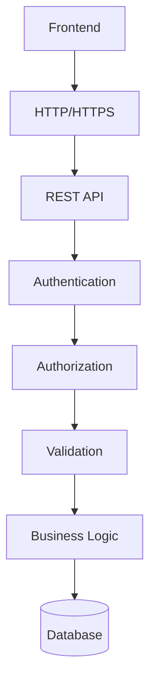

# WargaHub API Contract

## 1. Document Control

- Document Title: WargaHub API Contract
- Product Name: WargaHub
- Version: 0.1.0
- Status: Draft
- Owner: Product and Engineering Team
- Last Updated: 2026-07-18
- Related Documents:
  - [PROJECT_MANIFEST.md](../PROJECT_MANIFEST.md)
  - [.ai/AI_CONTEXT.md](../.ai/AI_CONTEXT.md)
  - [.ai/PROJECT_RULES.md](../.ai/PROJECT_RULES.md)
  - [.ai/SYSTEM_PROMPT.md](../.ai/SYSTEM_PROMPT.md)
  - [docs/01-VISION.md](01-VISION.md)
  - [docs/02-SRS.md](02-SRS.md)
  - [docs/03-PRODUCT-BACKLOG.md](03-PRODUCT-BACKLOG.md)
  - [docs/04-SPRINT-PLANNING.md](04-SPRINT-PLANNING.md)
  - [docs/05-ARCHITECTURE.md](05-ARCHITECTURE.md)
  - [docs/06-ERD.md](06-ERD.md)
- Change History:
  - 2026-07-18: Initial API contract draft created for the WargaHub MVP.

---

## 2. API Purpose

Dokumen ini adalah kontrak API resmi untuk WargaHub MVP. Tujuannya adalah memastikan frontend dan backend mengerti bentuk komunikasi yang sama sebelum implementasi dimulai.

Dokumen ini penting karena:

- menghubungkan kebutuhan pengguna dan bisnis dari [docs/02-SRS.md](02-SRS.md) ke antarmuka sistem yang terdefinisi
- mendukung arsitektur modular monolith yang dijelaskan di [docs/05-ARCHITECTURE.md](05-ARCHITECTURE.md)
- konsisten dengan struktur data yang ditetapkan di [docs/06-ERD.md](06-ERD.md)
- memberi dasar untuk implementasi endpoint, validasi, otorisasi, dan pengujian
- membantu menjaga konsistensi request/response dan error handling

Kontrak ini tidak dimaksudkan sebagai spesifikasi implementasi penuh. Dokumen ini menetapkan bentuk API yang konsisten, pola yang aman, serta batasan MVP.

---

## 3. API Architecture

Arsitektur API WargaHub mengikuti alur berikut:



Prinsipnya:

- frontend berkomunikasi dengan backend melalui HTTP API
- autentikasi dan otorisasi dijalankan di server
- validasi diterapkan di boundary request
- logika bisnis dijalankan di backend
- database menjadi sumber data utama

---

## 4. Base API Conventions

### 4.1 Base URL

Semua endpoint API menggunakan prefix:

- /api/v1

### 4.2 API Style

API ini bersifat REST-oriented dan menggunakan HTTP methods secara konsisten.

### 4.3 HTTP Methods

- GET: membaca data
- POST: membuat resource baru atau memicu aksi baru
- PATCH: memperbarui sebagian resource
- DELETE: menghapus resource bila memang diperbolehkan

### 4.4 Content Type

- Content-Type: application/json

### 4.5 Date and Time Format

Semua tanggal dan waktu disampaikan dalam format ISO 8601, misalnya:

- 2026-07-18T10:15:30Z

### 4.6 Identifier Format

Resource identifier menggunakan bentuk sederhana:

- string UUID atau integer surrogate identifier

Detail implementasi spesifik dapat ditentukan saat pengembangan, tetapi strategi identifier harus konsisten dan aman. Dokumen ini tidak mengubah arah desain yang sudah disepakati di arsitektur dan ERD.

---

## 5. Authentication

Autentikasi menjawab pertanyaan:

- Siapa pengguna ini?

Kontrak autentikasi MVP mencakup endpoint berikut:

### 5.1 POST /api/v1/auth/login

- Purpose: mengautentikasi pengguna dengan kredensial yang valid.
- Authentication requirement: tidak diperlukan.
- Authorization requirement: tidak diperlukan.
- Request body:

```json
{
  "username": "admin",
  "password": "secret"
}
```

- Success response:

```json
{
  "data": {
    "user": {
      "id": "123",
      "username": "admin",
      "roles": ["ADMIN"]
    },
    "token": "<session-or-token>"
  },
  "meta": {}
}
```

- Error responses:
  - 401 UNAUTHENTICATED
  - 422 VALIDATION_ERROR

### 5.2 POST /api/v1/auth/logout

- Purpose: mengakhiri sesi aktif.
- Authentication requirement: required.
- Authorization requirement: any authenticated user.
- Request body: tidak wajib.
- Success response:

```json
{
  "data": {}
}
```

- Error responses:
  - 401 UNAUTHENTICATED
  - 500 INTERNAL_ERROR

### 5.3 GET /api/v1/auth/me

- Purpose: mengambil profil sesi yang sedang aktif.
- Authentication requirement: required.
- Authorization requirement: any authenticated user.
- Success response:

```json
{
  "data": {
    "user": {
      "id": "123",
      "username": "admin",
      "roles": ["ADMIN"]
    }
  }
}
```

- Error responses:
  - 401 UNAUTHENTICATED

Catatan: password tidak pernah dikembalikan oleh API.

---

## 6. Standard Response Format

Semua response sukses harus mengikuti pola yang konsisten.

### 6.1 Single resource

```json
{
  "data": {}
}
```

### 6.2 Collection

```json
{
  "data": [],
  "meta": {
    "page": 1,
    "per_page": 20,
    "total": 0
  }
}
```

### 6.3 Mutation

```json
{
  "data": {}
}
```

### 6.4 When meta is required

Meta diperlukan saat endpoint mengembalikan daftar data, terutama untuk list endpoint dengan pagination.

---

## 7. Standard Error Format

Semua error harus mengembalikan struktur yang konsisten.

```json
{
  "error": {
    "code": "VALIDATION_ERROR",
    "message": "Data yang dikirim tidak valid",
    "details": []
  }
}
```

### 7.1 Common error codes

- VALIDATION_ERROR: input tidak valid.
- UNAUTHENTICATED: user belum login atau sesi tidak valid.
- FORBIDDEN: user tidak punya hak akses.
- NOT_FOUND: resource tidak ditemukan.
- CONFLICT: terjadi konflik data atau duplikasi.
- BUSINESS_RULE_VIOLATION: aturan bisnis dilanggar.
- INTERNAL_ERROR: error tak terduga.

### 7.2 HTTP status code mapping

- 400: validation atau request malformed
- 401: unauthenticated
- 403: forbidden
- 404: not found
- 409: conflict
- 422: validation error yang lebih spesifik untuk input domain
- 429: too many requests bila rate limiting dipakai
- 500: internal error

---

## 8. Pagination

Endpoint yang mengembalikan daftar data harus mendukung pagination.

### 8.1 Query parameters

- page: nomor halaman, default 1
- per_page: jumlah item per halaman, default 20
- sort: kolom sortir bila diperlukan
- order: asc atau desc

### 8.2 Rules

- per_page tidak boleh tidak terbatas.
- maximum per_page sebaiknya 100.
- pagination wajib dipakai untuk daftar yang bisa tumbuh.

---

## 9. Filtering and Search

Endpoint list harus mendukung filter dan pencarian yang sederhana.

Contoh:

- GET /api/v1/warga?search=budi
- GET /api/v1/warga?status=AKTIF
- GET /api/v1/pengajuan-surat?status=DIAJUKAN

### 9.1 Filter strategy

- Filter didukung melalui query parameter.
- Search dilakukan pada kolom yang relevan, misalnya nama atau nomor identitas.
- Filter dan search harus tetap tunduk pada otorisasi dan scope.
- Hasil yang dikembalikan harus tetap konsisten dengan hak akses pengguna.

---

## 10. Authorization and Data Scope

Bagian ini wajib dipahami karena data WargaHub bersifat terbatas dan sensitif.

### 10.1 Authentication vs Authorization vs Scope

- Authentication menjawab: Siapa pengguna ini?
- Authorization menjawab: Apa yang boleh dilakukan?
- Scope menjawab: Data wilayah mana yang boleh diakses?

### 10.2 Expected role behavior

#### WARGA
- dapat melihat profil sendiri
- dapat melihat surat yang dibuatnya
- dapat melihat tagihan dan pembayaran yang terkait dengannya
- dapat melihat pengaduan yang dibuatnya

#### PENGURUS_RT
- dapat mengakses data dalam cakupan RT yang diotorisasi
- dapat menangani surat, pengaduan, pengumuman, dan data warga pada cakupan tersebut

#### PENGURUS_RW
- dapat mengakses data lintas RT yang sesuai cakupan RW yang diotorisasi
- dapat melihat ringkasan dan informasi tingkat RW

#### BENDAHARA
- dapat mengakses data keuangan dalam cakupan yang berwenang
- dapat memverifikasi pembayaran yang relevan

#### ADMIN
- dapat mengakses administrasi sistem sesuai kebijakan

### 10.3 Enforcement rule

Authorization dan scope harus diterapkan di backend. Route guards di frontend hanya untuk UX, bukan satu-satunya perlindungan.

---

## 11. Auth API

### 11.1 POST /api/v1/auth/login

See section 5.1.

### 11.2 POST /api/v1/auth/logout

See section 5.2.

### 11.3 GET /api/v1/auth/me

See section 5.3.

---

## 12. Profile API

### 12.1 GET /api/v1/profil

- Purpose: mengambil profil pengguna yang sedang login.
- Authentication requirement: required.
- Authorization requirement: authenticated user only.
- Success response:

```json
{
  "data": {
    "profile": {
      "id": "123",
      "username": "admin",
      "nama_lengkap": "Admin",
      "roles": ["ADMIN"]
    }
  }
}
```

### 12.2 PATCH /api/v1/profil

- Purpose: memperbarui profil pengguna yang sedang login.
- Authentication requirement: required.
- Authorization requirement: authenticated user only.
- Allowed fields: field profil yang aman dan relevan untuk diri sendiri, misalnya kontak atau preferensi.
- Not allowed: role assignment, status akun, atau data sensitif administratif.

---

## 13. User and Role Administration API

### 13.1 GET /api/v1/pengguna

- Purpose: melihat daftar pengguna.
- Authentication requirement: required.
- Authorization requirement: ADMIN atau pihak yang diberi izin administratif.
- Query parameters: page, per_page, search, status, role.

### 13.2 GET /api/v1/pengguna/:id

- Purpose: melihat detail pengguna tertentu.
- Authentication requirement: required.
- Authorization requirement: ADMIN or self profile when appropriate.

### 13.3 POST /api/v1/pengguna

- Purpose: membuat akun pengguna baru.
- Authentication requirement: required.
- Authorization requirement: ADMIN.
- Request body should include identity and role assignment.

### 13.4 PATCH /api/v1/pengguna/:id

- Purpose: memperbarui data pengguna.
- Authentication requirement: required.
- Authorization requirement: ADMIN.

### 13.5 PATCH /api/v1/pengguna/:id/status

- Purpose: mengubah status akun.
- Authentication requirement: required.
- Authorization requirement: ADMIN.

### 13.6 Role assignment

- Role assignment dilakukan melalui endpoint administratif yang terpisah bila diperlukan.
- Minimal contract: endpoint admin dapat mengaitkan atau mencabut peran pengguna.

---

## 14. Resident API

### 14.1 GET /api/v1/warga

- Purpose: melihat daftar warga sesuai scope.
- Authentication requirement: required.
- Authorization requirement: sesuai role dan scope.
- Query parameters: page, per_page, search, status, rt, rw.

### 14.2 GET /api/v1/warga/:id

- Purpose: melihat detail warga.
- Authentication requirement: required.
- Authorization requirement: role/scope based.

### 14.3 POST /api/v1/warga

- Purpose: membuat data warga baru.
- Authentication requirement: required.
- Authorization requirement: RT, RW, or ADMIN depending on scope.

### 14.4 PATCH /api/v1/warga/:id

- Purpose: memperbarui data warga.
- Authentication requirement: required.
- Authorization requirement: authorized role and scope.

### 14.5 Scope expectations

- WARGA hanya melihat dirinya sendiri dan data terkait yang diperbolehkan.
- PENGURUS_RT hanya mengakses data sesuai RT yang ditugaskan.
- PENGURUS_RW melihat data sesuai cakupan RW.
- ADMIN mengakses sesuai kebijakan administratif.

---

## 15. Family and Household API

### 15.1 GET /api/v1/keluarga

- Purpose: melihat daftar keluarga sesuai scope.
- Authentication requirement: required.
- Authorization requirement: sesuai role dan scope.

### 15.2 GET /api/v1/keluarga/:id

- Purpose: melihat detail keluarga.
- Authentication requirement: required.
- Authorization requirement: authorized role and scope.

### 15.3 POST /api/v1/keluarga

- Purpose: membuat data keluarga baru.
- Authentication requirement: required.
- Authorization requirement: authorized RT/Admin.

### 15.4 PATCH /api/v1/keluarga/:id

- Purpose: memperbarui data keluarga.
- Authentication requirement: required.
- Authorization requirement: authorized RT/Admin.

### 15.5 Family member and residence data

- anggota_keluarga dapat dikelola melalui endpoint keluarga atau endpoint terpisah bila implementasi memerlukannya.
- domisili dapat diperlakukan sebagai data yang terkait dengan warga dan rumah, bukan endpoint independen yang wajib ada di MVP awal.

---

## 16. Announcement API

### 16.1 GET /api/v1/pengumuman

- Purpose: melihat daftar pengumuman yang relevan.
- Authentication requirement: required for protected access; could be public for some announcement types if allowed by policy.
- Authorization requirement: role-based visibility.

### 16.2 GET /api/v1/pengumuman/:id

- Purpose: melihat detail pengumuman.
- Authentication requirement: consistent with listing.
- Authorization requirement: sesuai visibility.

### 16.3 POST /api/v1/pengumuman

- Purpose: membuat pengumuman.
- Authentication requirement: required.
- Authorization requirement: RT, RW, or ADMIN.

### 16.4 PATCH /api/v1/pengumuman/:id

- Purpose: memperbarui pengumuman.
- Authentication requirement: required.
- Authorization requirement: author or authorized admin.

### 16.5 POST /api/v1/pengumuman/:id/publikasi

- Purpose: mempublikasikan pengumuman.
- Authentication requirement: required.
- Authorization requirement: authorized author/admin.

### 16.6 POST /api/v1/pengumuman/:id/arsip

- Purpose: mengarsipkan pengumuman.
- Authentication requirement: required.
- Authorization requirement: authorized author/admin.

---

## 17. Letter API

### 17.1 GET /api/v1/jenis-surat

- Purpose: melihat daftar jenis surat yang tersedia.
- Authentication requirement: required.
- Authorization requirement: authenticated user.

### 17.2 GET /api/v1/pengajuan-surat

- Purpose: melihat daftar pengajuan surat sesuai scope.
- Authentication requirement: required.
- Authorization requirement: role and scope based.

### 17.3 GET /api/v1/pengajuan-surat/:id

- Purpose: melihat detail pengajuan surat.
- Authentication requirement: required.
- Authorization requirement: pemohon, pengolah, atau admin.

### 17.4 POST /api/v1/pengajuan-surat

- Purpose: mengajukan surat baru.
- Authentication requirement: required.
- Authorization requirement: WARGA or authorized role.
- Request body should include letter type, description, and supporting information where appropriate.

### 17.5 POST /api/v1/pengajuan-surat/:id/periksa

- Purpose: memindahkan status ke pemeriksaan.
- Authentication requirement: required.
- Authorization requirement: authorized RT/RW/Admin.

### 17.6 POST /api/v1/pengajuan-surat/:id/setujui

- Purpose: menyetujui pengajuan surat.
- Authentication requirement: required.
- Authorization requirement: authorized reviewer.

### 17.7 POST /api/v1/pengajuan-surat/:id/tolak

- Purpose: menolak pengajuan surat.
- Authentication requirement: required.
- Authorization requirement: authorized reviewer.

### 17.8 POST /api/v1/pengajuan-surat/:id/selesaikan

- Purpose: menandai surat selesai.
- Authentication requirement: required.
- Authorization requirement: authorized reviewer/admin.

### 17.9 Status transition rules

Status transitions harus dikendalikan oleh aturan bisnis dan tidak boleh diserahkan sepenuhnya ke client. Perubahan status harus dicatat dalam audit trail.

### 17.10 Attachments

Lampiran dokumen dapat diproses melalui endpoint berkas yang terpisah atau melalui endpoint pengajuan surat yang mengirim metadata file. Kontrak ini tidak memaksa detail implementasi tertentu, tetapi harus ada mekanisme untuk menyimpan dokumen pendukung.

---

## 18. Dues and Payment API

### 18.1 GET /api/v1/iuran

- Purpose: melihat daftar jenis iuran.
- Authentication requirement: required.
- Authorization requirement: authenticated user, with scope-based visibility where relevant.

### 18.2 POST /api/v1/iuran

- Purpose: membuat jenis iuran baru.
- Authentication requirement: required.
- Authorization requirement: BENDAHARA or ADMIN.

### 18.3 PATCH /api/v1/iuran/:id

- Purpose: memperbarui jenis iuran.
- Authentication requirement: required.
- Authorization requirement: BENDAHARA or ADMIN.

### 18.4 GET /api/v1/tagihan-iuran

- Purpose: melihat daftar tagihan iuran.
- Authentication requirement: required.
- Authorization requirement: sesuai scope keuangan.

### 18.5 GET /api/v1/tagihan-iuran/:id

- Purpose: melihat detail tagihan.
- Authentication requirement: required.
- Authorization requirement: sesuai scope.

### 18.6 GET /api/v1/pembayaran-iuran

- Purpose: melihat daftar pembayaran iuran.
- Authentication requirement: required.
- Authorization requirement: sesuai scope keuangan.

### 18.7 POST /api/v1/pembayaran-iuran

- Purpose: mencatat pembayaran baru.
- Authentication requirement: required.
- Authorization requirement: BENDAHARA or ADMIN.

### 18.8 POST /api/v1/pembayaran-iuran/:id/verifikasi

- Purpose: memverifikasi pembayaran.
- Authentication requirement: required.
- Authorization requirement: BENDAHARA or ADMIN.

### 18.9 Financial scope and audit

- semua transaksi keuangan harus tercatat dan dapat diaudit.
- pembayaran yang sudah diverifikasi tidak boleh dihapus secara sembarangan.

---

## 19. Complaint API

### 19.1 GET /api/v1/kategori-pengaduan

- Purpose: melihat daftar kategori pengaduan.
- Authentication requirement: required.
- Authorization requirement: authenticated user.

### 19.2 GET /api/v1/pengaduan

- Purpose: melihat daftar pengaduan sesuai scope.
- Authentication requirement: required.
- Authorization requirement: role and scope based.

### 19.3 GET /api/v1/pengaduan/:id

- Purpose: melihat detail pengaduan.
- Authentication requirement: required.
- Authorization requirement: pelapor, penangan, atau admin.

### 19.4 POST /api/v1/pengaduan

- Purpose: membuat pengaduan baru.
- Authentication requirement: required.
- Authorization requirement: authenticated user, terutama WARGA.

### 19.5 POST /api/v1/pengaduan/:id/tinjau

- Purpose: menandai pengaduan untuk ditinjau.
- Authentication requirement: required.
- Authorization requirement: authorized penangan.

### 19.6 POST /api/v1/pengaduan/:id/tangani

- Purpose: menandai pengaduan sedang ditangani.
- Authentication requirement: required.
- Authorization requirement: authorized penangan.

### 19.7 POST /api/v1/pengaduan/:id/selesaikan

- Purpose: menyelesaikan pengaduan.
- Authentication requirement: required.
- Authorization requirement: authorized penangan/admin.

### 19.8 POST /api/v1/pengaduan/:id/tutup

- Purpose: menutup pengaduan.
- Authentication requirement: required.
- Authorization requirement: authorized penangan/admin.

---

## 20. Activity API

### 20.1 GET /api/v1/kegiatan

- Purpose: melihat daftar kegiatan.
- Authentication requirement: required.
- Authorization requirement: sesuai role dan scope.

### 20.2 GET /api/v1/kegiatan/:id

- Purpose: melihat detail kegiatan.
- Authentication requirement: required.
- Authorization requirement: sesuai role dan scope.

### 20.3 POST /api/v1/kegiatan

- Purpose: membuat kegiatan baru.
- Authentication requirement: required.
- Authorization requirement: RT, RW, or ADMIN.

### 20.4 PATCH /api/v1/kegiatan/:id

- Purpose: memperbarui kegiatan.
- Authentication requirement: required.
- Authorization requirement: authorized organizer/admin.

### 20.5 POST /api/v1/kegiatan/:id/daftar

- Purpose: mendaftarkan diri ke kegiatan.
- Authentication requirement: required.
- Authorization requirement: authenticated user.

### 20.6 POST /api/v1/kegiatan/:id/batal-daftar

- Purpose: membatalkan pendaftaran ke kegiatan.
- Authentication requirement: required.
- Authorization requirement: authenticated user.

Catatan: endpoint partisipasi hanya diikutsertakan karena konsisten dengan ERD yang mengajukan tabel peserta_kegiatan sebagai konsep ringan. Jika kegiatan partisipasi tidak diprioritaskan, endpoint ini dapat ditunda.

---

## 21. Notification API

### 21.1 GET /api/v1/notifikasi

- Purpose: melihat daftar notifikasi untuk pengguna yang login.
- Authentication requirement: required.
- Authorization requirement: self-only.

### 21.2 POST /api/v1/notifikasi/:id/baca

- Purpose: menandai satu notifikasi sebagai dibaca.
- Authentication requirement: required.
- Authorization requirement: self-only.

### 21.3 POST /api/v1/notifikasi/baca-semua

- Purpose: menandai semua notifikasi pengguna sebagai dibaca.
- Authentication requirement: required.
- Authorization requirement: self-only.

---

## 22. File API

### 22.1 POST /api/v1/berkas

- Purpose: mengunggah dokumen.
- Authentication requirement: required.
- Authorization requirement: sesuai role dan entitas terkait.
- Validation: file type dan size harus dipastikan.
- Success response: metadata file.

### 22.2 GET /api/v1/berkas/:id

- Purpose: mengambil metadata atau file yang diizinkan.
- Authentication requirement: required.
- Authorization requirement: pemilik, pihak terkait, atau admin.

### 22.3 DELETE /api/v1/berkas/:id

- Purpose: menghapus atau menonaktifkan berkas.
- Authentication requirement: required.
- Authorization requirement: pemilik, pihak terkait, atau admin.

### 22.4 File rules

- file type dan size dibatasi.
- akses file harus dikontrol server-side.
- nama file asli tidak boleh diperlakukan sebagai satu-satunya identitas.

---

## 23. Audit API

Audit record bersifat internal dan biasanya tidak diubah oleh user biasa. Untuk MVP, endpoint audit dapat dibatasi hanya untuk admin atau operator yang berwenang.

### 23.1 Optional endpoint

- GET /api/v1/aktivitas-audit

- Purpose: melihat log audit yang relevan.
- Authentication requirement: required.
- Authorization requirement: ADMIN only.

Catatan: jika audit tidak diprioritaskan sebagai API publik di MVP awal, endpoint ini dapat disimpan sebagai fitur administrasi lanjutan.

---

## 24. Administration API

Endpoint administrasi sistem hanya dibuat bila memang diperlukan oleh SRS dan MVP.

### 24.1 Scope

Endpoint admin yang dapat dipertimbangkan:

- pengelolaan pengguna
- pengelolaan peran
- pengelolaan konfigurasi sistem dasar

Tetapi API ini harus tetap terbatas dan tidak melebihi kebutuhan MVP.

---

## 25. HTTP Status Codes

Status code yang dipakai harus konsisten.

- 200 OK: request berhasil.
- 201 Created: resource berhasil dibuat.
- 204 No Content: operasi berhasil tanpa payload.
- 400 Bad Request: payload atau request tidak valid.
- 401 Unauthorized: belum autentikasi.
- 403 Forbidden: tidak punya hak akses.
- 404 Not Found: resource tidak ditemukan.
- 409 Conflict: konflik data atau duplikasi.
- 422 Unprocessable Entity: validasi domain yang gagal.
- 429 Too Many Requests: rate limiting.
- 500 Internal Server Error: error server.

---

## 26. Idempotency

Idempotency penting untuk operasi yang bisa diulang karena retry atau double submission.

Area yang memerlukan perhatian:

- pembayaran submission
- status transitions surat dan pengaduan
- aksi yang dapat dipanggil lebih dari sekali

Prinsipnya:

- operasi yang sensitif harus didesain untuk aman jika request diulang.
- response yang konsisten membantu client dan server tetap aman.

---

## 27. Security

Kontrak API harus mendukung keamanan yang baik.

- Authentication: semua endpoint sensitif memerlukan autentikasi.
- Authorization: hak akses harus dijalankan server-side.
- Input validation: validasi dilakukan sebelum business logic.
- Rate limiting: dapat diterapkan untuk endpoint login dan operasi sensitif.
- Sensitive data protection: tidak ada password atau token yang dikembalikan dalam response yang tidak perlu.
- No password exposure: API tidak boleh mengembalikan hash password atau plaintext password.
- No token exposure: token tidak boleh muncul di response publik.
- Secure file access: file hanya boleh diakses bila otorisasi benar.
- Audit: perubahan penting harus dicatat.

---

## 28. API Versioning

API menggunakan versi:

- /api/v1

Perubahan yang memengaruhi kontrak yang sudah ada harus dipertimbangkan sebagai breaking change dan memerlukan versi baru. Perubahan minor atau penambahan endpoint baru dapat ditambahkan dalam versi yang sama bila aman.

---

## 29. API Traceability

| API Group | SRS Requirement | Epic | ERD Entities |
|---|---|---|---|
| Auth API | FR-001, FR-002, FR-003, SEC-001 | EPIC-AUTH | pengguna, peran, pengguna_peran |
| Profile API | FR-004, FR-005 | EPIC-PROFILE | pengguna, warga |
| User and Role Admin API | FR-006, FR-007 | EPIC-ADMIN | pengguna, peran, pengguna_peran |
| Resident API | FR-010, FR-011 | EPIC-RESIDENT | warga, keluarga, rumah, domisili |
| Family and Household API | FR-012, FR-013 | EPIC-FAMILY | keluarga, anggota_keluarga |
| Announcement API | FR-020, FR-021 | EPIC-ANNOUNCEMENT | pengumuman |
| Letter API | FR-030, FR-031, FR-032 | EPIC-LETTER | jenis_surat, pengajuan_surat, berkas |
| Dues and Payment API | FR-040, FR-041, FR-042 | EPIC-DUES | jenis_iuran, tagihan_iuran, pembayaran_iuran |
| Complaint API | FR-050, FR-051, FR-052 | EPIC-COMPLAINT | kategori_pengaduan, pengaduan |
| Activity API | FR-060, FR-061 | EPIC-ACTIVITY | kegiatan, peserta_kegiatan |
| Notification API | FR-070, FR-071 | EPIC-NOTIFICATION | notifikasi |
| File API | FR-080, FR-081 | EPIC-FILE | berkas |
| Audit API | SEC-010, NFR-010 | EPIC-AUDIT | aktivitas_audit |

---

## 30. MVP vs Future API

### MVP
API yang termasuk dalam MVP:

- auth API
- profile API
- user and role administration API
- resident API
- family and household API
- announcement API
- letter API
- dues and payment API
- complaint API
- activity API
- notification API
- file API
- audit API (limited/admin)

### Future
API berikut tidak menjadi bagian dari MVP inti:

- external government integration APIs
- WhatsApp notification APIs
- advanced analytics APIs
- AI assistance APIs
- native mobile-specific APIs

Konsep-konsep ini tetap dapat ditambahkan nanti, tetapi tidak termasuk dalam kontrak MVP saat ini.

---

## 31. API Quality Checklist

Checklist kualitas kontrak API:

- Setiap endpoint memiliki owner konseptual.
- Authorization didefinisikan.
- Scope didefinisikan.
- Request validation didefinisikan.
- Response format konsisten.
- Error format konsisten.
- Pagination didefinisikan.
- Data sensitif dilindungi.
- API tertrace ke requirement.
- MVP dan future scope dipisahkan.

---

## 32. Change Log

| Version | Date | Summary |
|---|---|---|
| 0.1.0 | 2026-07-18 | Initial API contract draft for the WargaHub MVP |
