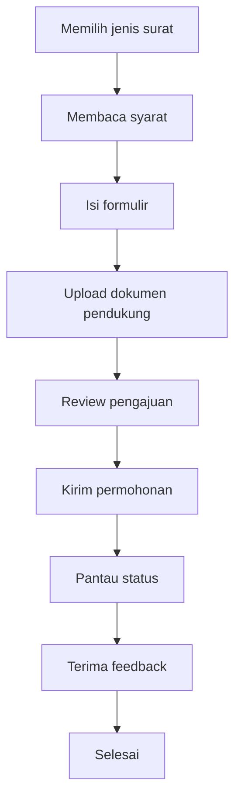

# WargaHub UI/UX Specification

## 1. Document Control

- Document Title: WargaHub UI/UX Specification
- Product Name: WargaHub
- Version: 0.1.0
- Status: Draft
- Owner: Product and Engineering Team
- Last Updated: 2026-07-18
- Related Documents:
  - [PROJECT_MANIFEST.md](../PROJECT_MANIFEST.md)
  - [.ai/AI_CONTEXT.md](../.ai/AI_CONTEXT.md)
  - [.ai/PROJECT_RULES.md](../.ai/PROJECT_RULES.md)
  - [.ai/SYSTEM_PROMPT.md](../.ai/SYSTEM_PROMPT.md)
  - [docs/01-VISION.md](01-VISION.md)
  - [docs/02-SRS.md](02-SRS.md)
  - [docs/03-PRODUCT-BACKLOG.md](03-PRODUCT-BACKLOG.md)
  - [docs/04-SPRINT-PLANNING.md](04-SPRINT-PLANNING.md)
  - [docs/05-ARCHITECTURE.md](05-ARCHITECTURE.md)
  - [docs/06-ERD.md](06-ERD.md)
  - [docs/07-API-CONTRACT.md](07-API-CONTRACT.md)
- Change History:
  - 2026-07-18: Initial UI/UX specification draft created for the WargaHub MVP.

---

## 2. UX Vision

WargaHub harus memberikan pengalaman pengguna yang sederhana, jelas, informatif, terpercaya, aksesibel, responsif, konsisten, dan efisien. Antarmuka tidak boleh terasa rumit atau teknis. Tujuan utamanya adalah membantu pengguna menyelesaikan tugas harian mereka tanpa bingung.

Visi UX WargaHub adalah menciptakan sistem yang terasa seperti alat bantu komunitas yang praktis, bukan sistem yang menghambat. Pengguna harus dapat memahami tujuan halaman, tindakan yang tersedia, dan status proses dengan cepat.

Prinsip inti yang menjadi fokus adalah:

> User tidak perlu memahami sistem untuk dapat menggunakan sistem.

Artinya, antarmuka harus dirancang sehingga pengguna dapat menjalankan tugas penting tanpa perlu memahami struktur teknis, alur backend, peran sistem, atau mekanisme internal aplikasi. Pengguna cukup melihat apa yang perlu dilakukan, apa statusnya, dan apa hasil yang diharapkan.

---

## 3. UX Principles

### Clarity First

Setiap halaman harus segera memberi pemahaman tentang tujuan, konteks, dan tindakan yang tersedia. Label harus jelas, bahasa harus sederhana, dan istilah yang digunakan harus konsisten dengan bahasa bisnis lingkungan RT/RW.

### Progressive Disclosure

Informasi penting harus tampil lebih dulu. Detail lanjutan, pengaturan, dan data teknis harus disembunyikan atau diakses ketika diperlukan. Halaman utama harus fokus pada tindakan yang paling sering dilakukan.

### Consistency

Pola navigasi, status, tombol, formulir, tabel, dan feedback harus konsisten di semua role dan modul. Konsistensi membantu pengguna mempelajari sistem dengan lebih cepat.

### Feedback

Setiap tindakan penting, seperti menyimpan data, mengirim permohonan, mengubah status, atau mengunggah file, harus memberi umpan balik yang jelas. Feedback dapat berupa pesan sukses, loading state, toast, atau perubahan status visual.

### Error Prevention

Desain harus membantu mencegah kesalahan sebelum pengiriman. Contohnya: menandai field wajib, memberikan petunjuk saat memilih opsi, menolak input yang tidak valid sebelum submit, dan mengonfirmasi tindakan yang penting seperti penghapusan atau perubahan status.

### Recovery

Jika terjadi kesalahan, pengguna harus memahami apa yang salah dan apa yang bisa dilakukan berikutnya. Pesan error harus jelas, tidak menyerang, dan menawarkan tindakan pemulihan yang sederhana.

### Accessibility

Antarmuka harus dapat digunakan dengan keyboard, pembaca layar, fokus yang terlihat, kontras yang memadai, dan struktur semantik yang baik. Aksesibilitas bukan fitur tambahan, melainkan bagian dari pengalaman inti.

### Mobile First Thinking

Workflow yang paling penting, seperti login, melihat pengumuman, mengajukan surat, melihat iuran, dan melaporkan pengaduan, harus dapat dilakukan dengan nyaman di layar kecil.

### Trust and Transparency

Khususnya untuk surat, pembayaran, pengaduan, dan tindakan administratif, pengguna harus dapat melihat status, riwayat, dan alasan tindakan. Tidak boleh ada ambiguitas mengenai apa yang sedang terjadi.

---

## 4. Target Users

### WARGA

Kebutuhan:
- navigasi sederhana dan cepat
- akses ke profil pribadi
- pengajuan surat
- informasi iuran
- pengaduan
- pengumuman
- status proses yang jelas

Tantangan:
- tingkat literasi digital bervariasi
- sering menggunakan perangkat mobile
- membutuhkan informasi yang mudah dibaca dan tidak membingungkan

UX considerations:
- gunakan bahasa yang sederhana
- tampilkan status dengan visual jelas
- hindari terlalu banyak informasi teknis
- prioritaskan tindakan yang paling sering dilakukan

### PENGURUS_RT

Kebutuhan:
- mengelola data warga
- memproses pengajuan surat
- menangani pengaduan
- membuat pengumuman
- mengelola kegiatan

UX considerations:
- desain harus efisien untuk tugas harian
- tampilkan daftar yang bisa dicari dan disaring
- gunakan alur yang singkat untuk review dan tindakan
- hindari banyak langkah yang tidak perlu

### PENGURUS_RW

Kebutuhan:
- gambaran komunitas yang lebih luas
- monitoring data lintas RT
- ringkasan administratif
- kontrol terhadap cakupan yang lebih luas

UX considerations:
- fokus pada ringkasan, status, dan pemantauan
- jangan memperlihatkan data di luar cakupan otorisasi
- tampilkan informasi yang relevan secara ringkas

### BENDAHARA

Kebutuhan:
- melihat iuran dan tagihan
- mencatat pembayaran
- memverifikasi status pembayaran
- melihat ringkasan keuangan

UX considerations:
- label keuangan harus jelas dan tidak ambigu
- tampilkan status pembayaran dengan seksama
- hindari istilah teknis yang tidak perlu
- buat ringkasan yang dapat dipahami oleh pengguna non-keuangan

### ADMIN

Kebutuhan:
- pengelolaan pengguna
- pengelolaan peran
- konfigurasi sistem dasar
- audit aktivitas

UX considerations:
- pemisahkan area administratif dari alur warga biasa
- gunakan alur yang aman dan jelas
- tampilkan tindakan berisiko dengan konfirmasi khusus
- hindari kebingungan antara fitur operasional dan fitur administrasi

---

## 5. Information Architecture

Struktur informasi harus jelas dan sesuai dengan peran pengguna. Navigasi utama disusun berdasarkan kebutuhan tugas, bukan berdasarkan struktur teknis.

### Warga

Dashboard
├── Profil Saya
├── Pengumuman
├── Surat Saya
├── Iuran Saya
├── Pengaduan Saya
├── Kegiatan
└── Notifikasi

### Pengurus

Dashboard
├── Warga
├── Keluarga
├── Pengumuman
├── Pengajuan Surat
├── Pengaduan
├── Kegiatan
└── Notifikasi

### Bendahara

Dashboard
├── Iuran
├── Tagihan
├── Pembayaran
└── Laporan Ringkas

### Admin

Dashboard
├── Pengguna
├── Peran
├── Konfigurasi
├── Audit
└── Pengaturan

### Visibility per Role

- WARGA: melihat menu yang relevan untuk kebutuhan pelayanan dan informasi pribadi.
- PENGURUS_RT: melihat modul operasional RT yang relevan secara langsung.
- PENGURUS_RW: melihat modul ringkasan dan monitoring lintas RT.
- BENDAHARA: melihat modul keuangan dan ringkasan transaksi.
- ADMIN: melihat modul administrasi sistem dan pengelolaan akses.

Semua menu harus memprioritaskan item yang paling sering dipakai. Menu yang tidak relevan untuk role tertentu tidak boleh ditampilkan untuk mengurangi kebingungan.

---

## 6. Application Shell

Aplikasi WargaHub harus memiliki shell yang konsisten pada desktop dan mobile.

### Desktop Layout

```text
┌──────────────────────────────────────────────────────────────┐
│ Header                                                       │
├──────────────┬───────────────────────────────────────────────┤
│ Sidebar      │ Main Content                                 │
│ Navigation   │                                             │
│              │                                             │
└──────────────┴───────────────────────────────────────────────┘
```

### Mobile Layout

```text
┌──────────────────────┐
│ Header               │
├──────────────────────┤
│ Main Content         │
│                      │
├──────────────────────┤
│ Bottom Navigation    │
└──────────────────────┘
```

### Header

Header harus berisi:
- brand atau identitas aplikasi
- pencarian sederhana bila diperlukan
- akses notifikasi
- menu pengguna
- tombol untuk membuka navigasi mobile

### Sidebar

Sidebar digunakan pada desktop dan tablet dengan area yang cukup untuk menu utama, sub-menu, dan status konteks role. Sidebar harus tetap sederhana dan tidak terlalu padat.

### Breadcrumb

Breadcrumb digunakan pada halaman yang memiliki kedalaman. Halaman detail seperti warga, pengajuan surat, atau pengaduan harus menunjukkan lokasi pengguna di dalam sistem.

### Page Title

Setiap halaman harus memiliki judul jelas yang mencerminkan tujuan halaman. Judul harus muncul di bagian atas konten.

### Main Content

Area utama harus memusatkan perhatian pada satu tugas utama per halaman. Halaman yang lebih kompleks harus menggunakan bagian, tab, atau card untuk memecah informasi menjadi blok yang terorganisir.

### Notification Access

Ikon notifikasi harus terlihat dan mudah diakses. Tampilan badge untuk notifikasi belum terbaca harus jelas namun tidak mengganggu.

### User Menu

Menu pengguna harus berisi profil, pengaturan akun, preferensi dasar, dan logout. Menu ini tidak boleh menampung terlalu banyak tindakan yang tidak relevan.

### Mobile Navigation

Navigasi mobile harus sederhana, dengan item utama yang paling sering dipakai. Bottom navigation cocok untuk item inti seperti Dashboard, Pengumuman, Surat, Iuran, dan Profil. Item yang lebih administratif dapat ditempatkan di menu tambahan.

---

## 7. Responsive Breakpoints

WargaHub harus dirancang sebagai pengalaman responsive yang fleksibel, tanpa terlalu menekankan angka pixel yang presisi. Kategori responsif yang disarankan adalah:

- Mobile
- Tablet
- Desktop
- Large desktop

### Mobile

- satu kolom
- navigasi ringkas
- card disusun vertikal
- tabel berubah menjadi daftar atau horizontal scroll bila perlu
- tombol utama harus cukup besar untuk jari

### Tablet

- layout dapat menjadi dua kolom pada area tertentu
- sidebar dapat dikompak atau disembunyikan sesuai ruang
- panel ringkasan dapat disusun lebih fleksibel

### Desktop

- sidebar penuh terlihat
- layout multi-kolom digunakan bila membantu pemahaman
- tabel dan daftar data dapat tampil lebih luas

### Large Desktop

- ruang yang lebih banyak dapat dipakai untuk ringkasan, panel terkait, dan daftar data yang ekstensif
- tetap mempertahankan fokus pada keterbacaan dan tidak terlalu ramai

---

## 8. Design System

### Color Strategy

WargaHub sebaiknya menggunakan sistem warna semantik yang jelas dan konsisten:

- Primary: warna utama untuk tindakan penting dan identitas aplikasi
- Secondary: warna pendukung untuk elemen yang kurang dominan
- Success: untuk status berhasil, disetujui, atau selesai
- Warning: untuk status menunggu, perlu perhatian, atau sedang diproses
- Danger: untuk error, penolakan, atau tindakan berisiko
- Information: untuk informasi penting yang tidak bersifat masalah
- Neutral: untuk teks, batas, latar, dan elemen yang tidak perlu menonjol

Warna harus digunakan untuk memberi makna, bukan sekadar dekorasi. Status harus dapat dipahami bahkan tanpa warna saja, misalnya lewat label dan ikon.

### Typography

Tipografi harus fokus pada keterbacaan.

- Heading: jelas, tegas, dan konsisten untuk membagi halaman
- Body text: nyaman dibaca dalam paragraf pendek
- Caption: untuk metadata, status, dan informasi pendukung
- Labels: singkat, deskriptif, dan konsisten

### Spacing

Pakai skala spacing yang konsisten untuk menjaga ritme visual. Spacing yang konsisten membantu antarmuka terasa rapi, terutama pada form dan daftar data.

### Border Radius

Gunakan radius yang konsisten untuk button, card, input, dan panel. Radius yang terlalu agresif sebaiknya dihindari agar visual tetap profesional dan sederhana.

### Elevation

Elevasi visual harus halus dan hanya dipakai untuk memberi hierarki, misalnya pada modal, dropdown, atau card yang menonjol. Hindari visual yang terlalu berat untuk MVP.

---

## 9. Component Principles

Komponen UI harus memiliki tujuan yang jelas dan dapat dipakai kembali.

### Layout

- PageShell: bingkai umum untuk halaman aplikasi, termasuk header, konten, dan area tindakan utama
- Sidebar: menu navigasi utama
- Header: identitas aplikasi, akses notifikasi, dan menu pengguna
- Breadcrumb: membantu navigasi antar level halaman

### Navigation

- NavigationMenu: daftar navigasi utama dan submenu
- Tabs: membagi konten terkait yang memiliki konteks berbeda
- Pagination: memecah daftar besar menjadi bagian yang lebih mudah diolah

### Data Display

- Card: ringkasan informasi atau blok tugas yang padat
- Table: menampilkan data terstruktur, terutama untuk daftar warga, tagihan, dan pengajuan
- Badge: label status atau kategori singkat
- StatusIndicator: visual status seperti Draft, Menunggu, Disetujui, Ditolak, Selesai

### Input

- Input: field teks dasar
- Select: pilihan tunggal atau sederhana
- DatePicker: input tanggal yang lebih mudah dipahami
- Textarea: input deskriptif yang lebih panjang
- FileUpload: pengunggahan dokumen pendukung

### Feedback

- Alert: pesan penting yang memerlukan perhatian
- Toast: pemberitahuan singkat setelah aksi selesai
- Modal: interaksi fokus untuk langkah penting seperti konfirmasi atau detail
- ConfirmDialog: konfirmasi sebelum tindakan berisiko

### State

- LoadingState: menunjukkan proses sedang berjalan
- EmptyState: memberi arahan saat data belum ada
- ErrorState: menunjukkan masalah yang terjadi
- PermissionDeniedState: memberi penjelasan saat akses tidak diizinkan

Setiap komponen harus dapat dipakai pada desktop dan mobile dengan perilaku yang konsisten.

---

## 10. Design Tokens

Desain token harus dipakai agar UI tetap konsisten dan mudah diimplementasikan di package UI.

- Color tokens: primary, secondary, success, warning, danger, info, neutral, text, background, border
- Typography tokens: heading sizes, body sizes, caption sizes, font weights, line heights
- Spacing tokens: xs, sm, md, lg, xl, 2xl
- Radius tokens: sm, md, lg
- Shadow/elevation tokens: low, medium, high
- Z-index tokens: dropdown, modal, toast, overlay

Token ini harus dipakai sebagai sumber desain untuk semua elemen UI. Hal ini membantu konsistensi antar komponen dan memudahkan perubahan visual di masa depan.

---

## 11. Authentication UX

### Login Page

Halaman login harus sederhana dan aman.

Elemen yang disarankan:
- identitas aplikasi atau brand
- field username atau email sesuai API contract
- field password
- tombol login
- feedback error yang jelas namun aman
- state loading saat login sedang diproses

UX rules:
- jangan menampilkan detail sensitif yang tidak perlu
- gunakan pesan error yang aman, misalnya “Kredensial tidak valid”
- cegah submit ganda dengan tombol disable saat loading
- jangan menampilkan password dalam bentuk yang tidak aman

### Logout

Logout harus tersedia melalui menu pengguna. Jika diperlukan, tampilkan dialog konfirmasi singkat untuk mencegah logout yang tidak sengaja.

### Session Expiration

Ketika sesi habis, pengguna harus diberi tahu dengan pesan yang jelas. Arahkan ke halaman login yang aman dan jelaskan bahwa sesi telah berakhir.

---

## 12. Dashboard UX

Dashboard harus membantu pengguna memahami apa yang penting saat ini. Dashboard tidak boleh terlalu padat. Fokusnya adalah ringkasan, tindakan yang menunggu, aktivitas terbaru, pengumuman, dan notifikasi.

Prinsip dashboard:
- tampilkan informasi yang paling relevan bersamaan
- hindari terlalu banyak metrik
- gunakan card yang jelas dan mudah dibaca
- prioritaskan tindakan yang bisa dilanjutkan sekarang

---

## 13. WARGA Dashboard

Widget yang disarankan:
- status surat terakhir
- status iuran
- pengaduan aktif atau terbaru
- pengumuman terbaru
- kegiatan terdekat

Prioritas UX:
- tampilkan status proses yang jelas
- buat tindakan utama terlihat
- gunakan bahasa yang sederhana
- hindari menampilkan data yang tidak relevan bagi warga

---

## 14. PENGURUS Dashboard

Widget yang disarankan:
- jumlah warga yang tercatat dalam cakupan otorisasi
- pengajuan surat menunggu tindakan
- pengaduan aktif
- pengumuman terbaru
- kegiatan yang akan datang

Prinsip:
- data hanya ditampilkan sesuai scope otorisasi
- tampilkan item yang memerlukan tindakan segera
- gunakan sekilas ringkasan yang memudahkan prioritas kerja

---

## 15. BENDAHARA Dashboard

Widget yang disarankan:
- total tagihan
- pembayaran menunggu verifikasi
- ringkasan pembayaran
- status iuran yang umum

Prinsip UX:
- label keuangan harus jelas dan tidak ambigu
- tampilkan saldo atau status dengan teks yang mudah dipahami
- hindari ringkasan yang terlalu rumit atau menyesatkan
- tampilkan status transaksi dengan jelas

---

## 16. ADMIN Dashboard

Widget yang disarankan:
- ringkasan pengguna
- daftar peran aktif
- aktivitas sistem atau audit ringkas
- peringatan penting
- ringkasan administratif

Prinsip UX:
- pemisahkan area administratif dari alur operasional harian
- tampilkan tindakan berisiko dengan perlindungan tambahan
- hindari menampilkan detail teknis yang tidak perlu di dashboard umum

---

## 17. Resident Management UX

### List View

Halaman daftar warga harus menyediakan:
- pencarian
- filter berdasarkan status, RT, RW, atau parameter lainnya sesuai hak akses
- pagination atau load more bila data banyak
- status administratif
- informasi identitas dasar

### Detail View

Halaman detail warga harus memisahkan informasi menjadi blok yang jelas:
- profil dasar
- keluarga
- rumah
- informasi terkait yang sesuai hak akses

### Create/Edit

Form pembuatan atau perubahan data harus:
- mengelompokkan field secara logis
- menandai field wajib
- menyediakan validasi yang jelas
- menampilkan ringkasan sebelum penyimpanan bila tindakan penting
- memberi konfirmasi setelah berhasil disimpan

---

## 18. Family and Household UX

Antarmuka keluarga dan rumah harus membantu pengguna memahami struktur hubungan antar warga dengan cara yang sederhana.

Elemen yang disarankan:
- ringkasan keluarga
- daftar anggota keluarga
- informasi rumah dan domisili
- hubungan yang relevan

Akses terhadap data sensitif harus dibatasi sesuai role dan scope. Informasi yang tidak boleh dilihat oleh pengguna tertentu tidak boleh tampil di UI yang tidak sesuai otorisasi.

---

## 19. Announcement UX

### List

Daftar pengumuman harus menampilkan:
- judul
- ringkasan singkat
- tanggal publikasi
- status, misalnya Draft, Dipublikasikan, Diarsipkan

### Detail

Halaman detail pengumuman harus menampilkan:
- isi penuh
- penulis atau pembuat bila relevan
- informasi publikasi
- status saat ini

### Management

Untuk pengguna yang berwenang, antarmuka manajemen pengumuman harus mendukung:
- draft
- publish
- archive
- edit
- hapus dengan konfirmasi bila diperlukan

Lifecycle status harus ditunjukkan dengan jelas menggunakan badge atau indikator.

---

## 20. Letter Request UX

Alur pengajuan surat harus sederhana, jelas, dan mudah dipantau.

### User Journey

1. Lihat jenis surat yang tersedia.
2. Pilih jenis surat.
3. Baca syarat dan informasi yang diperlukan.
4. Isi form.
5. Unggah dokumen pendukung bila diperlukan.
6. Review ulang pengajuan.
7. Kirim pengajuan.
8. Pantau status.
9. Terima feedback dari pengolah.
10. Selesaikan proses bila sudah lengkap.



### Status Presentation

Status surat harus ditampilkan dengan indikator yang jelas:
- DIAJUKAN
- DIPERIKSA
- DISETUJUI
- DITOLAK
- SELESAI

Setiap status harus ditampilkan dengan label yang mudah dibaca dan, bila memungkinkan, deskripsi singkat tentang arti status tersebut.

---

## 21. Dues and Payment UX

Antarmuka iuran harus dirancang agar informasi keuangan mudah dipahami.

Elemen yang disarankan:
- daftar iuran saat ini
- tagihan yang belum dibayar
- riwayat pembayaran
- opsi pengajuan pembayaran atau pencatatan pembayaran
- status verifikasi

Prinsip UX:
- label tidak boleh ambigu
- informasi jumlah harus jelas
- status pembayaran harus mudah dipahami
- tindakan penting seperti verifikasi pembayaran harus memerlukan konfirmasi yang tepat

---

## 22. Complaint UX

### User Journey

1. Buat pengaduan.
2. Pilih kategori.
3. Jelaskan masalah.
4. Kirim pengaduan.
5. Pantau status.
6. Terima respon.
7. Lihat penyelesaian.

Status yang harus jelas:
- DIAJUKAN
- DITINJAU
- DITANGANI
- SELESAI
- DITUTUP

### Privacy Considerations

Paparan detail pengaduan harus sesuai otorisasi. Informasi sensitif tidak boleh ditampilkan kepada pengguna lain secara tidak semestinya. UI harus menjaga privasi pelapor dan pihak yang terlibat.

---

## 23. Activity UX

Halaman kegiatan harus menampilkan:
- daftar kegiatan
- detail kegiatan
- tanggal dan lokasi
- partisipasi bila fitur tersebut didukung

Antarmuka harus membantu pengguna memahami siapa yang terlibat, kapan kegiatan berlangsung, dan apakah mereka perlu mengambil tindakan.

---

## 24. Notification UX

Notifikasi harus membantu pengguna fokus pada hal penting, bukan membanjiri mereka.

Fitur yang disarankan:
- indikator notifikasi belum dibaca
- daftar notifikasi yang rapi
- opsi tandai dibaca
- opsi tandai semua dibaca
- navigasi ke konten terkait ketika relevan

Notifikasi harus ringkas, jelas, dan tidak terlalu banyak untuk MVP.

---

## 25. File Upload UX

Upload dokumen harus sederhana dan aman.

Prinsip UX:
- tampilkan jenis file yang diizinkan
- beri feedback ukuran file
- tampilkan progress saat upload berlangsung
- tampilkan status sukses atau gagal dengan jelas
- beri opsi hapus atau coba lagi

Jangan menampilkan path internal atau detail penyimpanan teknis kepada pengguna.

---

## 26. Table UX

Tabel digunakan untuk daftar data yang cukup besar. Perilaku responsif harus dipikirkan dengan baik.

### Desktop

- tampilkan tabel penuh

### Mobile

- gunakan horizontal scroll bila perlu
- atau ubah menjadi daftar kartu bila lebih nyaman dipakai

Elemen pendukung:
- empty state bila tidak ada data
- loading state saat data sedang dimuat
- pagination bila daftar panjang
- sorting bila sesuai

---

## 27. Form UX

Form harus membantu pengguna menyelesaikan tugas dengan aman dan cepat.

Prinsip UX form:
- label harus jelas
- field wajib ditandai dengan jelas
- validasi inline saat mungkin
- mapping error server-side ke pesan yang mudah dipahami
- tombol submit menunjukkan loading state
- beri feedback sukses setelah submit berhasil
- sediakan tombol batal atau kembali dengan jelas
- tampilkan warning saat pengguna akan meninggalkan form yang belum disimpan bila relevan

---

## 28. Error UX

### Validation Error

Tampilkan pesan yang menjelaskan bagian yang perlu diperbaiki. Hindari menampilkan error generik yang tidak membantu.

### Unauthorized

Jika pengguna belum login, tampilkan pesan bahwa login diperlukan dan arahkan ke halaman masuk.

### Forbidden

Jika pengguna tidak memiliki izin, jelaskan bahwa akses dibatasi tanpa mengungkap detail sensitif.

### Not Found

Jika halaman atau data tidak tersedia, tampilkan pesan yang jelas dan tawarkan tindakan berikutnya, misalnya kembali ke daftar atau dashboard.

### Conflict

Jika ada konflik status atau data, jelaskan situasinya dengan bahasa yang sederhana.

### Server Error

Tampilkan pesan aman dan berikan opsi pemulihan, misalnya coba lagi atau kembali ke halaman sebelumnya.

---

## 29. Loading UX

Loading state harus ada untuk operasi yang membutuhkan waktu.

Kategori loading yang disarankan:
- loading halaman
- loading bagian tertentu
- loading tombol submit
- loading upload file

Hindari loading layar penuh yang berlebihan bila area tertentu sudah bisa menunjukkan progress.

---

## 30. Empty State UX

Setiap daftar utama harus memiliki empty state yang jelas.

Contoh:
- Belum ada pengumuman.
- Belum ada pengajuan surat.
- Belum ada pengaduan.
- Belum ada pembayaran.

Empty state sebaiknya dilengkapi dengan tindakan yang jelas, misalnya:
- buat pengumuman
- ajukan surat
- laporkan pengaduan
- tambah pembayaran atau tagihan

---

## 31. Accessibility

WargaHub harus memenuhi standar aksesibilitas yang praktis untuk MVP.

Prinsip yang harus diterapkan:
- navigasi keyboard harus bekerja dengan baik
- fokus elemen harus terlihat jelas
- HTML semantik harus dipakai dengan benar
- semua form field harus punya label yang jelas
- pesan error harus dapat diakses dengan pembaca layar
- warna tidak boleh menjadi satu-satunya indikator status
- kontras warna harus cukup
- dukungan pembaca layar harus diperhatikan
- pertimbangkan reduced motion untuk animasi yang tidak perlu

---

## 32. Content and Microcopy

Bahasa yang dipakai harus:
- Bahasa Indonesia
- jelas
- ramah
- profesional
- tidak bertele-tele
- tidak terlalu teknis
- tidak ambigu

Contoh gaya bahasa:

Daripada:
- Error 422

Lebih baik:
- Data belum dapat disimpan. Periksa kembali informasi yang Anda masukkan.

Yang penting adalah membuat sistem terasa membantu, bukan mengintimidasi pengguna.

---

## 33. User Journeys

### Login

- Actor: Warga, Pengurus, Bendahara, Admin
- Goal: Masuk ke sistem dengan aman
- Steps: membuka halaman login, memasukkan kredensial, menekan tombol login, melihat dashboard
- Success state: pengguna diarahkan ke dashboard yang sesuai peran
- Failure state: pesan error aman ditampilkan dan pengguna tetap berada di halaman login

### View Announcement

- Actor: Warga, Pengurus
- Goal: melihat pengumuman terbaru
- Steps: membuka pengumuman, memilih item, membaca isi
- Success state: informasi dapat dibaca dengan jelas
- Failure state: pengguna melihat pesan bahwa pengumuman tidak tersedia atau tidak memiliki akses

### Request Letter

- Actor: Warga
- Goal: mengajukan surat
- Steps: memilih jenis surat, membaca syarat, mengisi form, mengunggah dokumen, mengirim, memantau status
- Success state: pengajuan berhasil dibuat dan status terlihat
- Failure state: form menampilkan kesalahan yang jelas dan pengguna bisa memperbaiki input

### Check Dues

- Actor: Warga, Bendahara
- Goal: melihat tagihan dan status pembayaran
- Steps: membuka halaman iuran, melihat tagihan, melihat riwayat pembayaran
- Success state: status pembayaran jelas dan mudah dipahami
- Failure state: pengguna melihat pesan bahwa data tidak tersedia atau belum ada pembayaran

### Submit Complaint

- Actor: Warga
- Goal: mengirim pengaduan
- Steps: memilih kategori, menulis detail, mengirim, melihat status
- Success state: pengaduan tercatat dan status terlihat
- Failure state: pengguna diberi pesan pembersihan atau koreksi

### Manage Resident

- Actor: Pengurus RT, Pengurus RW, Admin
- Goal: mengelola data warga dalam cakupan otorisasi
- Steps: membuka daftar warga, mencari entri, membuka detail, mengubah data atau menambahkan data
- Success state: perubahan tersimpan dengan jelas dan status memadai
- Failure state: validasi dan pesan error membantu pengguna memperbaiki kesalahan

### Verify Payment

- Actor: Bendahara
- Goal: memverifikasi pembayaran
- Steps: membuka daftar pembayaran, meninjau transaksi, memberi status verifikasi
- Success state: status pembayaran berubah dengan jelas dan terdokumentasi
- Failure state: pengguna diberi penjelasan jika data tidak valid atau sudah diproses

---

## 34. Page Inventory

| Page | Route | Role | Purpose | Priority |
|---|---|---|---|---|
| Login | /login | Semua | Mengautentikasi pengguna | P0 |
| Dashboard | /dashboard | Semua | Ringkasan informasi yang relevan | P0 |
| Profil Saya | /profile | Warga | Melihat dan memperbarui profil pribadi | P1 |
| Pengumuman | /announcements | Warga, Pengurus | Melihat daftar dan detail pengumuman | P0 |
| Surat Saya | /letters | Warga | Melihat pengajuan surat pribadi | P0 |
| Ajukan Surat | /letters/new | Warga | Membuat pengajuan surat baru | P0 |
| Iuran Saya | /dues | Warga | Melihat tagihan dan riwayat pembayaran | P0 |
| Pengaduan Saya | /complaints | Warga | Melihat dan membuat pengaduan | P0 |
| Kegiatan | /activities | Warga, Pengurus | Melihat kegiatan lingkungan | P1 |
| Notifikasi | /notifications | Semua | Melihat dan mengelola notifikasi | P1 |
| Warga | /residents | Pengurus, Admin | Mengelola data warga | P0 |
| Detail Warga | /residents/:id | Pengurus, Admin | Melihat detail warga | P0 |
| Keluarga | /families | Pengurus, Admin | Melihat data keluarga | P1 |
| Pengajuan Surat | /letter-requests | Pengurus | Meninjau pengajuan surat | P0 |
| Pengaduan | /complaints/admin | Pengurus, Admin | Menangani pengaduan | P0 |
| Iuran | /dues/admin | Bendahara, Admin | Mengelola iuran dan tagihan | P0 |
| Pembayaran | /payments | Bendahara, Admin | Mengelola pembayaran | P0 |
| Pengguna | /users | Admin | Mengelola pengguna | P0 |
| Peran | /roles | Admin | Mengelola peran | P1 |
| Audit | /audit | Admin | Melihat aktivitas penting | P1 |

---

## 35. Component Inventory

| Component | Category | Reusable | Priority |
|---|---|---|---|---|
| PageShell | Layout | Ya | P0 |
| Sidebar | Layout | Ya | P0 |
| Header | Layout | Ya | P0 |
| Breadcrumb | Layout | Ya | P1 |
| NavigationMenu | Navigation | Ya | P0 |
| Tabs | Navigation | Ya | P1 |
| Pagination | Navigation | Ya | P1 |
| Card | Data Display | Ya | P0 |
| Table | Data Display | Ya | P0 |
| Badge | Data Display | Ya | P0 |
| StatusIndicator | Data Display | Ya | P0 |
| Input | Input | Ya | P0 |
| Select | Input | Ya | P0 |
| DatePicker | Input | Ya | P1 |
| Textarea | Input | Ya | P0 |
| FileUpload | Input | Ya | P0 |
| Alert | Feedback | Ya | P0 |
| Toast | Feedback | Ya | P0 |
| Modal | Feedback | Ya | P0 |
| ConfirmDialog | Feedback | Ya | P0 |
| LoadingState | State | Ya | P0 |
| EmptyState | State | Ya | P0 |
| ErrorState | State | Ya | P0 |
| PermissionDeniedState | State | Ya | P0 |

---

## 36. UI Traceability

| UX Area | SRS Requirement | Epic | API Group |
|---|---|---|---|
| Login and session | FR-001, FR-002, FR-003 | EPIC-AUTH | Auth API |
| Dashboard and summaries | FR-004, FR-005 | EPIC-DASHBOARD | Auth, Profile, Resident APIs |
| Resident management | FR-010, FR-011 | EPIC-RESIDENT | Resident API |
| Family and household | FR-012, FR-013 | EPIC-FAMILY | Family and Household API |
| Announcements | FR-020, FR-021 | EPIC-ANNOUNCEMENT | Announcement API |
| Letter requests | FR-030, FR-031, FR-032 | EPIC-LETTER | Letter API |
| Dues and payments | FR-040, FR-041, FR-042 | EPIC-DUES | Dues and Payment API |
| Complaints | FR-050, FR-051, FR-052 | EPIC-COMPLAINT | Complaint API |
| Activity | FR-060, FR-061 | EPIC-ACTIVITY | Activity API |
| Notifications | FR-070, FR-071 | EPIC-NOTIFICATION | Notification API |
| Files | FR-080, FR-081 | EPIC-FILE | File API |
| Audit and admin | SEC-010, NFR-010 | EPIC-AUDIT, EPIC-ADMIN | Audit API, User and Role Admin API |

---

## 37. MVP vs Future UX

### MVP

- responsive web experience
- role-based dashboard
- core community workflows
- internal notifications
- basic file upload
- practical CRUD workflows for core modules

### Future

- native mobile application
- advanced analytics
- AI assistant
- external notification channels
- advanced personalization
- richer automation and workflow orchestration

UI/UX untuk MVP harus tetap fokus pada kegunaan yang nyata, bukan fitur visual yang berlebihan.

---

## 38. UX Quality Checklist

- Can users understand the page purpose?
- Are primary actions obvious?
- Are errors understandable?
- Are loading states present?
- Are empty states present?
- Are permissions respected?
- Is the interface responsive?
- Is it accessible?
- Is sensitive information protected?
- Are workflows traceable to requirements?

---

## 39. Change Log

| Version | Date | Summary |
|---|---|---|
| 0.1.0 | 2026-07-18 | Initial UI/UX specification draft for the WargaHub MVP |
